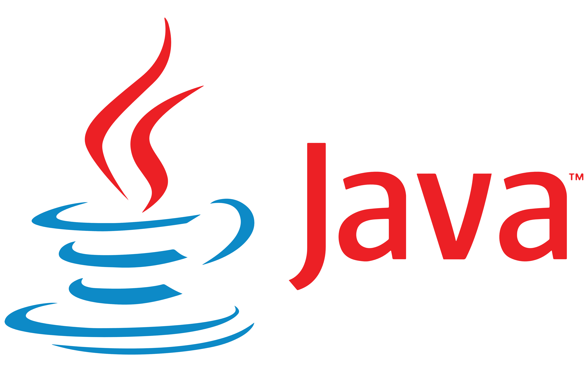
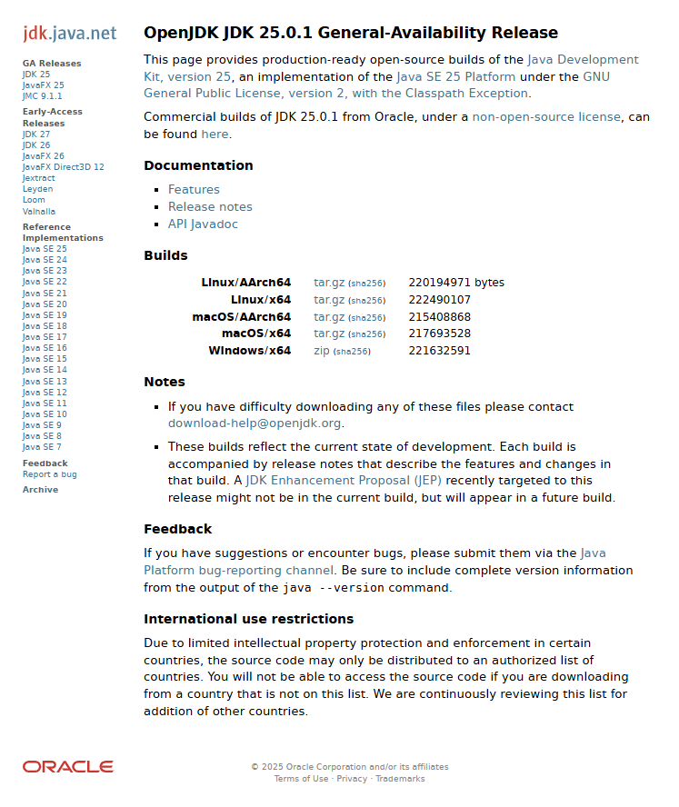
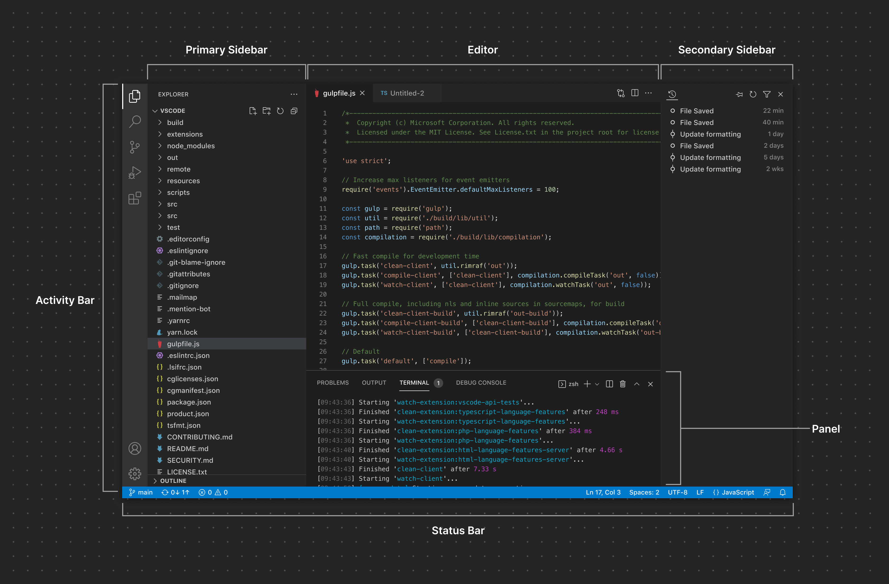
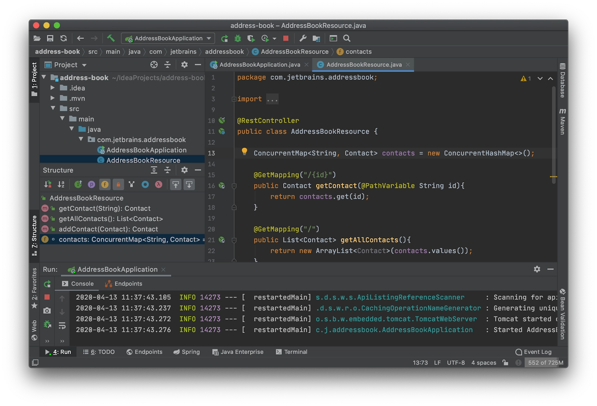

# Install Java

- [Java: Overview and Basics Characteristics](#java-overview-and-basics-characteristics)
- [Java Installing Methods](#java-installng-methods)
- [Java OpenJDK: Manual Installation](#java-openjdk-manual-installation)
    - [Windows](#windows)
    - [MacOS](#macos)
    - [Linux](#linux)
    
<!-- TODO: Add suggested IDEs -->


## Java: Overview and Basics Characteristics

<div align="center">
    
</div>
<div align="center">
    <figcaption>
        <em>The Java Logo.</em>
        <br>
        <br>
    </figcaption>
</div>

Java is a general‑purpose, object‑oriented programming language designed to be simple, robust and portable. It was created with the idea of “write once, run anywhere”, meaning that the same program can run on different platforms without changes.

- #### Portability and the Java Virtual Machine (JVM)
    Java code is first compiled into an intermediate form called ***bytecode***. This bytecode is executed by the ***Java Virtual Machine*** (**JVM**), which exists for many operating systems. Thanks to the JVM, the same `.class` file can run on Windows, macOS, Linux and other systems.

- #### Object-oriented focus
    Java is strongly ***object‑oriented***: almost everything revolves around ***classes*** and ***objects***. Concepts like ***encapsulation***, ***inheritance*** and ***polymorphism*** are central to how Java programs are structured.

- #### Static typing and safety
    Java is ***statically typed***: every variable has a declared type that is checked at compile time. This helps catch many errors early and contributes to the overall safety and reliability of programs.

- #### Memory management
    Java uses automatic memory management via a ***garbage collector***. Programmers do not manually free memory; instead, the runtime automatically recovers memory that is no longer referenced by the program.

- #### Rich standard library
    Java includes a large standard library (the **Java API**) that provides ready‑made components for ***collections***, ***input/output***, ***networking***, ***concurrency***, ***graphical interfaces*** and much more. This allows developers to focus more on **application logic** than on low‑level details.


## Java Installing Methods

Outside in the web it is possible to find different ways to install Java. The main difference across them is realated to the license of use. 

- #### Oracle JDK (Commercial License)
    Oracle JDK is the official implementation from Oracle. It comes under a ***proprietary license*** that requires a ***commercial subscription*** for *production use in enterprise environments*, though development and testing are typically free. For download, check [https://www.oracle.com/it/java/technologies/downloads/](https://www.oracle.com/it/java/technologies/downloads/).

    **Installation methods under Oracle license:**
        
    - **Installer (`.exe`, `.msi`, `.dmg`, `.pkg`):** Download from `oracle.com` and run the graphical installer. Easiest for `Windows` and `MacOS`; often handles `JAVA_HOME` and `PATH` automatically. Suitable for evaluation and development.​
    - **Manual archive (`zip`/`tar.gz`)**: Download from `oracle.com`, extract to a stable location, and configure `JAVA_HOME` and `PATH` manually. Same licensing terms apply.

- #### OpenJDK (Free and Open Source — GPL v2 + Classpath Exception)
    OpenJDK is the ***open-source*** reference implementation of **Java SE**. It is licensed under *GPL v2* with **Classpath Exception**, meaning you can freely use it, even in production, without license restrictions. Many vendors provide their own builds of OpenJDK. OpenJDK can be downlaoded and installed through a vendor like [Microsoft Build of OpenJDK](https://www.microsoft.com/openjdk), [Eclipse Temurin (Adoptium)](https://adoptium.net/en-GB/temurin), [Amazon Corretto](https://aws.amazon.com/it/corretto/q), and other providers.

    **Installation methods under OpenJDK license:**

    - **Vendor installer (`.exe`, `.msi`, `.pkg`):** Microsoft Build of OpenJDK, Eclipse Temurin (Adoptium), Amazon Corretto, and others provide ready-to-run installers. Usually automatic `JAVA_HOME` and `PATH` setup. Free for all use, including production.​

    - **Package manager (Linux, macOS, Windows):**

        - **Linux:** `apt install openjdk-17-jdk`, `dnf install java-21-openjdk-devel`, etc. No cost, maintained by OS vendor.​

        - **MacOS:** `brew install openjdk@17` (Homebrew). Free and simple.​

        - **Windows:** `winget install temurin` or `choco install openjdk` (via package managers).​

    - **Manual archive (`zip`/`tar.gz`):** Download from [openjdk.org](https://openjdk.org) or vendor sites, extract, configure `JAVA_HOME` and `PATH` manually. Free for any use.​

    - **SDK Manager (SDKMAN):** Install and manage multiple OpenJDK versions easily with `sdk install java 21.0.1-tem`. Ideal for development and switching between versions. Free and open-source.​

Summary table:

| Method                     | License      | Cost (Production)     | Effort | Best For                          |
| -------------------------- | ------------ | --------------------- | ------ | --------------------------------- |
| Oracle installer/archive   | Proprietary  | Subscription required | Medium | Enterprise with support contracts |
| OpenJDK installer (vendor) | GPL v2 + CPE | Free                  | Low    | Quick setup, any project size     |
| Package manager            | GPL v2 + CPE | Free                  | Low    | Linux/macOS, system integration   |
| Manual archive (OpenJDK)   | GPL v2 + CPE | Free                  | Medium | Full control, multiple versions   |
| SDKMAN                     | GPL v2 + CPE | Free                  | Low    | Development, version switching    |


## Java OpenJDK: Manual Installation

<div align="center">
    
</div>
<div align="center">
    <figcaption>
        <em>The OpenJDK download page.</em>
        <br>
        <br>
    </figcaption>
</div>

### Windows

1. Download Java `zip` file for Windows from [https://jdk.java.net/25/](https://jdk.java.net/25/).

2. Extract the folder and then place the result - something like `jdk-25.0.1` in the `C:\Program Files\Java\jdk-25.0.1` folder (keep it in mind for later; note: in italian, `Program Files` is `Programmi`).

3. Setup the `JAVA_HOME` and `PATH`: 
    
    - Start -> `Environment Variables` -> `Change Environment Variables for the System`
    - In `System Variables` click in `New` and set: 
        - Name: `JAVA_HOME` 
        - Value: `C:\Program Files\Java\jdk-25.0.1`
    - In `System Variables` select `Path` -> `Modify` -> `New` and add `C:\Program Files\Java\jdk-25.0.1`.

4. To verify, open a new `cmd` (close existing ones) and launch: `java --version` and `javac --version`. They should show the freshly installed version. 

### MacOS

1. Download the appropriate archive: `macOS/AArch64` (**Apple Silicon**) or `macOS/x64` (**Intel**).

2. Open `Terminal` and go to your downloads folder, for example: `cd ~/Downloads`.

3. Extract the archive: `tar -xzf openjdk-25.0.1_macos-x64_bin.tar.gz`.​

4. Move the JDK folder to a permanent location, for example (create the folder and move the target files): 
    
    - `sudo mkdir -p /Library/Java/JavaVirtualMachines`
    - `sudo mv jdk-25.0.1.jdk /Library/Java/JavaVirtualMachines/`

5. Set `JAVA_HOME` in your shell profile (e.g. `Zsh`):
    
    - open `~/.zshrc` and add:
        ```bash
        export JAVA_HOME=$(/usr/libexec/java_home -v 25)
        export PATH="$JAVA_HOME/bin:$PATH"
        ```
    - save and reload using `source ~/.zshrc`.

6. Open a new `Terminal` and launch: `java --version` and `javac --version`. They should show the freshly installed version. 

### Linux 

1. Download the appropriate archive: `Linux/AArch64` (**ARM chip**) or `Linux/x64`.

2. Open `Terminal` and go to your downloads folder, for example: `cd ~/Downloads`.

3. Extract the archive: `tar -xzf openjdk-25.0.1_linux-x64_bin.tar.gz`.​

4. Move the JDK folder to `/opt` (`sudo` needed): 
    
    - `sudo mkdir -p /opt/java`
    - `sudo mv jdk-25.0.1.jdk /opt/java/`

5. Set `JAVA_HOME` in your shell profile:
    
    - open `~/.bashrc` or `~/.zshrc` and add:
        ```bash
        export JAVA_HOME=/opt/java/jdk-25.0.1
        export PATH="$JAVA_HOME/bin:$PATH"
        ```
    - save and reload using `source ~/.bashrc` or `source ~/.zshrc`.

6. Open a new `Terminal` and launch: `java --version` and `javac --version`. They should show the freshly installed version. 


## Suggested IDEs

An IDE is a program that brings together all the main tools for writing, testing, and debugging code in a single interface, making software development faster and more organized. 

In practice, instead of using multiple separate programs (text editor, compiler, debugger), the programmer always works in the same environment, with features like syntax highlighting, autocompletion, and integrated debugging tools.

The IDE market is full of open and close-source alternative, each of which has its own peculiarities. In the following 2 suggestions are proposed to effectively handle Java. 

### VS Code

***Visual Studio Code*** (**VS Code**) is a free, cross-platform source code editor developed by Microsoft, designed to support many languages ​​and become a true development environment thanks to extensions. It offers features such as syntax highlighting, integrated debugging, Git version control, and a rich plugin marketplace to customize it to your needs.

VS Code was originally designed as a *lightweight editor*, but with *extensions* it can function as a full-featured IDE for web, backend, desktop, and cloud development. It's available for `Windows`, `MacOS`, and `Linux` and is widely used by both beginners and professional developers due to its flexibility and speed.

#### VS Code Interface

The VS Code interface is organized into a few main areas: 
- the taskbar on the left, 
- the editor area in the center, 
- the lower panel (terminals, output, debugging), and 
- the status bar at the bottom. 

On the left, icons provide access to file explorer, search, version control, debugging, and extensions, while the center opens one or more editors in tabs, some of which can be displayed side by side.

<div align="center">
    
</div>
<div align="center">
    <figcaption>
        <em>VS Code interface.</em>
        <br>
        <br>
    </figcaption>
</div>

#### VS Code Essential Plungins for Java

To work effectively in Java, it's recommended to install some extensions from the marketplace in VS Code:

- Extension Pack for Java (Microsoft): this includes the main Java extensions (Language Support, Debugger, Test Runner, Maven, etc.).
- Language Support for Java™ by Red Hat: it provides IntelliSense, refactoring, code navigation, and Java language support.
- Debugger for Java: it allows to debug Java applications with breakpoints, watch, and variable inspection.
- Test Runner for Java: it manages and runs JUnit and TestNG tests directly from the VS Code interface.
- Maven for Java or Gradle for Java (depending on the build system used): it helps the developer to create, import, and manage projects based on Maven or Gradle.

### Jetbrains IntelliJ

***IntelliJ IDEA*** is a professional Integrated Development Environment (IDE) designed specifically for Java and the JVM ecosystem, but also supports many other languages ​​via plugins. It offers advanced code completion, refactoring, debugging, and integration with build and version control systems.

The interface is organized around the concept of a project: 
- on the left there is the Project view with the file and module structure, - in the center is the editor with multiple tabs, and 
- on the right are any additional tool windows. 

At the bottom are the integrated terminal, the debugger window, the build console, and other tool windows useful for testing, logging, and output.

<div align="center">
    
</div>
<div align="center">
    <figcaption>
        <em>IntelliJ interface.</em>
        <br>
        <br>
    </figcaption>
</div>
