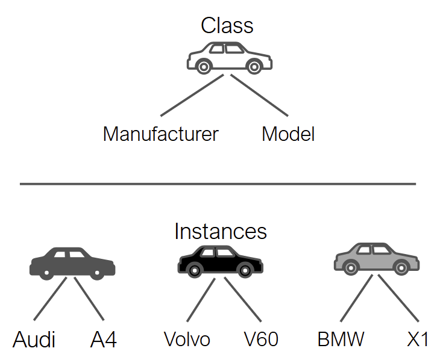
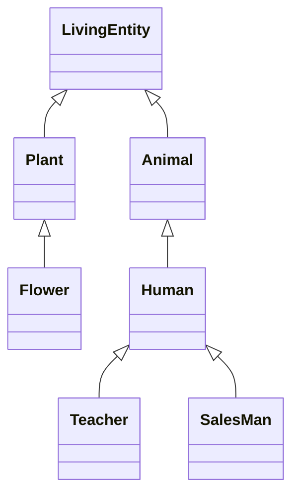
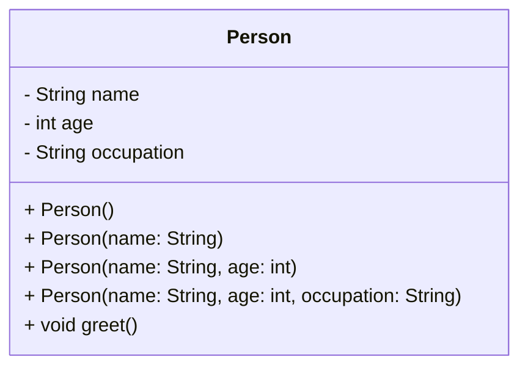
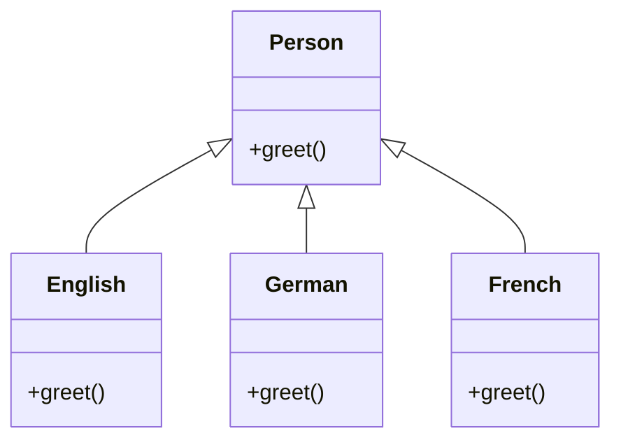

# Java From Functions to Classes

- [Motivations](#motivations)
  - [Lines of Code](#lines-of-code)
  - [Tools and Artifacts](#tools-and-artifacts)
  - [Errors / 1K SLOC](#errors--1k-sloc)
  - [Software Maintenance Costs](#software-maintenance-costs)
- [State of the Art](#state-of-the-art)
  - [The Present](#the-present)
  - [The Past](#the-past)
  - [The Future?](#the-future)
- [Procedural vs Object Oriented](#procedural-vs-objected-oriented)
  - [Object Oriented Programming: What is it?](#object-oriented-programming-what-is-it)
  - [OOP: How was born?](#oop-how-was-born)
  - [Procedural Approach](#procedural-approach)
  - [Object-Oriented Approach](#object-oriented-approach)
  - [Classes, Instances and Interfaces](#classes-instances-and-interfaces)
  - [Fields or Attributes and Methods](#fields-or-attributes-and-methods)
- [OOP Pillars](#oop-pillars)
  - [Encapsulation](#encapsulation)
  - [Inheritance](#inheritance)
  - [Polymorphism](#polymorphism)
- [References](#references)


## Motivations

### Lines of code

<div align="center">
    
</div>
<div align="center">
    <figcaption>
        <em>Lines of code per kernel version.</em>
        <br>
        <br>
    </figcaption>
</div>

<div align="center">
    
</div>
<div align="center">
    <figcaption>
        <em>Lines of code per space mission.</em>
        <br>
        <br>
    </figcaption>
</div>

<div align="center">
    
</div>
<div align="center">
    <figcaption>
        <em>Lines of code per product.</em>
        <br>
        <br>
    </figcaption>
</div>

(see more: [Million Lines of Code - Information is Beautiful](http://www.informationisbeautiful.net/visualizations/million-lines-of-code/))

### Tools and artifacts

In the early days of computing science it appeared increasingly evident that with
**increasing complexity** the lines of code contained in a software became more and more
numerous, making its **maintenance more and more complex**.

A great example of a severe misalignment between available tools and artifacts' complexity took place during the 1970s in a period remembered as [software crisis](https://en.wikipedia.org/wiki/Software_crisis). 
* Projects running over-budget
* Projects running over-time
* Software was inefficient
* Software was difficult to maintain

| Tools                                                          | Artifacts                                                  |
|----------------------------------------------------------------|------------------------------------------------------------|
|   |   |
|   |   |

### Errors / 1K SLOC

A simple and informal rule to understand the quality of a software is to measure the amount of
errors per thousand lines of code (_errors / 1K SLOC_).

- Industry Average, 25 errors / 1K SLOC
- Corporate Applications, 5 errors / 1K SLOC
- Cleanroom development technique, 0.5 errors / 1K SLOC

<div align="center">
    
</div>
<div align="center">
    <figcaption>
        <em>Code quality ... rule of thumb.</em>
        <br>
        <br>
    </figcaption>
</div>

Various processes and methodologies have been developed over the last few decades to improve
software quality management such as procedural programming and object-oriented programming.

### Software maintenance costs

- Procedural programming languages (e.g., C) are **not suitable for building large
  software infrastructures** because code reuse is limited. Limited reuse increases both development costs (code written from scratch) and maintenance costs (code written from scratch is less tested than older code).
- OOP aims at secure, re-usable, flexible, extensible software. Instead of focusing on algorithms, optimization, and efficiency, **OOP focus on programming techniques**.

<div align="center">
    
</div>
<div align="center">
    <figcaption>
        <em>Components of the overall cost of a software.</em>
        <br>
        <br>
    </figcaption>
</div>


## State of the Art

### The present

<div align="center">
    
</div>
<div align="center">
    <figcaption>
        <em>The actual state of programming languages.</em>
        <br>
        <br>
    </figcaption>
</div>

### The past

<div align="center">
    
</div>
<div align="center">
    <figcaption>
        <em>The history of programming languages.</em>
        <br>
        <br>
    </figcaption>
</div>

(see more: [Most Popular Programming Languages 1965-2020 - YouTube](https://www.youtube.com/watch?v=YqxeLodyyqA))

### The future?

<div align="center">
    
    
</div>
<div align="center">
    <figcaption>
        <em>What will be future trending programmnig languages?</em>
        <br>
        <br>
    </figcaption>
</div>


## Procedural vs Objected Oriented

### Object Oriented Programming: What is it? 

Object-Oriented Programming (OOP) is a ***programming paradigm***. A programming paradigm is a conceptual model that defines how a programmer should structure and organize code to solve problems using a programming language. It's like a way of thinking or an approach to writing software.

A paradigm provides:
1. ***Mental structures***: Guidelines for organizing thoughts while writing code (see UML and Design Patterns).
2. ***Tools***: Language features (such as classes, functions, or logical expressions) that help implement this model.

Each object combines data (fields or attributes) and behaviors (methods) to model and interact with the system.

### OOP: How was born? 

It originated in the 1960s and 1970s with the Simula language (1967), the first to introduce the concept of objects and classes for complex
simulations.

Subsequently, the Smalltalk language (1972) refined the paradigm. Its diffusion exploded with the advent of languages ​​such as C++, Java, and, "*more recently*", Python.

The idea was to bring software closer to the way humans perceive the world: as a ***set of objects with states and behaviors***.

The answer is: yes. Because different problems require different approaches.
Each paradigm emphasizes a specific aspect of programming to achieve specific effects.
Some paradigms are:
- ***Imperative*** vs. ***Declarative Paradigm***: 
    - the imperative paradigm focuses on step-by-step control of the execution flow, ideal for sequential tasks; an example is `Python`;
    - the declarative paradigm focuses on describing the logic of computation without detailing its control flow; an example is `HTML`, or advanced tools such as `Ansible` or `Docker-Compose`.
- ***Functional Paradigm***: this paradigm is based on the evaluation of mathematics functions; it focuses on the usage of pure functions, using immutable variables and functions compositions.
- ***Object-Oriented Paradigm***: more on this later.

### Procedural approach

* Data and functions are separate
* Functions process data: _operation(object, params)_

```c++
int main() {
  int v[100];
  int n = sizeof(v) / sizeof(v[0]);

  init(v, n);
  sort(v, n);
  search(v, n, 10);
}
```

```c++
void init(int v[], int size) {
  int i;
  for (i = 0; i < size; i++) {
    v[i] = rand() % 100;
  }
}

void sort(int v[], int n) {
  int i, j, tmp, changed;
  for (i = 0; i < n - 1; i++) {
    changed = FALSE;
    for (j = 0; j < n - i - 1; j++) {
      if (v[j] > v[j + 1]) {
        changed = TRUE;
        tmp = v[j];
        v[j] = v[j + 1];
        v[j + 1] = tmp;
      }
    }
    if (!changed) break;
  }
}

int search(const int v[], int size, int value) {
  int i;
  for (i = 0; i < size; i++) {
    if (v[i] == value) {
      return i;
    }
  }
  return -1;
}

void show(int v[], int size) {
  int i;
  for (i = 0; i < size; i++) {
    printf("[%d] %d\n", i, v[i]);
  }
}
```

**Issues**

<div align="center">
    
</div>
<div align="center">
    <figcaption>
        <em>Issues of the procedural approach.</em>
        <br>
        <br>
    </figcaption>
</div>

- **Reuse of code limited**: data and operations are separate. This makes it complex to reuse existing code in
  other projects
- **Data protection limited**: unprotected data accessible from vast portions of the source code. After a certain
  stage, debug becomes a nightmare!
- **Decomposition limited**: large scale projects require a large scale working force (many teams). Unprotected
  data, separate from operations, makes it hard to decompose
  
### Object-oriented approach

* Data and functions are coupled together within classes
* Objects deliver services using internal data: _object.operation(params)_

<div align="center">
    
</div>
<div align="center">
    <figcaption>
        <em>Object oriented approach.</em>
        <br>
        <br>
    </figcaption>
</div>

```java
public class App {
  public static void main(String[] args) {
    Vector vector = new Vector();
    vector.sort();
    vector.search(10);
  }
}
```


```Java
public class Vector {
    int[] v;

    public Vector(int capacity) {
        this.v = new int[capacity];
        init();
    }

    void sort() {
        boolean changed;
        for (int i = 0; i < v.length - 1; i++) {
            changed = false;
            for (int j = 0; j < v.length - i - 1; j++) {
                if (v[j] > v[j + 1]) {
                    changed = true;
                    int tmp = v[j];
                    v[j] = v[j + 1];
                    v[j + 1] = tmp;
                }
            }
            if (!changed) break;
        }
    }
    
    void init() {
      Random rnd = new Random();
      for (int i = 0; i < v.length; i++) {
        v[i] = rnd.nextInt(100);
      }
    }
  
    int search(int value) {
      for (int i = 0; i < v.length; i++) {
        if (v[i] == value) {
          return i;
        }
      }
      return -1;
    }
  
    void show() {
      for (int i = 0; i < v.length; i++) {
        System.out.printf("[%d] %d\n", i, v[i]);
      }
    }
  }
  ```

### Classes, Instances and Interfaces

<div align="center">
    
    <div align="center">
        <figcaption>
            <em>Conceptual representation of relationship between classes and objects.</em>
            <br>
            <br>
        </figcaption>
    </div>
</div>

***Abstraction***, ***Inheritance***, ***Encapsulation***, and ***Polymorphism*** revolve around the concepts of ***Class***, ***Object***, and ***Interface***.

- ***Class***: it is a body of code that defines the ***model*** that associated object must have to belong to that class. The model is structured in terms of ***attributes*** and ***methods***.
- ***Object***: it is a particular ***instance*** of a given class. An object has assigned particular values (i.e., data) ​​for each of its attributes, which belong to it. You can have as many objects as you want for
each class.
- ***Interface***: it is a ***contract*** that defines a set of methods that a class can implement. It is similar to a class, but usually it ***it does not provide implementations*** for the methods it declares (depending on the language used).

The main relationship to focus on in the first place, is about Classes and Objects.

<div align="center">
    
    
    <div align="center">
        <figcaption>
            <em>Conceptual representation of relationship between classes and objects.</em>
            <br>
            <br>
        </figcaption>
    </div>
</div>

***Classes are models***, like projects representing how an associated object must be structured and behave when created. It is the same concept belonging to the engineering world, when a new manufact is designed, and it is represented as a `.cad` project: it is a representation of how the designed object will be and how it will behave, but the actual object it represents does not exist. 

***Objects are implementations of classes***, holding particular details as data, that the associated class does not have. As a principle, given one class it is possible to create as much associated objects as needed. Using the engineering parallel, the Object is the implemented design of the manufact of interest. It is possible to create as many replicas of this artifact as desired. Each replica can hold different details, belonging to its particular instance. 

#### For example: 

<div align="center">
    
    <div align="center">
        <figcaption>
            <em>An example of the relationship existing between the Class and the Object concept based on cars and brands.</em>
            <br>
            <br>
        </figcaption>
    </div>
</div>

In the image above, the `Car` Class specifies that, to define a car, you must provide:
- a car manufacturer.
- a car model.

The Class, however, does not contain any manufacturer, maker, or model value for any specific car.

Then, when an object belonging to the Class `Car` is implemented (i.e., produced), then it starts holding particular details about its own instance, such as the Manufacturar and the Model name.

### Fields or Attributes and Methods

The OOP organizes code around ***objects***, which represent real-world entities or abstract concepts. Each object combines data, i.e., ***fields*** or ***attributes***, and behaviors, that are ***methods***. 

They are useful to model the problem to solve and interact with the system. Each object combines variables that describe its state and methods that allow it to be modified.

Therefore, OOP groups properties and behaviors into individual objects.
For example, the OOP support the model of:
- a person object with:
    - ***properties*** such as name, age, and address;
    - ***behaviors*** such as walking, talking, breathing, and running.
- an email object with:
    - ***properties*** such as a recipient list, subject, and body;
    - ***behaviors*** such as adding attachments and sending.

With object-oriented programming, it is possible to model concrete, real-world things, such as cars, as well as relationships between things, such as companies and employees, students and teachers, and so on.

OOP models real-world entities as software objects with associated data that can perform specific functions.
Through OOP, it is possible to model not only physical concepts that we experience directly, but also abstract concepts, such as:
- Timers
- Communication buses
- Classes and objects that have "virtual" functions, such as creating objects following a certain behavior, adapting communication protocols, etc. - see ***Desing Patterns***.

The fundamental conclusion is that objects are at the heart of object-oriented programming. They not only represent data, as in procedural programming, but also the overall structure of the program.


## OOP Pillars

The OOP paradigm is built around 4 pillars: 
- ***Encapsulation***:
    - Encloses data and methods within an object and controls access through *visibility modifiers* (i.e., `public`, `private`, `protected`).
    - Example: A bank account balance attribute can only be modified using specific methods.
- ***Inheritance***:
    - Allows you to define new classes based on existing classes, to ***reuse*** and ***extend*** specific behaviors.
    - Example: An `ElectricCar` class can inherit from a general `Car` class.
- ***Polymorphism***:
    - Allows program components, such as objects, methods or functions, to show different behaviors depending on their use and application context
    - Example: A `.start_engine()` method may behave differently when applied on an `ICECar` with respect an `ElectricCar`.
- ***Abstraction***:
    - Allows you to define concepts, ***hiding/ignoring implementation details***.
    - In other words, it involves the process of ***identifying the essential aspects*** of a form or concept, abstracted from specific implementations.
    - Example: A `Car` object has attributes such as `brand` and `model`, but you don't care how the `engine` works internally.

Resulting programs benefit from the following features:
- ***Modularity***: Breaks the code into independent, reusable objects;
- ***Maintainability***: Encapsulating the code reduces the risk of side effects and unwanted behavior;
- ***Extensibility***: Concepts can be refined through subsequent iterations, starting from higher-level classes, or by overriding methods when appropriate.

### Encapsulation

<!-- TODO: simplify this section using my material about classes and objects -->

Encapsulation is defined as the mechanism wrapping together, inside a protective shield, code and data (data is encapsulated inside a shield of code); that prevents the data from being accessed by code outside this shield. The rest of the program has access only to a selected list of public methods (_public interface_).

<div align="center">
    
</div>
<div align="center">
    <figcaption>
        <em>Object oriented approach.</em>
        <br>
        <br>
    </figcaption>
</div>

### Inheritance

Inheritance consists in the mechanism in which one class acquires all the properties and behaviours of a parent object. The idea is that you create new classes that are built upon existing classes. 
* The class that inherits (and that can reuse) methods and fields of the parent class is known as **subclass** or **child class**.
* Moreover, it can add new methods and fields or "override" the methods of the **parent class**, also known as **superclass**.
* Every class specializes its ancestors
* Inheritance introduces the **IS A** relationship (_child IS A parent_)
* Enables **reuse of code**

<div style="text-align:center">


<caption>
    <em>A schema depicting the inheritance principle.</em>
    <br>
    <br>
</caption>
</div>


### Polymorphism

In general, **polymorphism** means that something (an object or another entity) has many forms.

Java provides two main types of polymorphism:

**Static (compile-time) polymorphism** refers to polymorphic functions that can be applied to arguments of different types, but behave differently depending on the type of the argument to which they are applied. Java supports it as **method overloading**.

<div style="text-align:center">


<caption>
    <em>Class-diagram card reporting the method-overloading mechanism for constructors fo the class Person.</em>
    <br>
    <br>
</caption>
</div>

**Dynamic (run-time) polymorphism** is the possibility to use an instance of a subclass (and its methods) based on the object type used at run-time instead of the object type declared by the programmer (often the base class type). Java supports it as **method overriding**.

> **Tell-Don't-Ask Principle**
> 
> Instead of asking an object about its state and then performing actions, it is much easier to simply tell the object what it needs to do and let it decide for itself how to do that.

<div style="text-align:center">


<caption>
    <em>A representation of the "Tell-Don't-Ask" Principle.</em>
    <br>
    <br>
</caption>
</div>


## References