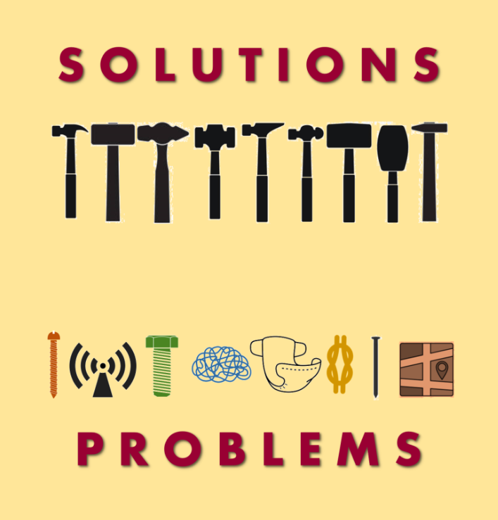
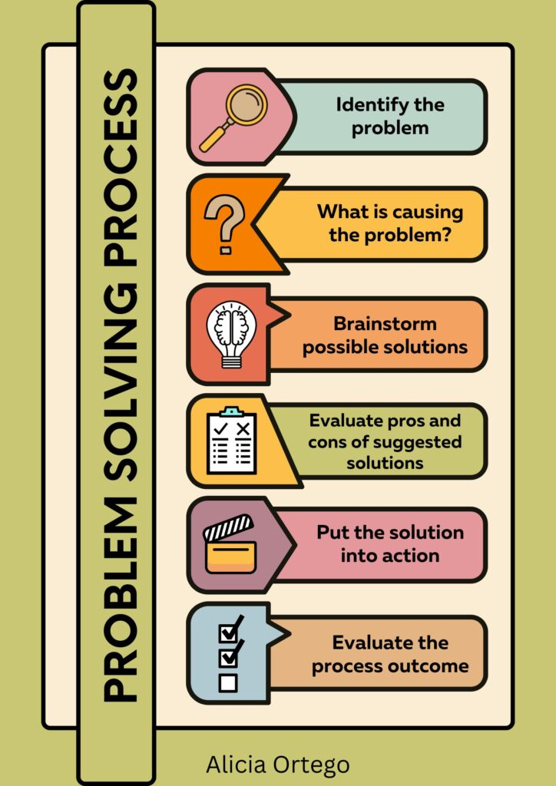
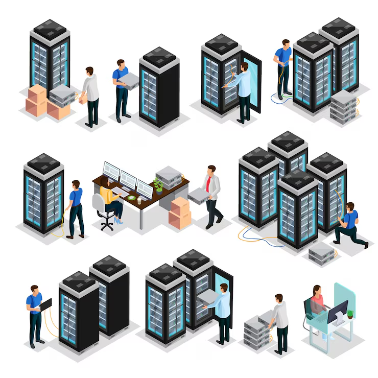

# Programming as Problem Solving

- [The World Full of Problems](#the-world-full-of-problems)
- [Many Ways to Solve Problems](#many-ways-to-solve-problems)
    - [Traditional Approaches](#traditional-approaches)
    - [Computer Based Approaches](#computer-based-approaches)
    - [Hybrid Approaches](#hybrid-approaches)
- [Not All Problems Can Be Solved with Computer Science](#not-all-problems-can-be-solved-with-computer-science)
- [Problems That Aren't "Computer Problems"](#problems-that-arent-computer-problems)
- [What Problems Can Be Solved with Computer Science?](#what-problems-can-be-solved-with-computer-science)
- [Categories of Computer-Solable Problems](#categories-of-computer-solable-problems)
    - [Practical Examples of Problems Solved by Computer Science](#practical-examples-of-problems-solved-by-computer-science)
- [Recognizing the Role of Computer Science](#recognizing-the-role-of-computer-science)

## The World Full of Problems

    
    

    <figcaption>
        <em>The World and related problems.</em>
         
         
    </figcaption>

The world around us is full of problems. From the simplest everyday difficulties to the most complex scientific challenges, humanity is constantly confronted with situations that require solutions. A problem, in this context, can be defined as a discrepancy between the current state of affairs and the desired state. Consider some common situations:

- A company has difficulty managing its warehouse inventory
- A person wants to reach a destination but doesn't know the best route
- A hospital needs to efficiently schedule patient appointments
- A school needs to calculate student grade point averages

Each of these problems represents a need for change, a gap between the current situation and a desired goal. Programming, and computer science more generally, has proven to be a powerful tool for addressing many of these challenges.

## Many Ways to Solve Problems

    

    <figcaption>
        <em>Problem Solving is not the only 
        <!-- TODO: Check the link if it works as expected -->
        <a href="https://polgovpro.blog/2021/06/18/problems-for-and-of-governance/" rel="noopener noreferrer" target="_blank">strategy</a>
         ... but is often the most adopted.</em>
         
         
    </figcaption>

It is important to understand that every problem can be addressed through multiple approaches and strategies. There is no single correct path, but rather different solutions that vary in terms of efficiency, feasibility, and cost.

### Traditional Approaches

Before the digital age, and still today in many contexts, problems were solved using:

- **Manual methods:** Processes completely managed by people. For example, manually calculating statistics, physically organizing documents in archives, and manually correcting errors.

- **Mechanical processes:** The use of machines and devices to automate repetitive tasks. Accounting machines, mechanical looms, and physical sorting systems are historical examples of this category.

- **Human organization and coordination:** Improving processes through reorganizing work, dividing responsibilities, and creating standardized procedures.

### Computer-Based Approaches

The advent of computers has introduced a new dimension of solution:

- **Computer Automation:** The use of software and algorithms to automate large-scale operations. A computer can process millions of banking transactions in seconds, a task impossible to achieve manually.

- **Data Analytics:** The ability to collect, process, and analyze massive amounts of information to extract meaningful insights.

- **Intelligent Systems:** Programs that can learn from previous data, recognize patterns, and make decisions based on this learning.

- **Global Interconnection:** The creation of networks that enable instant communication and collaboration between people around the world.

### Hybrid Approaches

Today's reality often combines different approaches. A modern hospital, for example:

- Uses computer systems to manage patient data.
- Maintains specific organizational procedures.
- Employs qualified professionals to make critical decisions.

Combines automation with human judgment.

## Not All Problems Can Be Solved with Computer Science

Although computer science is extremely powerful, it is crucial to recognize its limitations. Not all problems can be effectively solved using computers and software.

**Intrinsic Limitations of Computer Science:**

- **Emotional and Relational Problems:** An algorithm cannot console someone who is suffering emotionally, it cannot build true friendships, it cannot feel empathy. The human dimension of many problems remains inaccessible to computer science.

- **Ethical and Moral Decisions:** Questions like "Is it right to do this?" cannot be resolved by a computer program. These decisions require human judgment, values, and an understanding of the cultural context.

- **Tangible Physical Problems:** If a road is destroyed by an earthquake, no software will repair it. The need for physical intervention in the real world remains essential.

- **Problems with insufficient data:** A weather-predicting AI needs sufficient data to make accurate predictions. If data is unavailable, or of poor quality, the computer system is ineffective.

- **Situations that require genuine creativity:** While computers can generate variations on existing themes, true creative innovation—the ability to conceive of something entirely new—remains primarily a human skill.

### Problems That Aren't "Computer Problems"

Some problems could theoretically be solved by computer science, but for practical, economic, or social reasons, it's not appropriate to follow this path:

- A teacher who wants to establish a good relationship with students should not completely delegate this task to an AI.
- A parent who wants to educate a child cannot completely entrust this responsibility to a program.
- A community that wants to preserve cultural traditions should not completely automate practices that are valuable precisely because they are conducted by people.

### What Problems Can Be Solved with Computer Science?

If not all problems can be solved using computer science, it's essential to understand what characteristics a problem must have for computer science to provide an effective solution.

**Characteristics of Computer-Solable Problems:**

- **Well-defined problem:** The problem must be clearly articulated. It must be possible to specify exactly:

    - What are the inputs (the data).
    - What is the desired output (the desired result).
    - What are the constraints and rules to follow?
    - *Positive example:* "Given a list of 1,000 numbers, sort them in ascending order." This is well-defined.
    - *Negative example:* "Make the company better." This is vague and subjective.

- **Problem with computable logic:** There must be a sequence of logical steps, an algorithm, that leads from the initial situation to the solution.

    - *Positive example:* Calculating the shortest route between two cities. There are proven algorithms (such as Dijkstra).
    - *Negative example:* Deciding which song a person will like best. Musical preference is highly subjective and personal.

- **Processable Data:** The problem must have data available in a form that a computer can process:

    - **Structured:** Numbers, text, dates organized in defined formats (database, CSV file, JSON).
    - **Accessible:** The data must be obtainable and not protected by constraints that prevent access.
    - **Sufficient:** There must be enough information to solve the problem.
    - *Positive Example:* Predicting the price of a house is computationally solvable if you have data on thousands of past houses with features and prices. Without this data, no algorithm can make a good prediction.

- *Clear Computational Utility*: The problem must significantly benefit from a computer's ability to:

    - Process quickly (perform millions of operations per second).
    - Handle large volumes of data.
    - Operate 24 hours a day without tiring.
    - Maintain precision in repetitive calculations.
    - Scale effectively (solve larger versions of the same problem).

## Categories of Computer-Solvable Problems

    

    <figcaption>
        <em>A <b>reasonable</b> Computer Science mindmap. 
        <!-- TODO: Check the link if it works as expected -->
        <a href="https://www.informationisbeautifulawards.com/showcase/2333-map-of-computer-science" rel="noopener noreferrer" target="_blank">Credits</a>
        .</em>
         
         
    </figcaption>

- **Data Processing Problems:** Transform, filter, and analyze data.

    - Calculate student grade point averages.
    - Search for a specific word in a million documents.
    - Convert one unit of measurement to another.

- **Optimization Problems:** Find the best solution among many alternatives according to a specific criterion.

    - Find the fastest route for a delivery.
    - Allocate limited resources efficiently.
    - Plan a school schedule that satisfies the maximum number of constraints.

- **Automation Problems:** Automatically perform a repetitive procedure.

    - Process thousands of bills each month.
    - Automatically update a website with new information.
    - Send notifications to all users of a service.

- **Simulation and Forecasting Problems:** Create real-world models to test scenarios or make predictions.

    - Simulating traffic patterns before building a new road.
    - Predicting the spread of a disease in a population.
    - Testing the strength of a structure before physically building it.

- **Communication and Sharing Issues:** Connecting people and information.

    - An email that allows two people to communicate instantly from opposite sides of the world.
    - A search engine that allows you to find relevant information among billions of web pages.
    - A social networking platform that connects people with common interests.

### Practical Examples of Problems Solved by Computer Science

- **In commerce:** An e-commerce company receives thousands of orders every day. It is computationally solvable because:

    - Each order is well-structured (customer, products, address, date).
    - The algorithm is clear (processes payment, creates invoices, updates inventory).
    - The data is available and manageable.
    - Automation brings enormous advantages (speed, 24/7, reduced errors).

- **In medicine:** Diagnosing a disease from a medical scan. It is computationally solvable because:

    - The scan is a processable digital image.
    - There are thousands of manually diagnosed scans to train algorithms.
    - Automation is useful (speed, consistency).
    - **Important note:** It does not replace the doctor, who remains responsible for the final diagnosis.

- **In science:** Discovering patterns in huge scientific data sets. Computationally solvable because:

    - Experimental data is numerical.
    - Computers can test millions of hypotheses.
    - Automation dramatically accelerates scientific discovery.

- **In education:** A system that provides personalized feedback to students on math problems. Computationally solvable because:

    - The correct answer is easily verifiable.
    - The algorithm (error-based feedback) is well-defined.
    - Automation can serve thousands of students simultaneously.
    - **Important note:** Useful for rote tasks (repetitive exercises), but does not replace a teacher for mentoring and guidance.

## Recognizing the Role of Computer Science

    
    

    <figcaption>
        <em>Servers taking care of problems, and Engineers ... Taking care of servers.</em>
         
         
    </figcaption>

The programming journey begins with this crucial awareness: computer science is an extraordinarily powerful tool, but it is not a universal answer.

The responsibility of programmers and computer system designers is:

1. **Recognize when computer science is the right solution:** Identify problems that have the characteristics needed to be solved effectively through algorithms and automation.

2. **Understand the limitations:** Be aware of what computer science cannot do, and do not try to force it where it does not belong.

3. **Design human-centered systems:** Create computing solutions that augment human capabilities rather than blindly replace them.

4. **Ask critical questions:** Before you start writing code, ask yourself if this is truly the problem to be solved and if this is truly the best way to solve it.

In the following course, we will learn how to tackle "computer-solvable" problems, how to analyze them, and how to write algorithms and programs that solve them efficiently, keeping in mind that *programming is a means, not an end*. The true goal is to contribute to solving the world's problems in a responsible, ethical, and humane way.