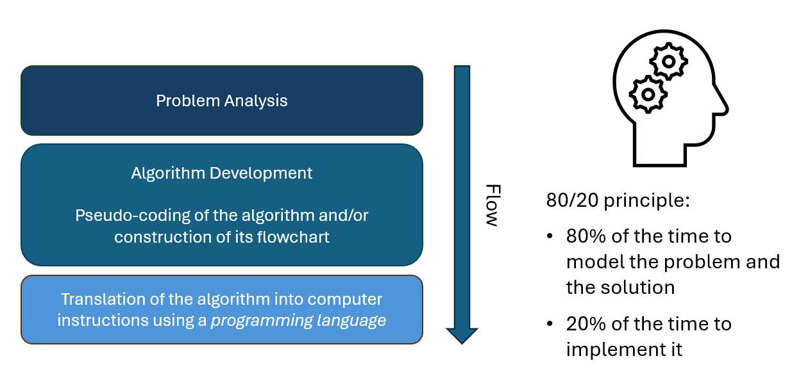
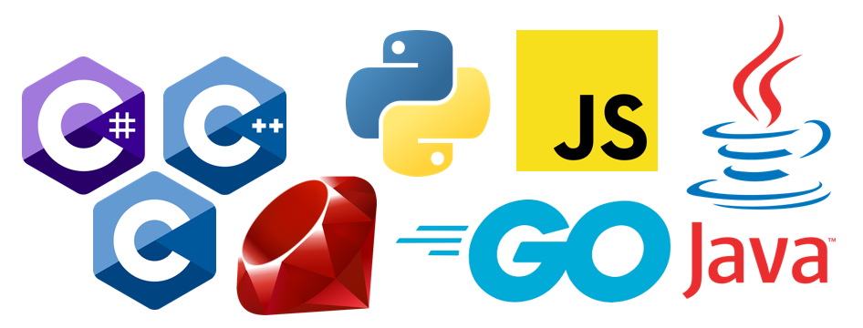
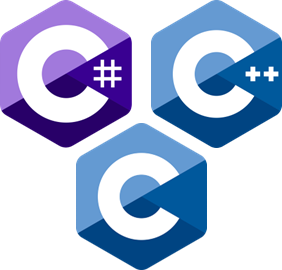
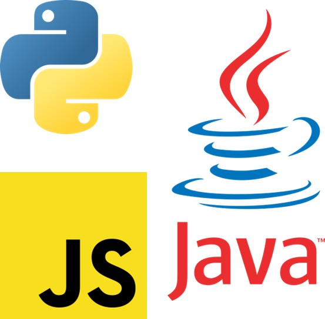
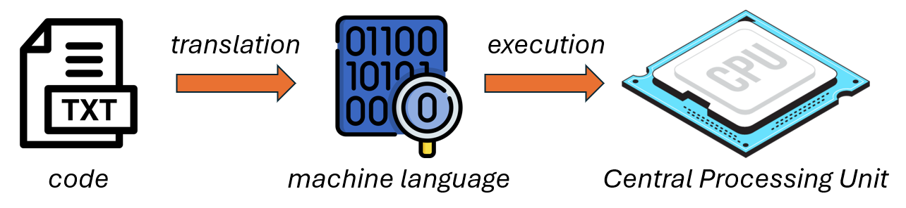
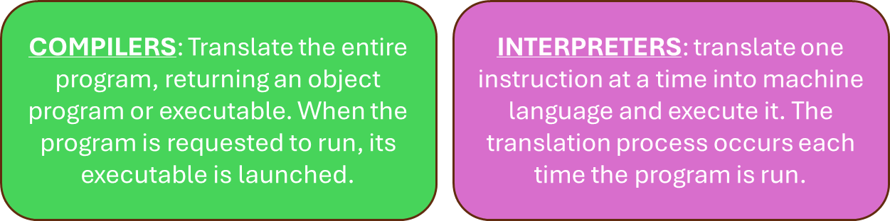

# Programming Languages

- [From the Idea To Programming](#from-the-idea-to-programming)
    - [Problem Analysis](#problem-analysis)
    - [Algorithm Development](#algorithm-development)
    - [Pseudocode and Flowcharts](#pseudocode-and-flowcharts)
    - [Translation into Programming Languages](#translation-into-programming-languages)
    - [The 80/20 Principle in Programming](#the-8020-principle-in-programming)
- [Programming Languages: Why](#programming-languages-why)
- [Languages Overview](#languages-overview)
    - [`C`](#c)
    - [`C++`](#c-1)
    - [`C#`](#c-2)
    - [`Java`](#java)
    - [`Python`](#python)
    - [`JavaScript`](#javascript)
    - [`Go`](#go)
    - [`Ruby`](#ruby)
- [High-Level Programming Languages Characteristics](#high-level-programming-languages-characteristics)
    - [Program Translating Programs](#programs-translating-programs)
    - [Compilers Main Characteristics](#compilers-main-charateristics)
    - [Interpreters Main Characteristics](#interpreters-main-charateristics)

## From the Idea to Programming

In the programming process, the developer **never starts by writing code immediately**: first, he/she **understands the problem**, then he/she **designs the solution** (code structures and algorithms), and only at the end he/she **translates everything in code** using a ***programming language***. This sequence also reflects the idea that the truly important and challenging part is ***analysis*** and ***modeling***, while coding is "*only*" the last technical step.

When it is necessary to solve a computer problem, there is a precise flow to follow: first is the **problem analysis**, then the **algorithm building**, and finally **code implementation**.

This approach is the basis of every program's development cycle, from small educational exercises to large real-world applications.

    

    <figcaption>
        <em>The 80/20 principle, based on Pareto.</em>
         
         
    </figcaption>

### Problem Analysis

In the analysis phase, the developer clarifies what the program will do, what input data it receives, and what output results it will produce.

In this phase, constraints are defined, as well as rules, and special cases. It is also decided which part of the problem to address using computer science and which to leave to the human or organizational team.

### Algorithm Development

Once the problem is understood, the developer designs an algorithm, a finite sequence of logical steps that lead from the initial situation to the solution.

**Pseudocode** and/or ***flowcharts*** are often used to describe the algorithm: the former is a textual description in structured natural language, the latter is a graphical representation of the control flow.

### Pseudocode and Flowcharts

Pseudocode allows you to focus on the logic without worrying about the syntax of a specific language, and it is easily translated into different programming languages.

The flowchart ***visually*** clarifies the path of decisions and cycles, which is useful for explaining the algorithm and identifying **conceptual errors** before writing the code.

### Translation into Programming Languages

Only once the algorithm has been designed and verified does one move on to coding, that is, the ***step-by-step translation*** into instructions in a chosen programming language (`Python`, `Java`, `C`, etc.).

This phase requires attention to the syntax and language tools, but if the algorithm is correct, coding becomes a primarily technical task of transcription and refinement.

### The 80/20 Principle in Programming

In the context of software development, the **Pareto Principle** suggests that a ***small portion of the activities is responsible for the majority of the overall result***.

Applied to the programming process, this means that the majority of the time should be devoted to **understanding** and **modeling** the problem and the solution (analysis and algorithm design), while writing the code takes up a smaller fraction of the total work.

## Programming Languages: Why

    

    <figcaption>
        <em>Some of the most popular programming languages.</em>
         
         
    </figcaption>

Programming languages ​​arose because humans and computers "***speak***" completely different languages: we use natural, ambiguous, and redundant language, while the `CPU` understands only ***`precise`*** ***`binary`*** ***`instructions`***. Programming languages ​​are therefore a ***formal*** and ***unambiguous*** middle ground, designed to express algorithms in ***a way that humans understand*** and can be ***automatically translated into machine language***.

- **Natural Language and Ambiguity**

    Natural language (*Italian*, *English*, etc.) is designed for human communication. It leverages **context** and contains a lot of **redundancy** to ***clarify meaning***. However, precisely for this reason, **it can be ambiguous**: the same sentence can have multiple interpretations.

    Computers, on the other hand, require **instructions** that have ***only one possible meaning***; managing natural language requires advanced artificial intelligence systems and disambiguation techniques, which are still prone to error due to the intrinsic ambiguity of human languages.

- **Machine Language and Binary Code**

    Machine language is the lowest level of software: it consists of instructions in the form of sequences of bits (`0`s and `1`s) that the `CPU` can decode and execute directly.
    Each machine language instruction specifies an operation (`opcode`) and any `data` or `memory addresses` (`operands`), and is ***defined by the processor's hardware architecture***, which """*thinks*""" in terms of binary states such as `on`/`off`, `true`/`false`, `high`/`low`.

- **Why We Don't Program Directly in Binary**

    In theory, it would be possible to write a program directly as a sequence of bits or machine code, but in practice, this is ***extremely cumbersome***: code is difficult to **read**, **debug**, and **maintain**, and *a single incorrect bit is enough to introduce a bug*.

    This is why **layers of abstraction** were introduced: first **symbolic languages** ​​closer to machine language (`assembly`), then **languages ​​closer** to the human way of reasoning (`C`, `Java`, `Python`, etc.), which are then ***automatically translated*** into machine language by **compilers** and **interpreters**.

- **The Role of Programming Languages**

    Programming languages ​​were designed to **formally** and **unambiguously** express concepts such as **variables**, **data structures**, **flow controls**, **functions**, **objects**, and so on.
    In this sense, they act as a *bridge*: they allow us to describe algorithms that we could explain in **natural language**, but in a **rigorous form**, halfway between human language and machine language, so that **the computer can translate** them into executable binary code.

- **From Problem to Machine Language**

    The reason why a problem must first be described in a human-friendly language and then translated into machine language is twofold: 

    - on the one hand, it allows designers and programmers to reason at a comprehensible level of abstraction;
    - on the other, it guarantees the CPU precise and unambiguous binary instructions.

    In other words, a programming language is the standardized way to describe an algorithm in detail in a human-understandable form, which software tools can transform into computer-readable bit sequences.

## Languages Overview

Not all languages come with the same set of capabilities. Most of them followed the development process of IT technologies, thus solving particular problems arose along the way and, consequently offering peculiarities not commong in other tools of the same class. In the following a brief overview about some of the most popular programming languages is proposed.

    
    <figcaption align="center">
        <em>The C gang.</em>
         
    </figcaption>

### `C`

Not the earliest of languages, but certainly one that has had a significant impact on our modern lives.

- Procedural
- Low-level, optimized for memory and performance operations
- Compiled, portable, minimalist
- Allows direct control over memory and hardware, ideal for system programming, operating system development, drivers, and embedded software.

### `C++`

`C++` is a multi-paradigm language, both procedural and object-oriented.

- It can be considered an extension of C with added support for object-oriented programming.
- Compiled.
- Like C, it offers memory manipulation capabilities and high-performance programming.
- It is commonly used in video games, desktop applications, graphics rendering engines, and systems requiring high performance.

### `C#`

A fully object-oriented language.
Developed by Microsoft, it is part of the `.NET` ecosystem.
- Compiled.
- It automatically manages memory through the use of a garbage collector.
- It has a syntax similar to `C++`, although simpler.
- It supports advanced features such as `async`/`await` for asynchronous programming.

    
    <figcaption align="center">
        <em>Python, JavaScript and Java logos.</em>
         
    </figcaption>

### `Java`

It is a cross-platform object-oriented programming language.
- "*Write once, run everywhere*". `Java` bytecode can run on any system with a `JVM` (Java Virtual Machine).
- It has a garbage collector.
- It has a syntax similar to `C++`.
- It has an extensive standard library for networking, I/O, graphical interfaces, etc.
- It is typically used for enterprise-level applications, Android, web servers, and distributed applications.

### `Python`

A simple, easy-to-use, multi-paradigm language (procedural, object-oriented, functional)

- Clean, readable syntax, ideal for prototyping and rapid development
- Interpreted
- Includes a garbage collector
- It has an extensive standard library and several third-party libraries for data analysis, machine learning, and web development

### `JavaScript`

A dynamic, multi-paradigm language (procedural, object-oriented, functional)

- Born to execute client-side code in the browser, it is now also used server-side (see Node.js)
- Interpreted, sometimes JIT-compiled (to improve performance)
- Dynamically typed: there is no need to explicitly declare variable types, which can change at runtime
- Allows the use of asynchronous programming
- Typically used in web, front-end, back-end, and full-stack environments.

    
    <figcaption align="center">
        <em>Ruby and Go logos.</em>
         
    </figcaption>

### `Go`

Also called `Golang`, it is a compiled language designed by Google.

- Simple and readable syntax, similar to `C`.
- Compiled, with garbage collection, very fast to compile.
- Built-in concurrency to handle parallel operations.
- Extensive standard library, a modern alternative for back-end systems.
- Used in server applications, network services, and cloud computing.

### `Ruby`

Object-oriented, dynamic.

- Clean and readable syntax.
- Complete with garbage collection.
- Used for web development, automation scripts, and prototyping.

***… And the more you have, the more you add!***

> [!TIP]
> 
> For a full list of all the existing programming language, visit this  [Wikipedia page](https://en.wikipedia.org/wiki/List_of_programming_languages).

## High-Level Programming Languages Characteristics

High-level programming languages have in common a set of patterns making them very useful for day-by-day system modeling, implementation and maintenance. 

1. Programming langueages are (more or less) **machine-independent**. It means that, when a developer writes in `Python` (for example), he/she does not really care about technical details of the machines that will execute that code (e.g, available ram, type of disk, `CPU` production technology), as long as ***a software capable of translating the code for the given CPU set of instruction exists***.

2. Instructions are expressed through words (usually English), whose meaning represents the operation they perform. It happens because of *abstraction* capabilities that the programming languages brings, enabling the capacity of desribing what the actual algorithm must do rather than imperatively manage all the underlying memory and information handling. 

3. Instructions **must be translated into machine language**. It is true for all existing programming languages. Designing a new programming language means, indeed, to define a language lexicon and logic, and to then build the rules translating that lexicon and logic into machine-level instructions.

4. The translation from programming language to machine language is performed by "**translator programs**" that convert the original text file (**source**) into machine language (**object file**).

5. The independence between language and machine means that the same source can be used on different machines (*portability*).

    

    <figcaption>
        <em>Code translation high-level process.</em>
         
         
    </figcaption>

### Programs Translating Programs

Translating code into machine language executable is a process that can be carried out following different strategies, thus defining different types of "*translators*". Although in practice a clear division does not always exist, "program translators" can be grouped into two large groups:

    

    <figcaption>
        <em>Compilers vs Interpreters.</em>
         
         
    </figcaption>

### Compilers Main Charateristics

- ***Post-compilation execution***: when a program is requested to run, its executable, the result of compilation, is launched.
- ***High performance***: since compiled languages ​​are "prepared" before being run, they are more likely to achieve high performance. Furthermore, the compiler can perform various optimizations, thus increasing the performance of the executable.
- ***Better debugging support***: the compilation phase, by reading the entire code, is able to detect errors before runtime.
- ***Security***: compiled code is much harder to read and less susceptible to reverse-engineering attacks.
- ***Slower development cycle***: compilation becomes more expensive as the project grows, often slowing down software development.

### Interpreters Main Charateristics

- ***Immediate execution of each instruction***: by immediately executing the read code, the result can be immediately analyzed.
- ***No final executable***: no executable file is generated, but the code itself is executable. This requires the code to be constantly updated by its interpreter.
- ***Flexible and dynamic***: the code can be modified and adapted in real time. It is not necessary to declare the type of variables.
- ***Less performant***: its execution is slower and requires resources. This can be mitigated with modern solutions, such as `JIT` compilers or more performant interpreters (see `Python` and [`PyPy`](https://pypy.org/)).
- ***Less secure and debuggable***: by executing line by line, the result of each operation can be easily traced (exposed source code). Dynamic modification can be another vulnerability.
- ***Lack of typical compiler checks***: compiled languages ​​often have tools that support debugging (see type-checking) and testing. This makes interpreted languages ​​more difficult to debug.
