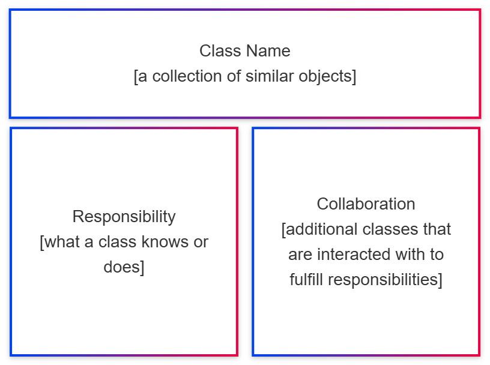
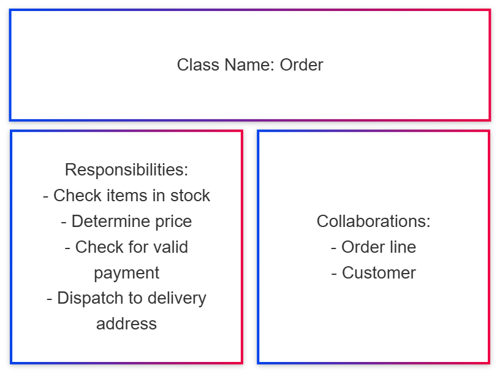
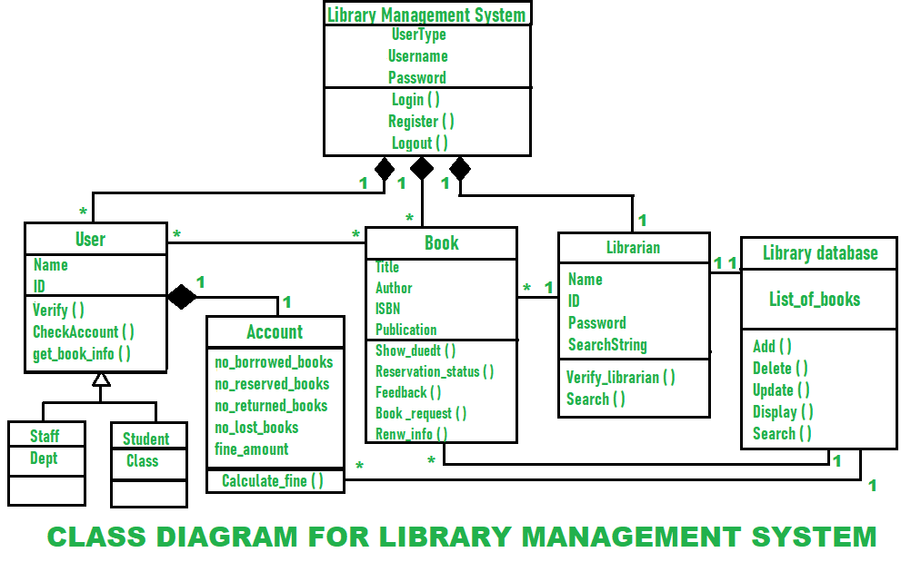
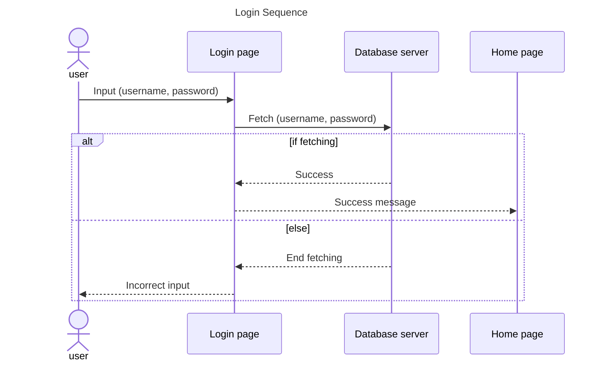
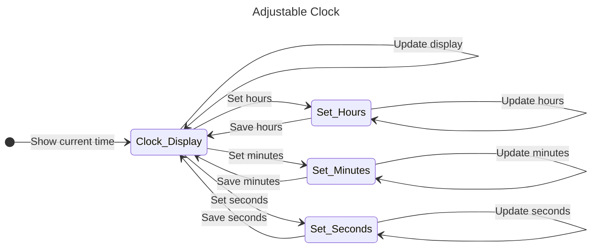
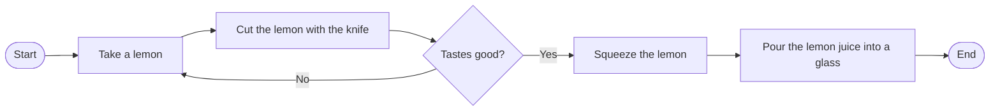

# How to Represent a program

- [Concepts and Tools](#concepts-and-tools)
    - [Class-Responsibility-Collaborator](#class-responsibility-collaborator-connetion-cards)
    - [Class Diagrams](#class-diagrams)
    - [Sequence Diagrams](#sequence-diagrams)
    - [State Diagrams](#state-diagrams)
    - [Flowcharts](#flowcharts)


## Concepts and Tools <!-- TODO: find a better name -->

Every basic programming language basically ***accepts input data*** and ***returns output data***. At the program rutime, data is stored in ***variables***.

Data can be manipulated using various ***operations***, also depending on the ***data types*** being manipulated. Data can be ***compared***, returning **TRUE** if the comparison is `true`, **FALSE** otherwise. The program follows a ***flow***, which is controlled by appropriate constructs.

A program written in a given language can be represented with various tools. It does not exist a ***unique*** tool to represent every aspect of the program. There exist rather a series of tools useful to represent different aspects of the same digital artifact, such as: 

- Class-Responsibility-Collaborator (Connection) cards, 
- Class Diagrams, 
- Sequence Diagrams, 
- State Diagrams,
- Flowcharts,
- etc. ...

Each of these tools help the system designer in define a specific aspect of the program, from ***micro*** to ***macro*** point of view. More in general, cited (and also other) tools for code design have been collected under a single name, called *Unified Modeling Language* (**UML**). Despite the name, it is not a really "unified" way to model and design programs. It is a collection mentioned tools, revised by a scientific community and regulated under specific standards. 

In the following, the proposed tools will be presented, and commented. Not all standards will be strictly followed, for sake of teaching: some concepts more related to the coding activity will be introduced to help the student in approaching upcoming concepts.

### Class-Responsibility-Collaborator (Connetion) Cards

*Class–Responsibility–Collaborator* (**CRC**) cards are a lightweight tool for designing object-oriented systems, especially useful during the analysis and preliminary design phase. They clarify what each **class** should do and which **other classes** it should collaborate with (i.e., use or interact with), even before drawing UML diagrams or writing code.

- **What are CRC cards?**
    
    A **CRC** card is, essentially, a simple card (typically an [index card](https://ggl.link/index-cards-examples)) dedicated to a single class in the system. The same card records the **name of the class**, its **main responsibilities**, and the **other classes with which it interacts** to perform those responsibilities.
    
    > [!NOTE]
    >
    > "Index card" is simply the name of small cards on which, for example, bibliographical notes or notes are recorded and which are stored neatly in a box or binder.

    They were introduced by Kent Beck and Ward Cunningham as a teaching aid for teaching object-oriented thinking and are now considered an agile brainstorming technique for design.

    <div align="center">
        
    </div>
    <div align="center">
        <figcaption>
            <em>CRC card layout.</em>
            <br>
            <br>
        </figcaption>
    </div>

- **CRC Card Structure:** each card is divided into three sections:

    - **Class:** the name of the class or object being modeled

    - **Responsibilities:** a concise list of what that class must do, expressed in short verb-object sentences

    - **Collaborators:** the list of other classes on which the class depends or with which it exchanges messages to perform its responsibilities
    This structure forces the team to think of **cohesive classes** (*well-focused responsibilities*) and **explicit collaborations**, encouraging **decoupling** and **modularity**.

<div align="center">
    
</div>
<div align="center">
    <figcaption>
        <em>Practical example of a CRC card.</em>
        <br>
        <br>
    </figcaption>
</div>

- **How to Use Them in Practice:** CRC cards are typically *used in group sessions*. Starting from use cases or scenarios, participants propose possible classes, write cards, and they then "play out" the various scenarios by passing the cards around and simulating messages between objects.
During these sessions, the cards are moved, rewritten, and discarded with great ease, making design an iterative and collaborative activity, ideal for agile contexts.

- **Advantages:** among the main advantages are simplicity, virtually zero cost, the strong drive for group discussion, and clarity regarding the role of each class in the system.

- **Limitations:** the main limitation is that CRC cards are deliberately informal: they lack the expressive power to describe states, constraints, or implementation aspects in detail, so they must be integrated with other models (such as UML diagrams) as the project becomes more complex.

### Class Diagrams

A **Class Diagram** represents a "*static snapshot*" of an object-oriented system, showing **classes**, their **attributes**, **operations**, and the **relationships** between them. It is one of the main tools for **designing** and **documenting** software architecture before (and during) code writing.

- **Basic Elements:** in a class diagram, each **class is drawn as a rectangle** divided into **three parts**: the **class name at the top**, **attributes in the center**, and **methods** (*operations*) **at the bottom**. Attributes describe the data that objects of that class store, while methods describe the actions they can perform or the services they provide.

- **Relationships Between Classes:** classes are connected by various types of relationships, such as **association** (one class uses another), **aggregation**/**composition** (part-whole relationship), **inheritance**/**generalization** (one class specializes another), and *weaker dependencies*. These relationships are **represented with lines and arrows** with different symbols, allowing us to understand how responsibilities are distributed and how data flows within the system. Additionally, relationships can also model *multiplicity*/*cardinality*, quantifing the numerical degree of a relationship (e.g., a library can have from 0 to infinte books).  Considering a generic class A and a class B, main realtionships are: 

    - Association: `Member ─── Loan`, generic "*uses*/*knows*" relationship, no strong life-long bonds between classes. It means that an object of class A, to exist, *might* need an object of class B, but its not mandatory (and viceversa, eventually).

    <div style="text-align:center">

    ```mermaid
    ---
    title: Association
    ---

    classDiagram
    direction LR
        class A_Loan {
            + memberB
            + firstAAttribute
            + secondAAttribute
            - thirdAAttribute
            + firstAMethod()
            + secondAMethod()
            - thirdAMethod()
        }

        class B_Member {
            + loanA
            + firstABttribute
            + secondBAttribute
            - thirdBAttribute
            + firstBMethod()
            + seconBdMethod()
            - thirdBMethod()
        }

        A_Loan "*" -- "*" B_Member
    ```
    </div>
    
    - Dependendcy: `NotificatioService ─ ─ ─> Member`, "occasionally use" relationship; one class depends on another for some operations, but does not maintain it as a stable part of its structure. Very similar to association.

    <div style="text-align:center">

    ```mermaid
    ---
    title: Association
    ---

    classDiagram
    direction LR
        class A_NotificationService {
            + memberA
            + firstAAttribute
            + secondAAttribute
            - thirdAAttribute
            + firstAMethod()
            + secondAMethod()
            - thirdAMethod()
        }

        class B_Member {
            + notificationServiceB
            + firstABttribute
            + secondBAttribute
            - thirdBAttribute
            + firstBMethod()
            + seconBdMethod()
            - thirdBMethod()
        }

        A_NotificationService "1" <-- "*" B_Member
    ```
    </div>

    - Aggregation: `Library ◇── Book`, weak "part–whole" relationship; the whole contains the parts, but the parts can also exist without the whole.

    <div style="text-align:center">

    ```mermaid
    ---
    title: Aggregation
    ---

    classDiagram
    direction LR
        class A_Library {
            + booksA
            + firstAAttribute
            + secondAAttribute
            - thirdAAttribute
            + firstAMethod()
            + secondAMethod()
            - thirdAMethod()
        }

        class B_Book {
            + firstABttribute
            + secondBAttribute
            - thirdBAttribute
            + firstBMethod()
            + seconBdMethod()
            - thirdBMethod()
        }

        A_Library "1" o-- "500" B_Book
    ```    
    </div>

    - Composition: `Library ◆── Loan`, strong "part–whole" relationship; the parts have no sense of autonomous existence outside the whole, or are destroyed when the whole is destroyed.

    <div style="text-align:center">

    ```mermaid
    ---
    title: Composition
    ---

    classDiagram
    direction LR
        class A_Library {
            + loansA
            + firstAAttribute
            + secondAAttribute
            - thirdAAttribute
            + firstAMethod()
            + secondAMethod()
            - thirdAMethod()
        }

        class B_Loan {
            + firstABttribute
            + secondBAttribute
            - thirdBAttribute
            + firstBMethod()
            + seconBdMethod()
            - thirdBMethod()
        }

        A_Library "1" *-- "*" B_Loan
    ```    
    </div>

    - Inheritance: `PaperBook ─▷ Book`, "is-a" relationship; the subclass *inherits* attributes and operations from the superclass.

    <div style="text-align:center">

    ```mermaid
    ---
    title: Inheritance
    ---

    classDiagram
    direction TD
        class A_Book {
            + firstAttribute
            + firstMethod()
        }

        class B_PaperBook {
            + firstAttribute
            + secondAttribute
            - thirdAttribute
            + firstMethod()
            + secondMethod()
            - thirdMethod()
        }

        A_Book <|-- B_PaperBook
    ```    
    </div>

    Summing up, in the following a table of basic relationships in a class diagram are reported:

    | Relationship      | Short Meaning         | UML Symbol (with examples)        | Details                               |
    | ------------      | -------------         | -------------                     |---------------                        |
    | Dependency        | Temporary/Less Use    | `NotificatioService ─ ─> Member`  | Open Arrow Pointing to Supplier       |
    | Association       | Generic Connection    |  `Member ─── Loan`                | Optional Open Arrow                   |
    | Aggregation       | Weak Part–Whole       |  `Library ◇── Book`               | Hollow Diamond on “Whole”             |
    | Composition       | Strong Part–Whole     |  `Library ◆── Loan`               | Filled Diamond on “Whole”             |
    | Generalization    | “Is-a” Inheritance    | `PaperBook ─▷ Book`               | Hollow Triangular Arrow on Superclass |


In the following, a class diagram for a library is presented, taken from [geekforgeeks](https://www.geeksforgeeks.org/) website.

<div align="center">
    
</div>
<div align="center">
    <figcaption>
        <em>
            Library class diagram example taken from  
            <a  
            href="https://www.geeksforgeeks.org/software-engineering/class-diagram-for-library-management-system/"
            rel="noopener noreferrer" 
            target="_blank">
                geekforgeeks
            </a>.
        </em>
        <br>
        <br>
    </figcaption>
</div>

Summing up, class diagrams serve to demonstrate how ideas about "object types" (classes, responsibilities, collaborations) translate into a formal structure, similar to what will later be codified in an object-oriented language. They are useful for discussing design in teams, analyzing the quality of modeling (encapsulation, reuse, extensibility), and serving as a bridge between high-level analysis and concrete implementation in code.

### Sequence Diagrams

Sequence Diagrams show how different objects collaborate over time by exchanging messages, highlighting the temporal order of calls rather than the static structure of classes. They are particularly useful for clarifying the step-by-step flow of a use case or complex operation.

- **Main Elements:** 

    At the top, the diagram shows the participants (objects or external actors) as rectangles, each with a lifeline, a vertical line representing the object's existence over time. Activation rectangles (execution occurrences) appear along the lifeline, indicating the periods in which the object is performing an operation following a received message.

    Messages are horizontal arrows between lifelines:

    - Full-headed arrow = synchronous message (the caller waits for a response)

    - Stick-headed arrow = asynchronous message (the caller is not blocked)

    - Dashed-headed arrow = return message (optional, often implied)

    There are also special messages for creation ("create," the lifeline starts at the destination) and destruction (lifeline ending with an X).

- **Fragments and Conditions:** 
    
    To describe more complex logic, a sequence diagram can include *combined fragments*, which are boxes labeled with operators such as alt (if/else alternative), opt (single option), and loop (repetition), with any conditions in square brackets. This way, the diagram shows *not only a linear sequence of messages*, but *also conditional branches, loops, and alternative scenarios* for the same use case.

In the following, an example depicting the login sequence to a service performed by a user is presented.



### State Diagrams

State Diagrams describe how an object's state changes over time in response to events, **showing possible states** and the **feasible transitions**  between them. They are useful when an object's behavior depends heavily on the "*phase*" it is in (e.g., order, login session, device, etc.).

- **States and Transitions:**

    A state is a condition in which an object can remain for a certain period of time, during which certain properties or rules apply. Graphically, **a state is represented by a rectangle with rounded corners** containing the name of the state and, optionally, entry/exit actions or internal activities.

    Transitions **are directional arrows that connect different states** and represent the transition from one state to another when a certain event occurs, possibly subject to a condition (*guard*) and accompanied by an action. The typical label notation is event [guard] / action, where each of the three parts is optional.

- **Initial, Final States, and Actions:**
    
    The initial point is shown as **a filled circle** and represents the state from which the state machine starts when the object is created or activated. One or *more* final states are drawn as a **circle with an outer ring** and indicate the conclusion of the lifecycle or modeled behavior.

    Each state can define entry actions (executed when entering the state) and exit actions (executed when leaving it), as well as any "do" actions executed while the state is active. This allows for the compact expression of initialization, ongoing activities, and cleanup, reducing the duplication of logic on individual transitions.



### Flowcharts

One of the first basic tools invented, and still frequently used today, are flowcharts (or block diagrams). 

Flowcharts are **graphical representations of an algorithm** or **process**, in which *each step is shown as a standard symbol connected by arrows* indicating the order of execution. In the context of programming, they serve to **plan the logic of a program** before writing the code, making it easier to discuss, debug, and translate the algorithm into language instructions.



- **Basic Symbols:**
    
    Flowcharts have just a few fundamental symbols. 
    
    - **Oval** for *start*/*end*, 
    - **Rectangle** for an operation or instruction, 
    - **Diamond** for a test or decision (with "*true*/*false*" branches), 
    - **Parallelogram** for *input*/*output*, 
    - **Arrows** that connect the blocks and show the direction of flow. 
    
    With these elements alone, it is possible to describe linear sequences, conditional choices, and loops—the control structures underlying any algorithm.

By the way, it is worth to introduce other programming concepts to have the ability of better representing program instructions and related elements in a flow-chart. 
