# Flowcharts Elements

- [Variables and Constants](#variables-and-constants)
    - [Variables Assignment](#variables-and-assignment)
    - [Variables: General Primitives Overview](#variables-general-primitives-overview)
    - [Variables: Non Primitives - or Structured Overview](#variables-non-primitives---or-structured-overview)
    - [Language Specific Examples](#language-specific-examples)
- [User I/O](#user-io)
    - [Refined Input Block for Flowcharts](#refined-input-block-for-flowcharts)
- [Data Type Conversion](#data-types-conversion)
- [Variables Roles](#variables-roles)
    - [Support Variable](#support-variable)
    - [Flags](#flags)
    - [Switches](#switches)
    - [Counters](#counters)
    - [Totalizer or Accumulator](#totalizer-or-accumulator)
- [Logical Operations](#logical-operations)
    - [Relational Operators](#relational-operators)
    - [Logical Operators](#relational-operators)
- [Program Control Structures](#program-control-structures)
    - [Deciding What To Do: the `if ... else` Block](#deciding-what-to-do-the-if--else-block)
    - [Choosing Between Multiple Options: the `switch-case` Block](#choosing-between-multiple-options-the-switch-case-block)
    - [Cycling Multiple Times a Piece of Code: the `for` Cycle](#cycling-multiple-times-a-piece-of-code-the-for-cycle)
    - [An Alternative Loop: the `while` Cycle](#an-alternative-loop-the-while-cycle)
    - [Another Loop: the `do-while` Cycle](#another-loop-the-do-while-cycle)
    - [Blocking a Loop: the `break` Statement](#blocking-a-loop-the-break-statement)
    - [Jumping a Loop Cycle: the `continue` Statement](#jumping-a-loop-cycle-the-continue-statement)
    - [Nested Controls](#nested-controls)
    - [Nested Controls](#nested-controls)
- [Program Flow Control and Data Structures](#program-flow-control-and-data-structures)
    - [Accessing Arrays Elements](#accessing-arrays-elements)
    - [Accessing Dictionaries Elements](#accessing-dictionaries-elements)
- [Let's Experiment!](#lets-experiment)
- [Appendix: Programs to Draw Flowcharts](#appendix-programs-to-draw-flowcharts)

As seen so far, flowcharts are a handy way to represent the flow of a program. It can be employed at various granularity levels, thus representing processes at both high or low-level. By the way, for low-level cases, it is necessary to introduce some additional basic bricks to fully enable the opportunity of properly model a program. 


## Variables and Constants

When writing a program, a developer is not just working with abstract "numbers" or "texts", but with data that must be represented in memory precisely and consistently.

For this reason, programming languages ​​define different data types, each designed to describe a specific category of information: *integers*, *boolean values*, *characters*, *decimal numbers*, more *complex structures*, and so on.

- **Data Types and Languages**
    
    The idea of ​​having data types is common to almost all languages, but each language implements it with its own "dialect."
    For example, `Java` offers eight well-defined primitive types (such as `int`, `double`, `boolean`, `char`), while other languages ​​may have different sets of basic types or different rules for how these types behave.

<div align="center">
    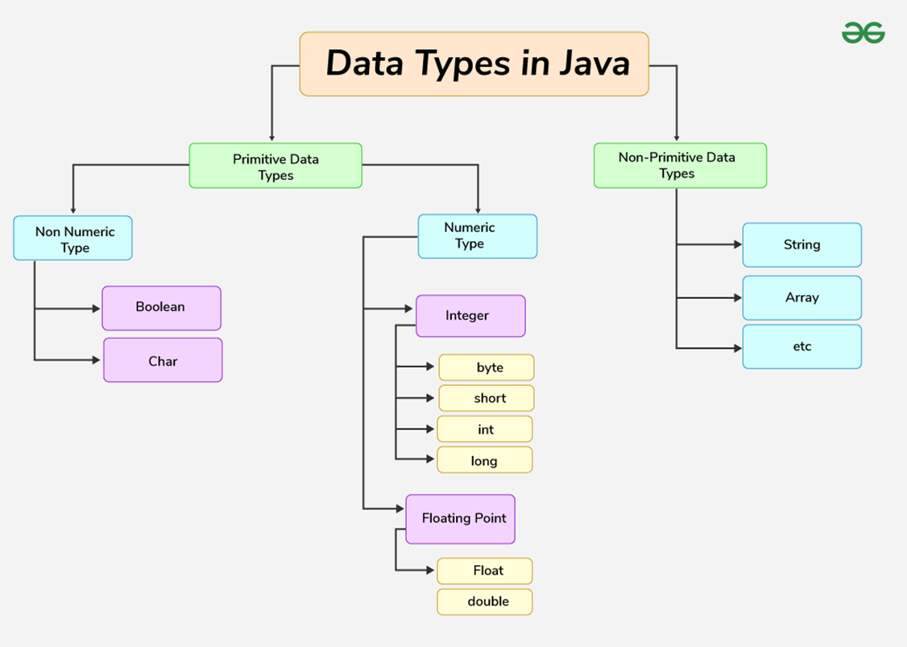
</div>
<div align="center">
    <figcaption>
        <em>
            Native data types of Java described by   
            <a  
            href="https://www.geeksforgeeks.org/java/java-data-types/"
            rel="noopener noreferrer" 
            target="_blank">
                geekforgeeks
            </a>.
        </em>
        <br>
        <br>
    </figcaption>
</div>

- **Types Defined by Libraries**

    Not only languages, but also libraries can introduce more specialized data types, often optimized for certain contexts.
    A library like `NumPy`, used in `Python`, defines, for example, variants of integers and floating-point numbers with different dimensions (`int16`, `int32`, `uint16`, `float32`, etc.) to balance precision and memory consumption in scientific applications.

- **Towards Custom Types in OOP**

    With object-oriented programming, technology goes a step further: the developer is not limited in using the types provided by the language or libraries, but can define new types by modeling real-world entities.
    In `Java`, a class can be viewed as a "blueprint" for creating *custom variables* (**objects**), capable of grouping different data and their behavior into a single unit.

- **Primitive and Structured**

    To navigate all these types, it's useful to distinguish between ***primitive*** types and **structured** (or **non-primitive**) types.
    Primitive types are elementary, non-decomposable types, such as *ints* or *booleans*, while structured types combine multiple values ​​or references (such as *arrays*, *lists* or *objects*), allowing for richer information to be represented starting from the basic building blocks.

<div align="center">
    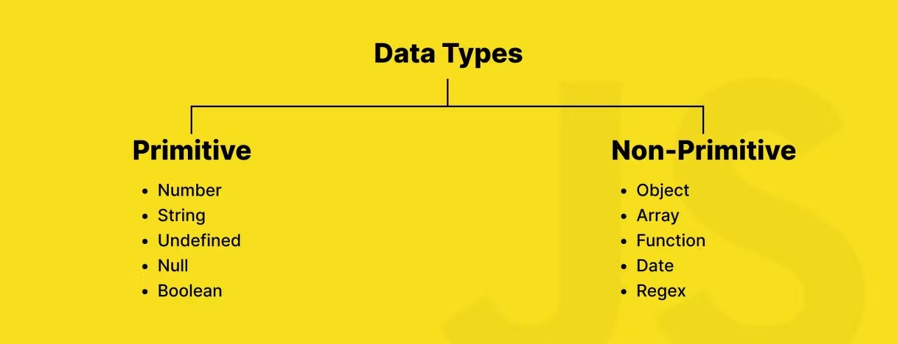
</div>
<div align="center">
    <figcaption>
        <em>
            Data types offered by JavaScript.
        </em>
        <br>
        <br>
    </figcaption>
</div>

### Variables and Assignment

When assigning a variable in a program, a notation similar to a math expression is used. Let's look at the following `Python` example:

```Python
a = 42
```

The `=` (*equal*) operator is the same used in mathematical operations, but in this context it has a different meaning. Indeed, in programming ***an assignment does not maintain the same meaning when read left to right or right to left***. 

It works in math since they make the first and second members equal, and are therefore mirror images with respect to the equality sign. In programming instead, the `=` sign means: "**I assign the value at my right to the variable at my left**". The reading can not be, consequently, specular.

### Variables: General Primitives Overview

The following are just introductory examples showing, at a general level, the basic characteristics of the most common variables. Keep in mind that they are not presented following a specific language. For more language-specific examples, take a look at links presented after the list.

- **Integer:**
    
    Example: `int a = 1;` <br>
    Description: integer numbers, without decimals.

- **Float:**
    
    Example: `float b = 1.16;` <br>
    Description: numbers with a decimal point, such as `3.14` or `-0.001`.

- **Double:**
    
    Example: `double c = 1.0;` <br>
    Description: as floating point numbers, but with higher precision (usually the are representede by 64 bits, vs the 32 bits of `float`).

- **Char:**
    
    Example: `char d = "k";` <br>
    Description: representation of a single alphanumeric character.

- **String:**
    
    Example: `str e = "abcd";` <br>
    Description: sequence of characters representing a text; in some languages, strings are a primitive type (e.g., JavaScript), in other they are considered as a collection of characters.

- **Boolean:**

    Example: `bool f = true;` <br>
    Description: variables that can assume only two values, that are `true` or `false`. Sometimes the values must be capitalized, in some other implementations also numerical values (i.e., `1` and `0`) are accepted.

### Variables: Non Primitives - or Structured Overview

- **Array:**

    Example: `array int g = [1, 42, -3, 4];` <br>
    Description: ordered collection of homogeneous elements, variable in size. In some languages, the size is fixed, and defined at the array declaration. Note that, if a language does not offer a string type, it is possible to build strings using an *array of chars* (e.g., `array char h = ["h", "e", "l", "l", "o", "!"];`).

- **List:**

    Example: `list i = ["a", 3, "hello", 42];` <br>
    Description: ordered collection of heterogeneous elements, variable in size. It is a data structure typical of `Python`.

- **Tuple:**

    Example: `tuple k = ("a", 3, "hello", 42);` <br>
    Description: ordered collection of heterogeneous elements, **immutable**. The latter characteristic makes tuples useful when it is necessary to store some temporary values in a structure that must not change, even accidentally. By the way, *immutability does not imply the read-only property*. It is a data structure typical of `Python`.

- **Set:**

    Example: `set j = ("a", 3, "hello", 42);` <br>
    Description: unordered collection of heterogeneous, unique elements. It has been implemented to model sets as a mathematical concept, and their properties. It is a data structure typical of `Python`.

- **Dictionary:**

    Example: `dict l = {"a": 3, "b": "hello"};` <br>
    Description: it is a collection of *key-value pairs*. Keys can be only be of `int` or `str` type, while values can be anything. In some implementations, dictionaries (sometimes also called *maps*) do not guarantee an insertion order. In other, they do. It is a data structure typical of `Python`.

### Language Specific Examples

For language specific example, visit the following link: 

<!-- TODO: complete with internal and external links -->
- Java
- Python


## User I/O

At a certain point of their execution, programs may receive data from an external source (at this stage, a *keyboard*), or may need to return a value to the user via some output peripheral - e.g., the screen through a *console*. 

These capabilities can be generally drawn with a flowchart, but it can become somewhat cumbersome if certain precautions are not taken. 

<div style="text-align:center">

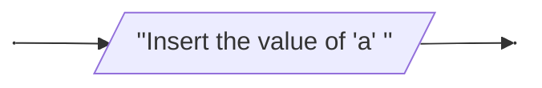
<caption>
    <em>Example of a not so clear I/O flowchart block.</em>
    <br>
    <br>
</caption>
</div>

Take for example the node above: is it an input node? is it an output? What does it expect or represent? Now let's look to the following example:

<div style="text-align:center">

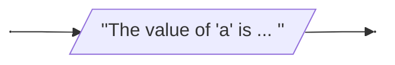
<caption>
    <em>Another not so clear I/O flowchart block.</em>
    <br>
    <br>
</caption>
</div>

The uncleareness is still there. It is not immediately clear if the block is an input or an output, if it expects an interaction from the user or if it underlines a step where the program wants to return the value of a variable on the screen. 

To overcome these limitations, within the perimeter of this course alone, the following "*dialect*" is proposed, to clear out the actual purpose of an input or an output flowhchart block. 

### Refined Output Block for Flowcharts

Let's start from the output block, since is the easire to redesing. To differentiate and input from an output block it is possible to add a little label close to the block reporting the its meaning. 

Seconldy, basically an output block must perform two actions: the first is to return a *static string* (i.e., a fixed value); the second is to report the value of a variable. To reach the desired result it is possible to use the double quotes in a smart way. Let's look at the following example: 

<div style="text-align:center">


<caption>
    <em>Example for a refined output I/O block.</em>
    <br>
    <br>
</caption>
</div>

Basically, everything that is encapsulated into the double quotes is a fixed text displayed on the console, while not encapsulated values are variables. The two pieces of information are divided by a comma (`,`) for order purposes.

### Refined Input Block for Flowcharts

When a program expects an input from the keyboard, it also needs to know where to store the received input. In other words, the typed values must be assigned to a variable, and this variable needs to be specified.

Depending by the language, the keyboard input is managed as a stream of bytes of directly as a string. Here, for simplicity, it is directly considered as a string.

Moreover, usually the input activity of the program is preceded by a message printed in the console. Using flowcharts blocks, it can be possible to concatenate an output block with an input block, but the result would be a little bit messy. Therefore, the following notation also embodies a potential message to pass to the user .

<div style="text-align:center">

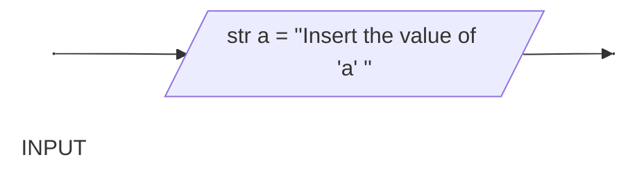
<caption>
    <em>Example for a refined input I/O block.</em>
    <br>
    <br>
</caption>
</div>

Let's breakdown the block from left to right. First of all, a label specifying that it is an *input* block is added. This detail improves readability. 

A sort of variable "assignation" is setup. Indeed, the operator assignment (`=`) is used, preceded by the declaration of the name of the variable that will store the received input from the keyboard, and of the type that it is - `str`, as said before. Secondly, at the right side of the assignment operator a string encapsulated in double quotes (`" "`) is reported, representing the message to print to the screen to advise the user about the entry to input. 


## Data Types Conversion

At a certain point of a program flow, an information stored in a variable under a certain type may need to be changed. User inputs from keyboard are a perfect example: they are ingested as strings (as seen before), but then the information might need to handled as another type - for example, an `int`.

Thus, it is necessary to define a way to represent variable type conversion - also called, *casting*. In the following, there is a practical example: 

<div style="text-align:center">

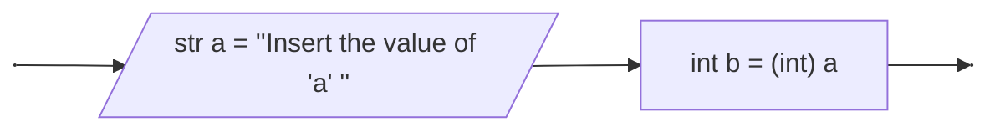
<caption>
    <em>Example for a variable cast.</em>
    <br>
    <br>
</caption>
</div>

The cast is represented as a particular assignment, where the right-hand value to assign is preceded by the type that it must take. In the example above, it is assigned to the variable `b` the value assigned to `a`, but before the assignment, it is converted in an integer.

Casting results may vary with respect to the programming language of choice. For example: 

<div style="text-align:center">

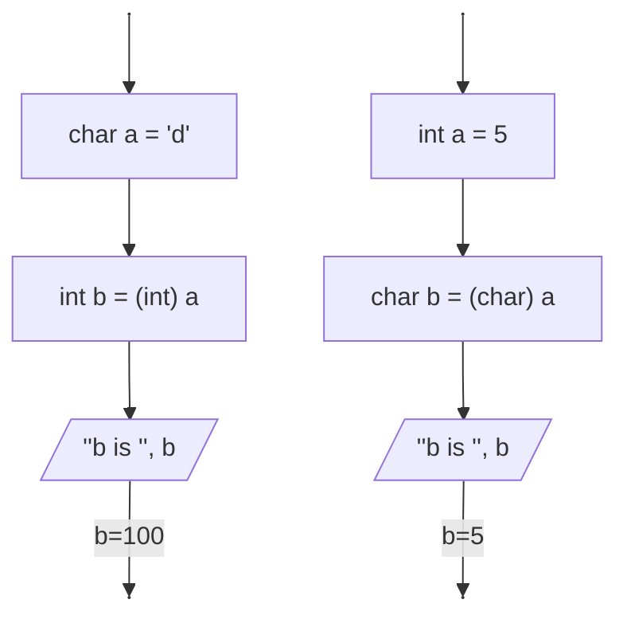
<caption>
    <em>Example for a variable cast.</em>
    <br>
    <br>
</caption>
</div>

If the logic on the left is implemented in `Python`, then the result will be: 

```
ERROR!
Traceback (most recent call last):
  File "<main.py>", line 4, in <module>
ValueError: invalid literal for int() with base 10: 'd'

=== Code Exited With Errors ===
```

This because `Python` does not support such conversion. By the way, in `C++` the result is different: 

```
b is 100
```

Indeed, `C++` handles the conversion levereaging the ASCII table: in this table, used to convert keyboard characters into a (binary) number, the letter `d` corresponds to the value `100`. More information about the ASCII table [here](https://en.wikipedia.org/wiki/ASCII).


## Variables Roles

In a program, variables can be used in various ways. Even if it might be difficult (or useless) for an experienced program to define these differences, let's take a look at various ways a variable can be used.

### Support Variable

A variable can be used as a support to temporarily save a certain pieces of information. Consider for example the following problem: you have two variables of the same type, and you want to swap them. How would you do it? Draw a flowchart. 

The result is showed [here](assets/images/18-variables-swap-flowchart.png).

### Flags

Flag variables are a special case of boolean variables, widely used to track "what's happening" in a program with a single piece of information: yes/no, true/false, on/off.

A flag represents the state of a certain logical concept or event in the program. It is usually implemented as a Boolean (`true`/`false`) or a binary value (`0`/`1`), but what matters is the meaning: "*the condition is satisfied*" or "*the condition is not satisfied*".

In this context, values ​​true and false not only describe the logical truth of an expression, but are often interpreted as labels closer to the problem domain.
For example, a flag can indicate whether a device is `on`/`off`, whether a request has been `completed`/`incomplete`, whether an input is `valid`/`invalid`, or whether a user is `authenticated`/`unauthenticated`.

In general, flags indicate whether a certain condition has been reached or not and are read within control structures such as `if`, `while`, or `for` to determine the flow of the program.
They are particularly useful when you want to remember that "*something happened*" (for example, an error detected, an item found in a search, a time limit exceeded) and react accordingly at a later point in the code.

<div style="text-align:center">

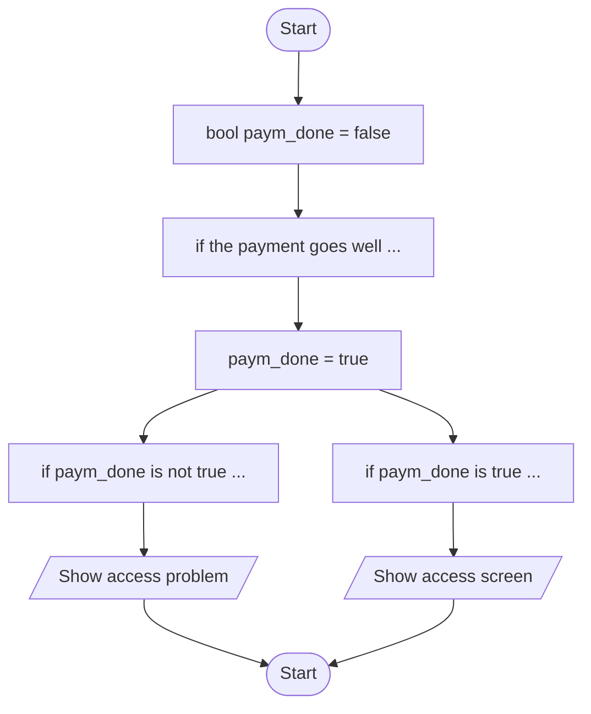
<caption>
    <em>Flowchart using a flag variable.</em>
    <br>
    <br>
</caption>
</div>

### Switches

Switches are useful when the program must distinguish not only between `true` and `false`, but between multiple operating modes or possible states of the same concept.

A switch can be thought of as a "state variable" that can assume one of several mutually exclusive values ​​(for example, `OFF`, `PLAY`, `PAUSE`, `REC`).
Unlike flags, which represent binary conditions, here the state is chosen from a *finite set of options*, and at any given moment the switch is in exactly one of them.

Options can be modeled with very different types depending on the language and the complexity of the domain. Strings, symbolic integers, enumerations, or actual objects (i.e., *a class that models an actual state*) can be used when each state must have dedicated logic and data, as in *state machines* or the *State* pattern.

Switches and program behavior
In practice, the value of the switch is read within control structures (typically a `switch`/`case` statement or an `if`/`else` chain) to decide which state to use. Execute code block.
This allows you to clearly change the behavior of a function or an entire component based on the selected mode, such as "basic configuration", "advanced," or "debug".

Imagine a portable music player: its current state can be `STOP`, `PLAY`, `PAUSE`, `FORWARD`, or `REWIND`.
The variable representing this state is a `switch`: when the value is `PLAY`, the system plays the music; when it is `PAUSE`, it pauses it; when it is `STOP`, it stops the audio and resets the position, and so on. The entire control logic revolves around the fact that, at any given moment, the program knows exactly what mode it is in.

<div style="text-align:center">

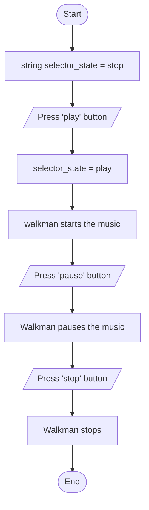
<caption>
    <em>Flowchart using a switch variable.</em>
    <br>
    <br>
</caption>
</div>

### Counters 

A counter variable is one of the simplest but also most important forms of control variable: its purpose is to measure "how many times" something has happened or represent a numerical quantity that increases or decreases over time.

A counter is typically an integer variable that starts from an initial value (often `0`) and is incremented or decremented by a fixed amount, usually `1`, each time a certain event occurs in the program.
This controlled evolution of the value allows for the compact representation of information such as the number of iterations of a loop, the number of elements already processed, or the number of occurrences of a certain condition.

In particular, within loops, the counter is often the variable that determines both *how many times the loop repeats* and *what is processed at each step*.
For example, in a loop that iterates through an array, the counter can represent the **index of the current element**, or the **number of values ​​that satisfy a certain property**, such as "how many numbers are even" or "how many votes are above the threshold."

Despite appearing "simple", counters have a crucial role in programs, as they allow for controlling the positioning of the chunk of software visiting a data strucutre such as a *list*, a *string* or a *file*. Finally, they are also useful for collecting statistics such as how many times a user has logged in, how many requests a server has handled, how many times an error has been generated. 

<div style="text-align:center">

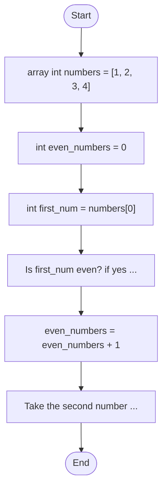
<caption>
    <em>Flowchart using a counter variable.</em>
    <br>
    <br>
</caption>
</div>

### Totalizer or Accumulator

A totalizer (or accumulator) is a variable designed to "sum" a series of values, progressively accumulating a total as the program processes the data.

Unlike a counter, which simply counts how many times something happens, a totalizer represents a true summation: each time a new value is encountered, it is added to the variable's contents.

The totalizer is typically numeric (integer or real) and is initialized to zero before starting processing, so that the final result corresponds to the sum of all the added values.

The typical scheme is: initialize the totalizer to 0, iterate through a collection of data, and, for each element, update the totalizer by adding the corresponding contribution.
A classic example is the calculation of daily turnover: given an array containing the amounts of all the receipts issued, the program adds these amounts one after the other in a totalizer, which at the end of the cycle will contain the total collected for the day.

<div style="text-align:center">

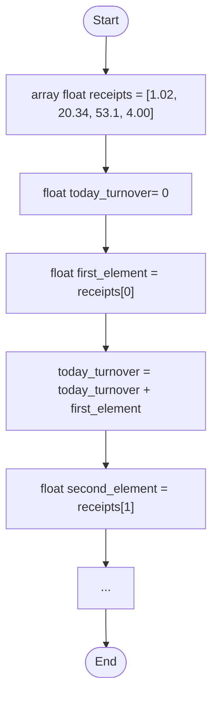
<caption>
    <em>Flowchart using an accumulator variable.</em>
    <br>
    <br>
</caption>
</div>


## Logical Operations

Logical operations are the basis of all decisions a program makes: they allow you to ask questions about data and obtain a truth value — `true` or `false` — as the answer. To formulate these questions, expressions are constructed with relational operators and logical operators, which often work together.

**Relational Operators:**
Relational operators ***compare two values*** ​​and determine whether a certain relationship exists between them, returning a Boolean value as the result. Typical examples are "equal to", "not equal to", "greater than", and "less than or equal to", which allow you to write conditions such as "is the temperature greater than 30?" or "is the entered user the same as the logged-in user?".

**Logical Operators:**
Logical operators, on the other hand, ***combine*** or ***modify*** Boolean values ​​already obtained from comparisons or other conditions, allowing you to construct more complex expressions. With operators like `AND`, `OR`, and `NOT`, you can, for example, check whether two conditions are both `true`, whether at least one is sufficient, or whether you want to deny a certain condition, such as "the user is of legal age and authenticated" or "the input is not empty".

### Relational Operators

As introduced beofore, relational operators are used to perform comparisons between values. Operations performed by relational operators always return a Boolean result (`true` or `false`).

Operations are: 
- `==` (equal): Tests whether two values ​​are equal.

    ```python
    a = 3
    b = 3
    c = 4

    print(a == b)   # Output: True
    print(a == c)   # Output: False
    ```

- `!=` (not equal): Tests whether two values ​​are different.

    ```python
    a = 3
    b = 3
    c = 4

    print(a != b)   # Output: False
    print(a != c)   # Output: True
    ```

- `>` (greater than): Tests whether the first value is strictly greater than the second.

    ```python
    a = 3
    b = 3
    c = 4

    print(a > b)   # Output: False
    print(c > a)   # Output: True
    ```

- `>=` (greater than): Tests whether the first value is greater than or equal to the second.

    ```python
    a = 3
    b = 3
    c = 4

    print(a >= b)   # Output: True
    print(c >= a)   # Output: True
    ```

- `<` (less than): Tests whether the first value is strictly less than the second.

    ```python
    a = 3
    b = 3
    c = 4

    print(a < b)   # Output: False
    print(c < a)   # Output: False
    ```

- `<=` (less than): Tests whether the first value is less than or equal to the second.

    ```python
    a = 3
    b = 3
    c = 4

    print(a <= b)   # Output: True
    print(c <= a)   # Output: False
    ```

### Logical Operators

Logical operators combine two or more Boolean expressions. Since relational operators always return a Boolean value, their results (and the original expressions) can be combined to obtain specific information.

- `&&`, `and`: the result is `true` if both values are `true`.
    ```python
    (5 > 3) and (3 > 1) # True
    (5 > 3) and (3 > 4) # False
    ```
- `||`, `or`: the result is `true` if at least one value is `true`.
    ```python
    (5 > 3) or (3 > 4) # True
    (5 < 3) or (3 > 4) # False
    ```
- `!`, `not`: logical negation, inverts the Boolean value of an expression.
    ```python
    not (5 > 3) # False 
    not (3 > 5) # True
    ```


## Program Control Structures

In a program, as in a flowchart, without any additional instruction, instructions are executed linearly, one after the other. By the way, there are scenarios where it is necessary to make decisions or repeat certain operations multiple times.

For example, think about a fairly easy algorithm where it is needed to execute a certain task *for every element* of a collection. The words "*for every element*" are clearly associated to a potential control structure (i.e., an iterative cycle) enabling a  task to be repeated multiple times. 

Here it is when control structures become useful. Control structures are language constructs that govern the flow of execution, establishing if, when, and how many times a block of instructions should be executed.

Three major families are generally distinguished: sequential structures, in which instructions are executed in the order in which they are written; selection structures (such as `if` or `switch`), which allow the program to choose between alternative paths based on the value of a condition; and iterative structures (such as `while` or `for`), which allow a block of code to be repeated as long as a certain condition remains `true`. 

Moreover, there are furthere instructions adding more functionalities to the flow control - such as `break`, `continue`, `goto` or `return`, enabling more complex variant in the code strucutre. 

Considering our natural way of describing the steps of an algorithm, transforming our sentences into control flow commands means translating questions into code: "Should I check a condition?" then I'll use a selection; "Should I visit all the elements of a data structure?" then I'll need a loop that traverses them one by one.

### Deciding What To Do: the `if ... else` Block

The `if … else` allows a code block to be executed only if a specific condition is `true`. If the condition is `false`, alternative blocks (`else`, or `elif`) can be specified. In block diagrams, it is represented by a diamond-shape decision or test block.

<div style="text-align:center">

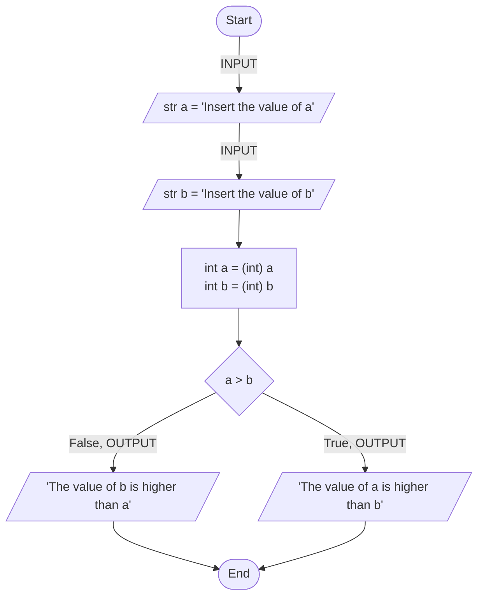
<caption>
    <em>Flowchart with an if statement.</em>
    <br>
    <br>
</caption>
</div>

In the above example, the `if` block check whether the value of the variable `a` is higher than `b`. The relational check always returns a `true` or a `false` value, which is the only value the `if` statement can use to choose the right branch to visit next.

### Choosing Between Multiple Options: the `switch-case` Block

From time to time it is necessary to evaluate multiple options with respect the same relational operation. In this scenario, multiple `if` blocks should be concatenated one after the other. Alternatively, some languages ​​(e.g., `C`, `C++`, `JS`), offer an alternative control flow structure, that is the `switch-case` form. 

This alternative is always represented by a diamond-shape block, which value is instead compared with respect to the value identified on each branch, thus allowing to choose between different blocks of code.

<div style="text-align:center">

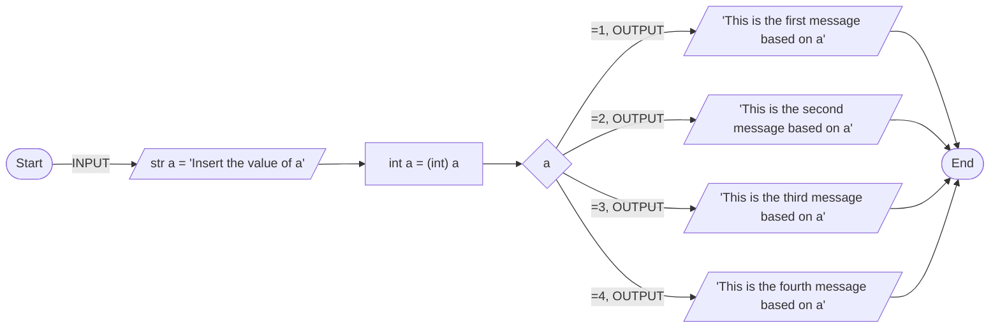
<caption>
    <em>Flowchart using the switch statement.</em>
    <br>
    <br>
</caption>
</div>

### Cycling Multiple Times a Piece of Code: the `for` Cycle

The `for` loop is an iterative control structure designed to *repeat a block of statements a specific number of times*, controlled by a **counter** variable. Unlike other loops, it combines **three key elements**: 

1. the initialization of the counter, 
2. the condition that decides whether to continue iterating, and 
3. the updating of the counter at each iteration. 

This makes it particularly useful when you **know in advance** how many iterations are needed, for example, to iterate through the elements of an array or perform a certain operation on the first N integers.

<div style="text-align:center">

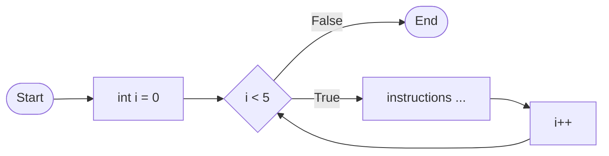
<caption>
    <em>Flowchart employing a for loop. Guess the blocks forming the loop.</em>
    <br>
    <br>
</caption>
</div>

### An Alternative Loop: the `while` Cycle

The while loop is a **condition-controlled** iterative structure: it allows to repeat a block of instructions *as long as a certain logical expression remains* `true`. 

Unlike the `for` loop, which is designed for a known or easily computable number of iterations, the `while` loop is ideal when *it is not know in advance how many times it is necessary to repeat the operation*, such as when waiting for a certain input, monitoring a sensor, or continuing to read data as long as there is data. 

In practice, before each iteration, the program checks the condition: if it is satisfied, it executes the body of the loop; otherwise, it exits and moves on to the next instruction.

<div style="text-align:center">

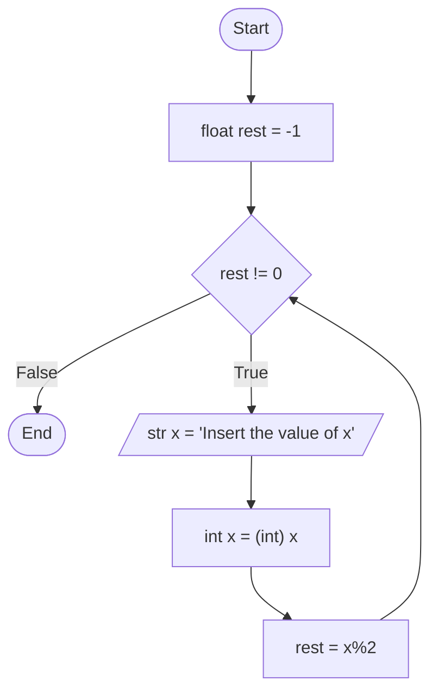
<caption>
    <em>Flowchart showing a while loop.</em>
    <br>
    <br>
</caption>
</div>

### Another Loop: the `do-while` Cycle

The `do-while` loop is a variant of the `while` loop in which the condition is checked ***after the block of statements has been executed***, and not before. This means that *the body of the loop is executed at least once*, regardless of the initial value of the condition, and only then does the program decide whether to repeat the iteration or exit. 

The `do-while` loop is therefore particularly useful in all those cases where you want to **guarantee an initial action** (for example, displaying a menu or requesting user input) and then repeat it until a certain continuation condition is satisfied.

<div style="text-align:center">

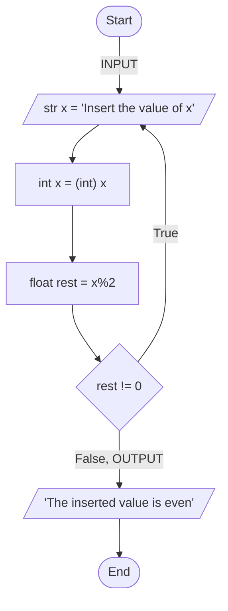
<caption>
    <em>Flowchart showing a do-while loop.</em>
    <br>
    <br>
</caption>
</div>

### Blocking a Loop: the `break` Statement

The `break` statement is a command that allows you to prematurely interrupt the execution of a `loop` or `switch`, jumping directly to the instructions following the block it's in. 

In practice, when a certain condition occurs during an iteration (for example, it is found the item the program is looking for or the user has chosen to exit the menu), the `break` statement allows you to "immediately exit" the loop, without completing all the remaining iterations. 

This makes it a very useful tool for making *code more efficient* and readable when it doesn't make sense to continue repeating the block of instructions beyond a certain point.

<div style="text-align:center">

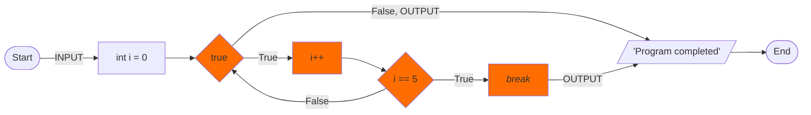
<caption>
    <em>Flowchart showing the use of the break statement.</em>
    <br>
    <br>
</caption>
</div>

### Jumping a Loop Cycle: the `continue` Statement

The `continue` statement is a command that allows you to skip the rest of the code in the current iteration of a loop *and proceed directly to the next*. 

When the condition associated with the continue statement is satisfied, the program ignores the remaining statements within the loop body, returns to checking the condition (or updating the counter in the case of a `for` loop), and resumes execution from the next loop. 

This is particularly useful when, within a loop, you want to "filter" certain cases to skip without completely interrupting the loop—for example, ignoring invalid values ​​or blank lines in a data sequence.

<div style="text-align:center">

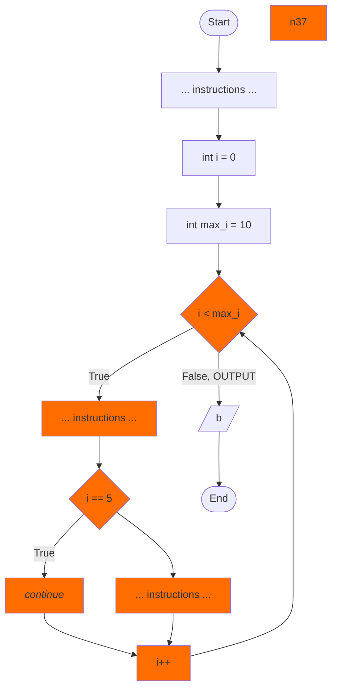
<caption>
    <em>Flowchart showing the use of the continue statement.</em>
    <br>
    <br>
</caption>
</div>

### Nested Controls

Control structures and branch instructions do not exist in isolation: they can be nested, that is, inserted one inside the other, to describe even very complex processes. 

An `if` block can contain a `for` loop, which in turn contains a `while` with a `switch` inside it, and so on; within these loops, `break` and `continue` can be used to fine-tune the flow of execution. A clear example is the previous flowchart, showing that an `if` statement can be nested inside of a `for` loop. 

This nesting allows real-world situations involving decisions within decisions, conditional repetitions, and special cases to be translated into code, while maintaining a clear and readable logical structure if the levels of depth are carefully chosen and the code is commented appropriately.


## Program Flow Control and Data Structures

The title "Program Flow Control and Data Structures" brings together the two fundamental pillars of *imperative programming*: **how the program decides what to do**, and **what data these decisions affect**. Control structures (sequences, selections, loops, controlled jumps) determine the path that execution will follow over time, while data structures (arrays, lists, queues, stacks, sets, maps) organize information in memory efficiently and meaningfully for the problem at hand. 

Understanding how to combine these two aspects—choosing the right control flow to traverse and transform the right data structure—is what allows us to design clear, correct, and high-performance algorithms, moving from simple basic exercises to robust solutions for real-world applications.

In previous sections, different basic data structures, such as *array*, *list*, *set*, *tuple*, and *dictionary*. How can a program visit all elements in these data structure? Using flow controls! 

### Accessing Arrays Elements

Recall the given definition of an array, that is an *ordered sequence of homogenous elements*. 

<div style="text-align:center">

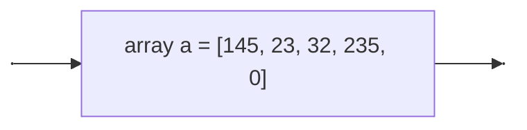
<caption>
    <em>Recall about how to define an array.</em>
    <br>
    <br>
</caption>
</div>

Since an array is ***ordered***, each element inside of it has a ***defined position***.

<div align="center">
    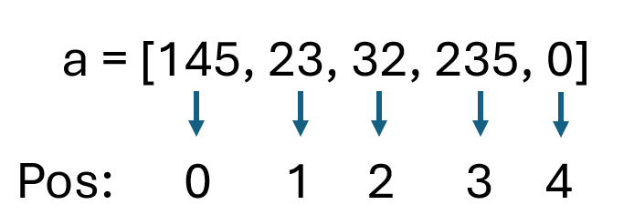
</div>
<div align="center">
    <figcaption>
        <em>
            Array positioning, visualized.
        </em>
        <br>
        <br>
    </figcaption>
</div>

Almost all programming languages give the possibility to access to the elements of a collection, such as an array, starting from their positioning. The notation may vary from language to language, but the most common and the one introduced and used in this context is the following: 

```
type_of_the_element element_at_the_accessed_position = name_of_the_collection[position_to_access]
```

Given the array in the previous, example, it is possible to access to its first element writing: 

```
int first_element = a[0] 
```

> [!NOTE]
>
> What value will store the variable `first_element`?

To visit all elements, and have the possibility to use them in the program, it is possible to use a `for` loop.

<div style="text-align:center">

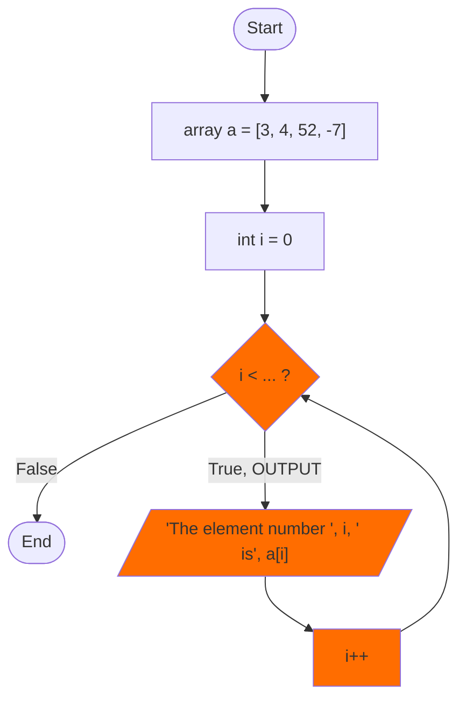
<caption>
    <em>How to visit all elements of an array.</em>
    <br>
    <br>
</caption>
</div>

#### Other examples: 

<div style="text-align:center">

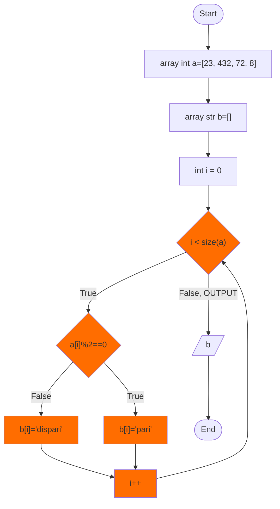
<caption>
    <em>Another example of a flowchart visiting all elements of an array.</em>
    <br>
    <br>
    <br>
</caption>
</div>

<div style="text-align:center">

```mermaid
flowchart TB
    n27["array int a=[23, 432, 72, 8]"] --> n39["array int b=[]"]
    n15["i &lt; size(a)"] -- False, OUTPUT --> n33["b"]
    n15 -- True --> n29["a[i]==72"]
    n29 -- True --> n37["continue"]
    n31["i++"] --> n15
    n29 -- False --> n38["b[i]=a[i]"]
    n33 --> n34(["End"])
    n1(["Start"]) --> n27
    n38 --> n31
    n39 --> n28["int i = 0"]
    n28 --> n15
    n37 --> n31

    n39@{ shape: rect}
    n15@{ shape: diam}
    n33@{ shape: lean-r}
    n29@{ shape: diam}
    n37@{ shape: rect}
    n38@{ shape: rect}
    style n15 fill:#FF6D00
    style n29 fill:#FF6D00
    style n37 fill:#FF6D00
    style n31 fill:#FF6D00
    style n38 fill:#FF6D00
```
<caption>
    <em>A third example of a flowchart visiting all elements of an array.</em>
    <br>
    <br>
</caption>
</div>

Similar flowcharts can be done for `list` and `tuple`, since they are collection implementing the concept of *order*.

### Accessing Dictionaries Elements

It is necessary to make a slightly different reasoning for `dictionary`: indeed, even if in some implementation they implement the concept of order (see `Python 3.7`), a `dictionary` is meant to return its values by accessing its keys. It is therefore necessary to somehow ***extract the list of the keys*** of a dictionary. 

To do it, in the following the notation `dict_name.keys()` will be used, which is the actual notation used in `Python` to extract the collection of the keys of a dictionary. The result of this "method call" is a list, as `Python` does.

<div style="text-align:center">

```mermaid
flowchart TB
    n1["n1"] --> A["dict a={'a':1, 'b':2, 'c':3}"]
    A --> n3["list keys = a.keys()"]
    n3 --> n2["n2"]

    n1@{ shape: anchor}
    n2@{ shape: anchor}
```
<caption>
    <em>Example of the declaration of a dictionary and extraction of its keys using a flowchart. The variable a_keys is a list.</em>
    <br>
    <br>
</caption>
</div>

To add an element to a dict, it is possible to use the same notation of other data structures.

<div style="text-align:center">

```mermaid
flowchart TB
    n1["n1"] --> A["dict a={}"]
    A --> B["str my_key = 'first key'"]
    B --> C["a[my_key] = 3"]
    C --> n2["n2"]

    n1@{ shape: anchor}
    n2@{ shape: anchor}
```
<caption>
    <em>Example of the declaration of a dictionary and extraction of its keys using a flowchart. The variable a_keys is a list.</em>
    <br>
    <br>
</caption>
</div>

As a result, the dictionary called `a` has associated the value `3` at the key `first key`.


## Let's Experiment!

1. Calcolo della Media dei Numeri Positivi
    Descrizione: Scrivi un diagramma di flusso che chieda all'utente di inserire numeri interi. Il programma deve terminare quando l'utente inserisce un numero negativo. Alla fine, calcola e stampa la media dei numeri positivi inseriti.

2. Ricerca del Numero Minimo e Massimo
    Descrizione: Crea un diagramma di flusso e un programma che chiede all'utente di inserire un elenco di n numeri (con n definito a priori). Il programma deve determinare e stampare il numero minimo e massimo tra quelli inseriti.

3. Verifica di Numeri Primi
    Descrizione: Disegna un diagramma di flusso e scrivi un programma che prenda un numero intero come input e verifichi se è un numero primo. Il programma deve stampare "primo" o "non primo".

### Exercises from Docs

From the [doc](assets/docs/exercises/flowgorithm-exercises.pdf), execute: 
- Ex. 3, 4, 5, 6, 7, 8, 9, 10, 11, 12
- Ex. 15, 16, 17, 18, 26, 33, 35, 36, 40, 70, 94, 98, 99, 100, 101, 102


## Appendix: Programs to Draw Flowcharts

- [Draw.io](https://www.drawio.com/)
- [Lucidchart](https://www.lucidchart.com/)
- [Canva](https://www.canva.com/it_it/)
- [Figma](https://www.figma.com/)
- [MermaidJS](https://mermaid.js.org/) and [Mermaid Live Editor](https://mermaid.live/edit)
