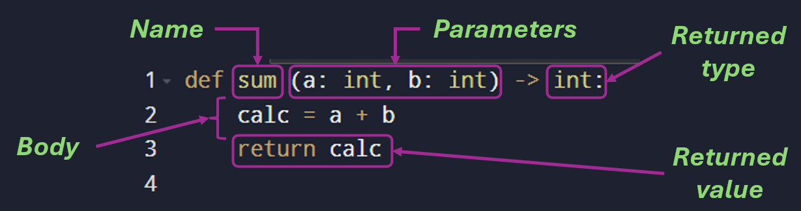
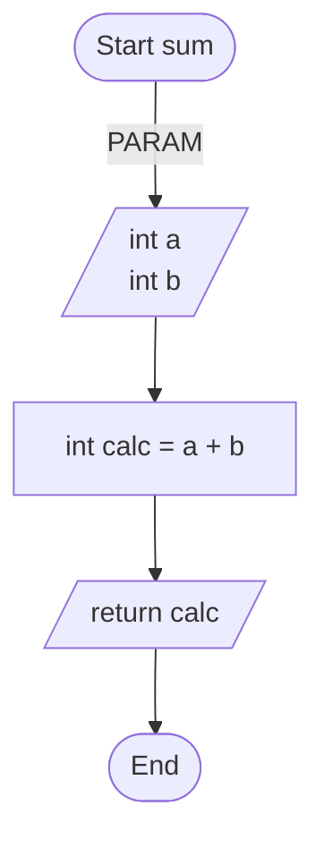
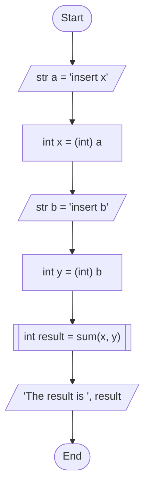
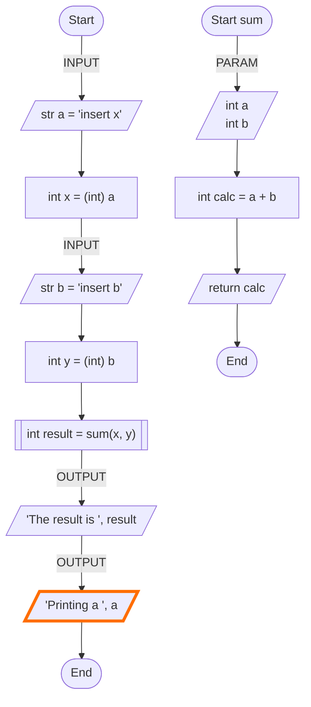
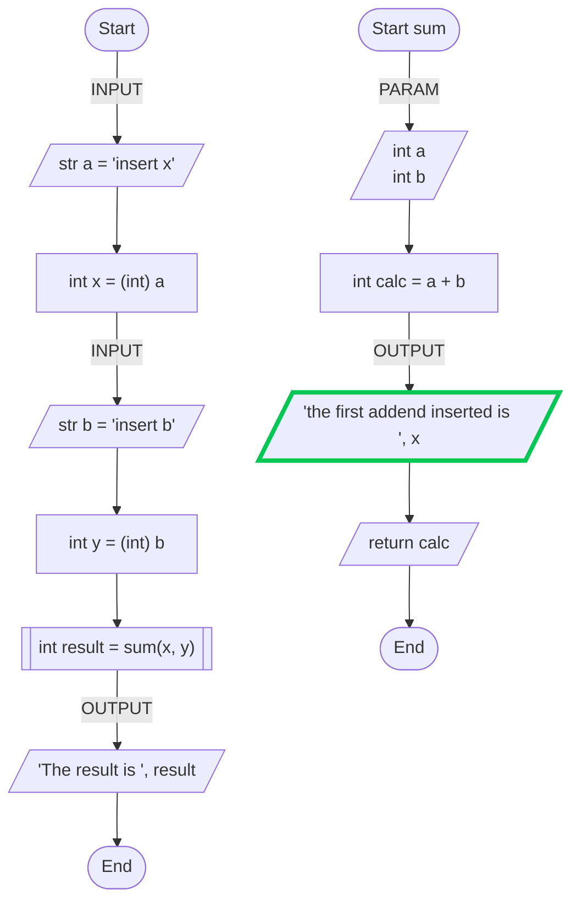

# Code Reusability

- [Why to Reuse Code](#why-to-reuse-the-code)
- [Functions: How Are Made](#functions-how-are-made)
    - [The Anatomy of a Function](#the-anatomy-of-a-function)
    - [Function, Procedures and Methods](#functions-procedures-and-methods)
    - [A Practical Example](#a-practical-example)
- [Functions Definition in Block Diagrams](#function-definition-in-block-diagrams)
- [Functions, Scopes and Flowcharts](#functions-scopes-and-flowcharts)
    - [Some Practical Examples](#some-practical-examples)
    - [Scope Types](#scope-types)
    - [Scope: Summing Ups](#scope-summing-up)
- [Let's Experiment!](#lets-experiment)

## Why to Reuse the Code

One of the fundamental principles of programming is ***code reusability***, meaning the ability to ***write instructions that can be used multiple times***, in ***different contexts***, ***without having to rewrite them each time***. In other words, it means creating **generic**, **modular**, and **independent** solutions that reduce duplication and increase development efficiency.

Writing reusable code doesn't just save time: it's also a way to improve software quality. A program made up of reusable parts is ***easier to maintain***, ***test***, and ***extend*** because changes in one module don't require rewriting throughout the rest of the project. This approach leads to a more organized, readable, and consistent structure.

***Why We Duplicate Code***

When starting programming, it's natural to solve every problem by writing code from scratch. For example, if a program needs to calculate the average of two numbers at multiple points, a beginner tends to rewrite the formula each time. As complexity increases, **this strategy becomes fragile**: if the formula needs to be changed, it must be rewritten everywhere. The risk of error increases, and the code becomes difficult to maintain.

***The DRY Principle***

A popular motto among programmers is "***Don't Repeat Yourself***" (**DRY**). Whenever we realize we're writing the same piece of code twice, we should ask ourselves if there's a way to enclose it in a single reusable entity. This principle underpins the creation of functions, classes, modules, and many other abstractions typical of modern programming.

***How Reusability Is Achieved***

Reusability is achieved through several key strategies:

- **Modularity**: Breaking the program into independent blocks, each with a specific responsibility.

- **Abstraction**: Hiding implementation details, offering a clear and easy-to-use interface.

- **Parameterization**: Building generic solutions that adapt to different cases using parameters or arguments.

- **Documentation**: Clearly explaining what each component does and how it can be reused elsewhere.

A good example is the definition of ***functions***: a **function** can encapsulate a common operation—such as calculating an average, sorting a list, or converting a measurement—and reuse it freely throughout the program.

***The Concrete Benefits***

The benefits of reusability are especially evident in the long term:

- Less code duplication and lower risk of errors.
- Faster development of new features.
- Ease of maintenance and bug fixing.
- Greater collaboration between developers: reusable modules can be shared or integrated into different projects.

Thinking in terms of reusability helps develop a designer's mindset: instead of writing just to solve an immediate problem, he starts writing code that can be useful in the future. It is precisely this ability to design with foresight that distinguishes simply "writing code" from true "programming."

## Functions: How Are Made

Functions are the first brick to achieve reusability. They are anything else than reusable code blocks, thought to absolve a specific task inside of a program. 

Functions enable and support:

- ***reusability***: a function can be called multiple times in a program, reducing duplicated code; 
- ***readability***: through the name of the function and its structure, it is possible to abstract the code, improving its *readability* and *comprehension*.
- ***maintenability***: functions enable to execute changes in the code in **only one point**, thus dramatically improving maintenance activities.

To define a function, it is necessary to define its **signature**:

> [!IMPORTANT]
> 
> The ***signature*** of a function is the set of information that permits to identify the function and to use it correctly. 

Intuitively, the **signature** is like a business card: it reports the name of the function, what it expects as an input, and what returns as an output. 

### The Anatomy of a Function

In most contests, a signature contains: 
- ***the function name***: it must be unique. The code encapsulated within the function is executed when the function is *called* or *invoked*; 
- ***input parameters***: the ***number***, ***order*** and oftentimes the ***type*** of input parameters are specified within the function signature. A function may also accept no input parameters, but it is important to remember that, if no other methodologies are provided, the order of insertion of parameters is important;
- ***returned type***: a function can return one result, more than one result, or no result at all. Each language provide ways to specify what type of information the system returns.
- ***function body***: the body is the actual code executed after the signature definition. It can be arbitrarily long and must employ the input parameters defined at the signature level. At its end, must also return values respecting the returned type specified in the signature. 

### Functions, Procedures and Methods

In the programming domain, (mainly) three different definitions of funtions arose: 

- ***function:*** a function is a block of code that performs a specific operation and returns a value. Functions are typically used for calculations or operations that produce a result. Functions are generally independent and can be called from different parts of the program.

- ***procedure:*** a procedure is similar to a function but does not return a value (or `void`). It is used to execute a set of instructions without a specific output. It is typically used to perform actions, such as updating data or printing information, without returning results.
- ***method:*** a method is a function associated with an object or class (OOP). It is called on an instance of the object or the class itself and can access and manipulate the object's data. Methods depend on the object or class to which they belong.

Therefore, the name of the same structure, as defined so far, can adopt a different name depending on the context of usage. Nevertheless, these names are mainly used as synonyms in most cases, with the boundaries differentiating each one, which fades into practice.

### A Practical Example

In the following, an example reporting a function definition is proposed.

    

    <figcaption>
        <em>
            Components of a function in Python.
        </em>
         
         
    </figcaption>

The defined piece of code can be called multiple times by using its name. The function implementation (i.e., its body) is hided to external programs calling the function. In other words, they do not care about how the code executed within the function is actually structured. They only care about the result of the function, which is specified by its signature.

## Function Definition in Block Diagrams

Functions can be defined also in block diagrams. 

The following piece of code ...

    

    <figcaption>
        <em>
            Example of a function usage in Python.
        </em>
         
         
    </figcaption>

... can indeed be represented by the following blok diagram: 

<caption>
    <em>Flowchart representing the sum function.</em>
     
     
</caption>

The actual flowchart defining a function is therefore characterized by the following elements: 

- a ***start*** node: this node is elliptical and contains both the keywords `start` as well as the name of the function, that in this case is `sum`.
- an ***input*** node, reporting the input parameters that the function needs to properly execute the steps in its body. To distinguish this block from other input/output blocks, the `PARAM` label has been added close to the block. 
- a ***body***, composed by an artitraty number of blocks, actually executing the processing steps of the function.
- a ***return*** block, represented as an I/O block, and using the keyword `return` which highlights the value returned to the piece of code calling the function. 

> [!NOTE]
> 
> For a function, some elements are mandatory, while others are not strictly required: for example, input parameters, I/O block, and `return` block are not strictly necessary for the function to be correctly defined.

After having defined a function in a flowchart, it can be used by *another flowchart*. A special block is used to specify that, in that point, a function is called. The block is a rectangle with double vertical borders, as highlighted in the following example: 

<caption>
    <em>A flowchart calling an external function ... defined by another flowchart.</em>
     
     
</caption>

Going further in the coding journey, it is possible to encounter different *specialized* types of functions, each of which absolve to a very specific task (e.g., *getters* and *setters*).

## Functions, Scopes and Flowcharts

Scope is one of the fundamental concepts for understanding where a variable "*exists*" and where it can be used in code. The concept is also present in flowcharts, in particular when the concept of function is introduced.

***What is meant by scope?***

The scope of a variable is the portion of the program within which that variable is visible and usable.
Outside its scope, the variable "does not exist": it cannot be read or modified, as if it had never been declared.

***Global and local scope***

In many languages, two typical cases are distinguished:

- **Global scope**: variables declared "outside" the main functions or blocks. They are visible in many parts of the program.
- **Local scope**: variables declared "inside" a function, an if block, a loop, etc. They are visible only within that block.

A local variable is created when the execution flow enters its block and is destroyed when the flow leaves that block. This avoids interference between different parts of the program that perhaps use the same names for variables with different roles.

***Why Scope is Important***

Understanding scope helps the developer:

- avoid errors due to reused names in different parts of the code;
- better control where changes can occur to certain data;
- think about the lifespan of variables (when they "come into being" and when they "die").

In practice, scope is an organization and protection tool: it keeps data "close" to the piece of code that uses it and hides it from the rest.

***Connecting Scope to Flowcharts***

A flowchart represents the program's execution flow through blocks (start, statements, decisions, loops, end).
To visualize scope within a flowchart, just think about the following:

Each logical block (e.g., the "body of a loop," the "THEN branch of an if statement," or the "ELSE branch") defines a small "world" in which certain variables can exist.

Variables local to a block exist only within the subdiagram representing that block.

Global variables, on the other hand, are available in all blocks of the diagram, regardless of where you are in the flow.

Moreover, remember that variables defined within a "more external scope" are visible in "more internal scopes", while the opposite is not always true.  

***How to Represent Scope in a Flowchart***

When drawing a flowchart with scope in mind, it can be helpful to:

Visually group blocks that share the same scope, for example, by enclosing the body of a loop or an if statement in a mental "frame": within that frame, certain local variables apply.

Note in the comments of the flowchart (or in the margin) which variables are created when entering a certain block and which cease to exist when exiting.

If you have variables with the same name but different scopes (for example, a global i variable and an i local to a loop), highlight in the comments that they are different scopes.

In this way, the designer can connect the flowchart structure to the concept of scope: where the flow enters a subblock, new local variables are created; when the flow exits, those variables are no longer available.

### Some Practical Examples

<caption>
    <em>Which "a" variable is printed in the highlighted block? The one that is visible in that scope!</em>
     
     
</caption>

<caption>
    <em>This alternative works, however in Python (for example), it can be accessed in read-only mode. If I also wanted to write, the variable would have to be global.</em>
     
     
</caption>

### Scope Types

Scopes can be classified into 3 groups: 

- ***Local scope:*** a variable declared within a function or code block is *local* to that function/block and is not visible outside it.
- ***Global scope:*** a variable declared outside of all functions or blocks is *global* and can be accessed from ***anywhere*** in the program.
- ***Block scope:*** variables declared within a block (such as `if`, `for`, etc.) exist only within that block (depending on the language). Blocks can be identified in different ways depending on the language (e.g., in `Java`, `{ }` ; in `Python`, identified by ***indentation***).

### Scope: Summing Up

The concept of scope is similar in every programming language, but some features may differ. The concept of scope is not limited to functions, but is also found within **classes** and **objects** (OOP).
But... Why does scope exist?

- **Data protection:** it keeps variables protected from accidental changes in the code.
- **Organization:** it helps separate variables from their context of use.
- **Conflict limitation:** it prevents variables with the same name from interfering in different contexts (points in the program).

## Let's Experiment! 

1. ***Logical-Mathematical Operations:***

    Draw a program block diagram that prints a menu and gives the user the option to choose between different mathematical operations.

    The menu must print and wait for user input.
    There must be an option to exit the main menu and terminate the program.
    
    The program options are:
    - add two numbers entered by the user,
    - check whether a number entered by the user is even or odd,
    - calculate the factorial from a number entered by the user with a maximum input value of 10,
    - calculate the maximum of three numbers,
    - check whether a word is a palindrome.