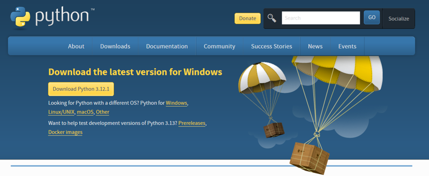
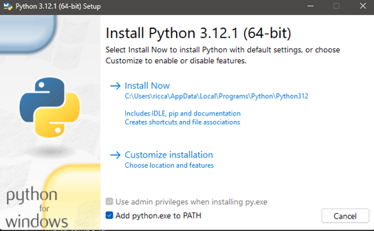

# Python: Installation

1. On your browser go to the following address and start the download of python for your operating system -> 
[https://www.python.org/downloads/](https://www.python.org/downloads/)

    

    <figcaption>
        <em>Python Website Banner.</em>
         
         
    </figcaption>

2. When you start the installation, a window similar to the one below opens.

    

    <figcaption>
        <em>Python installation screenshot.</em>
         
         
    </figcaption>

<!-- TODO: specify details about installation -->

3. Check the box `Add python.exe to PATH` and click `Install Now`. 

> [!NOTE] 
> The PATH is an OS environment variable. Associated with the path where Python will be installed, you can run it with a terminal throughout your system without having to recall the installation path each time.

If you don't add Python to your PATH, it will be harder to use from the terminal. To add Python to PATH, look at the following steps:

1. You should find the path where Python is installed (if you want to use the global interpreter).
    -  On ***Windows***:         
        - Terminal: `where Python`     
        - Result: `C:\Users\YourUser\AppData\Local\Programs\Python\Python39\python.exe`

    - On ***Linux*** / ***MacOS***:   
        - Terminal: `which Python3`        
        - Result: `/usr/bin/python3`
    
2. When you run each script, you should call the entire path.
    <!-- TODO: Find a better way to render terminal code -->
    - On Windows:    
        - Terminal: `C:\Users\YourUser\AppData\Local\Programs\Python\Python39\python.exe my_script.py`    
        - Result: code execution
    - On Linux/MacOS:                            
        - Terminal: `/usr/bin/python3 my_script.py`    
        - Result: code execution
    - In short, the PATH allows you to invoke Python simply with the keyword «Python3».
