# Python IDEs

An **IDE** (***Integrated Development Environment***), is an environment (more simply... a "***`program`***") that makes programming more convenient. In fact:

- It provides developers with a set of tools and features to simplify and improve the software development process;
- It is designed to be a single platform where developers can write, test and compile their code from a single user interface.

IDEs are generally installed on the development machine, directly "on the OS", in containerized environments, or online.

## PyCharm Community Edition

The reference IDE during the course is FREE. For those who are undecided or inexperienced, we recommend using PyCharm.

From the following link to the [JetBrains](https://www.jetbrains.com/pycharm/download) web page, download the Community Edition (CE).

    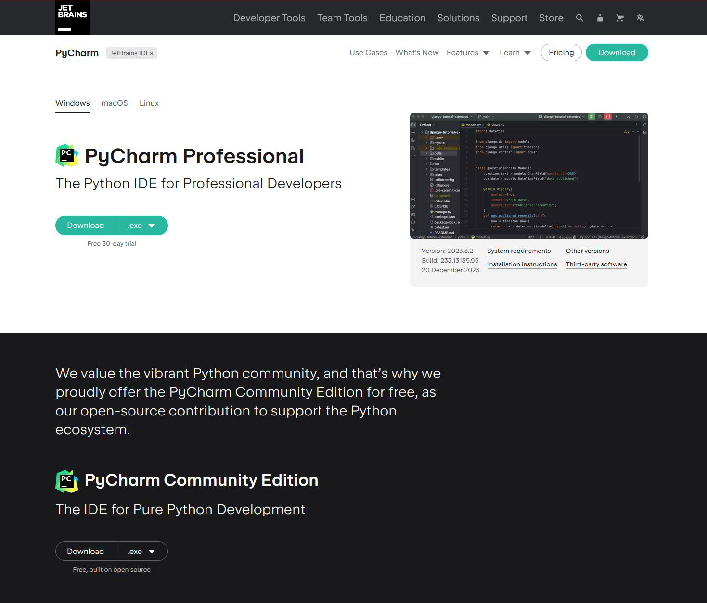

    <figcaption>
        <em>PyCharm CE download page.</em>
         
         
    </figcaption>

PyCharm CE is open-source and free. It only has some limitations compared to the paid version:
- DB support
- Remote development
- Contextual AI assistance

## PyCharm Installation

Once the download is complete, start the installation.

    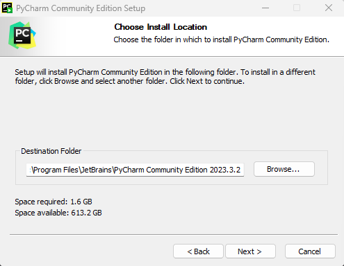
    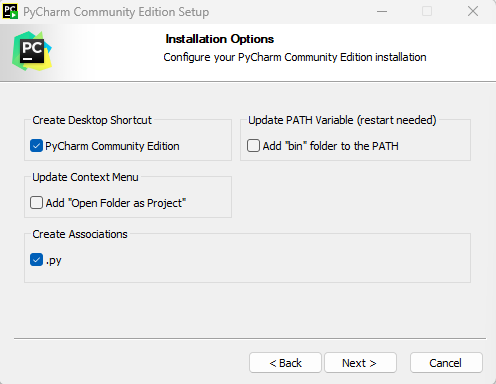

    <figcaption>
        <em>PyCharm installation process.</em>
         
         
    </figcaption>

## PyCharm: New Project

Start PyCharm: a window similar to the one shown below will appear. 

    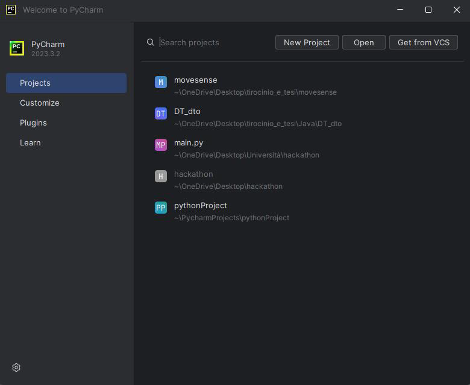
    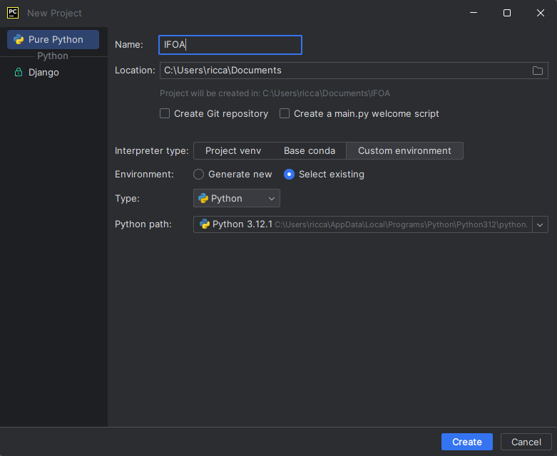

    <figcaption>
        <em>PyCharm project creation window.</em>
         
         
    </figcaption>

Click on `New Project` and follow the instructions. Finally click on `Create`.

## PyCharm: IDE Hands-On

To create a new Python file inside the IFOA folder (which you can see on the left, in the ***folder tree***):

    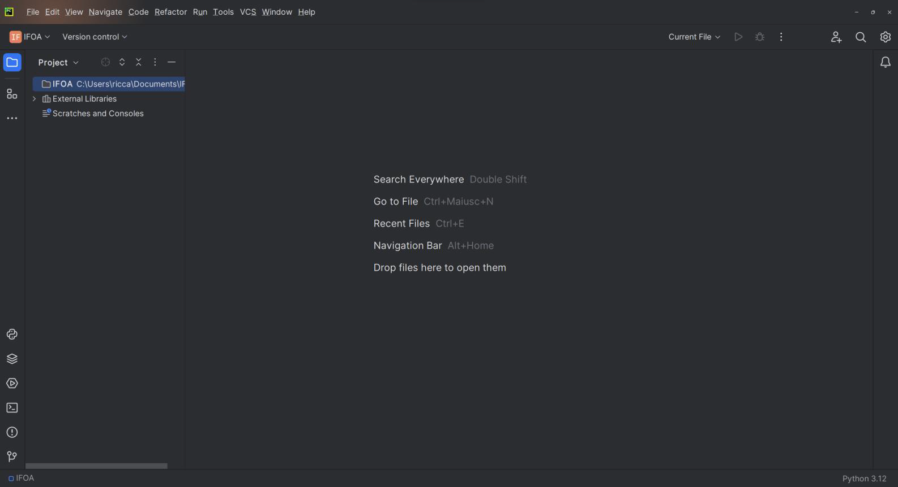

    <figcaption>
        <em>PyCharm main IDE view.</em>
         
         
    </figcaption>

- Right click on the IFOA folder
- Select `new`
- Select `Python file`
- Enter the name `main` and confirm.

Once the main file is created, the text editor for the code will appear on the right. 

    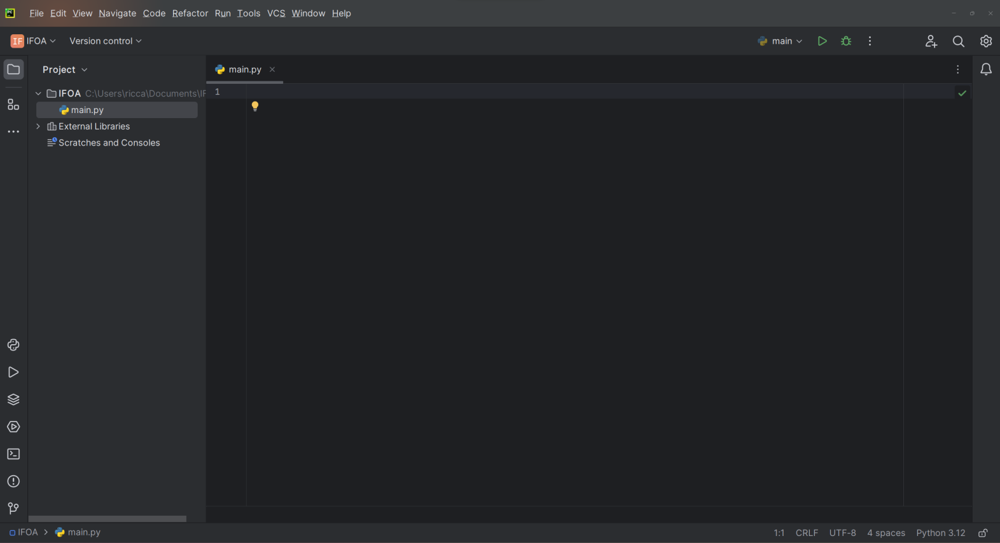

    <figcaption>
        <em>New `main.py` file.</em>
         
         
    </figcaption>

To test the functionality, write: `print(«Hello, world!»)`. 

Then:
- Right click on the editor
- Click run ‘main’

The "`Run`" window will open at the bottom, showing the console with the outputs. 

    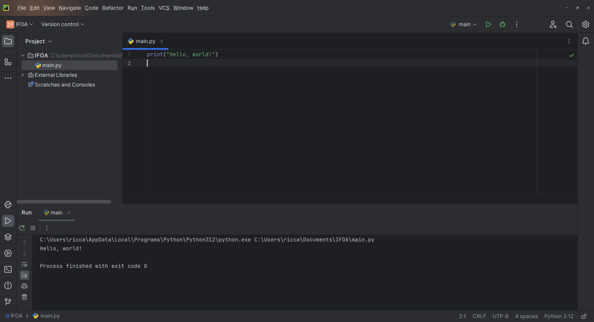

    <figcaption>
        <em>`main.py` and `hello_world`.</em>
         
         
    </figcaption>

To add to line 2: `print(«Hello, world! Again!»)` and test the debug function:
- Click on the number `2` on the left of the line, making a red dot (*breakpoint*) appear;
- Right click on the editor;
- Click on debug ‘main’;

The code execution stops after line 1, on line 2.

The Debug window appears instead of the "`Run`" window. To see the generated output, click on "`Console`". 

    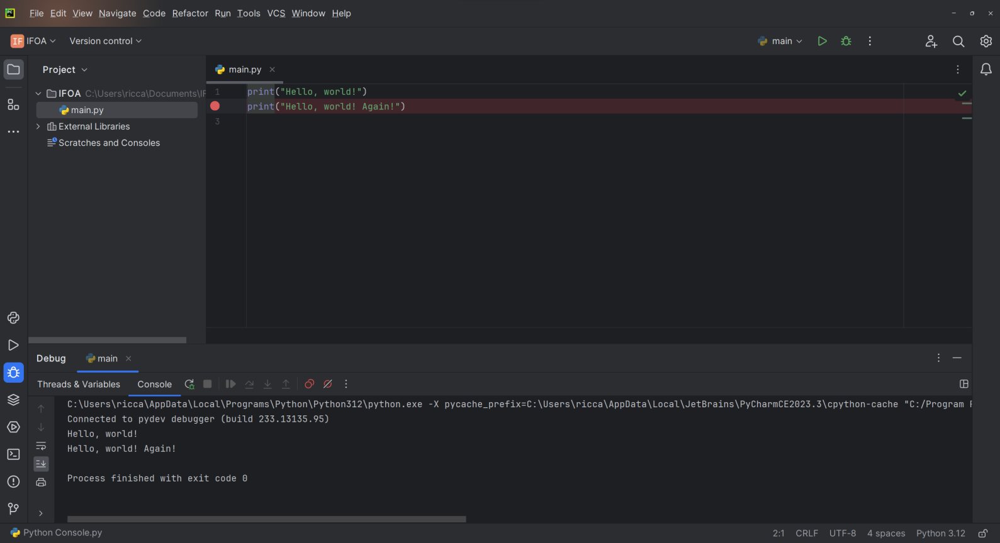

    <figcaption>
        <em>PyCharm and debugging tools.</em>
         
         
    </figcaption>

The first print will have appeared, the second will not. 

> [!NOTE]
>
> To resume the code execution click on the green "Resume Program" button

Now the code execution is complete: all outputs are visible in the console.

## PyCharm and Python Venv

In software development, a virtual environment (or venv for short) is an isolated and autonomous environment for a specific project. In this way, dependencies and libraries of the project can coexist on the same machine, separated from other projects, avoiding conflicts between artifacts with different versions.

Creating a venv from the PyCharm graphical interface:
- At the bottom right you will find the words "Python version" (e.g., Python 3.12);
- Click on the Python version;
- Click on add new interpreter;
- Click Add local interpreter.

    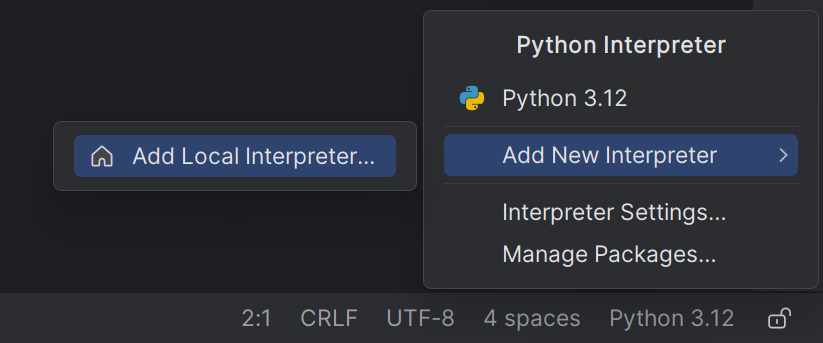

    <figcaption>
        <em>PyCharm and debugging tools.</em>
         
         
    </figcaption>

From the dialog box, to create the venv you need to be sure of the following points:
- Select New.
- Verify that Location contains a string that ends with .venv.
- Verify that .venv is inside the working directory (IFOA).
- Verify that the Base Interpreter is the installation path of Python.
- Confirm with OK.

    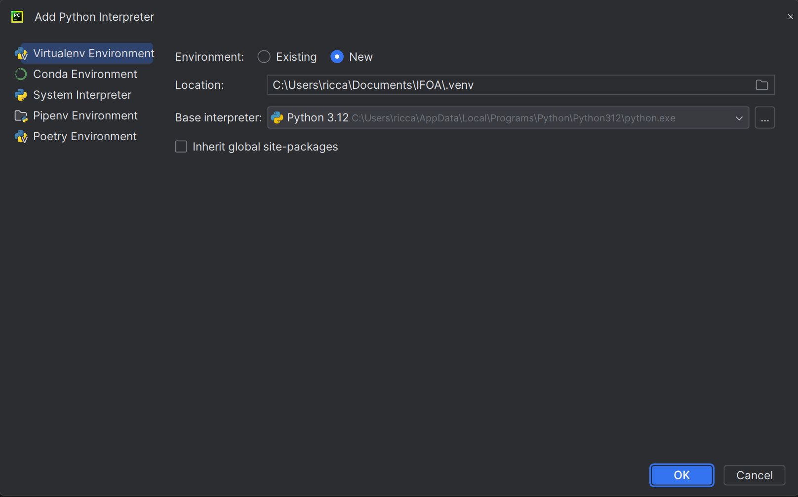

    <figcaption>
        <em>PyCharm and debugging tools.</em>
         
         
    </figcaption>

To confirm the process, find the writing Python 3.12 (IFOA) at the bottom right:
- It indicates the current use of venv.
- In the file tree the .venv folder has also appeared.
- Inside it there will be the executable of the language.
- Here the libraries necessary for the project will be installed.

    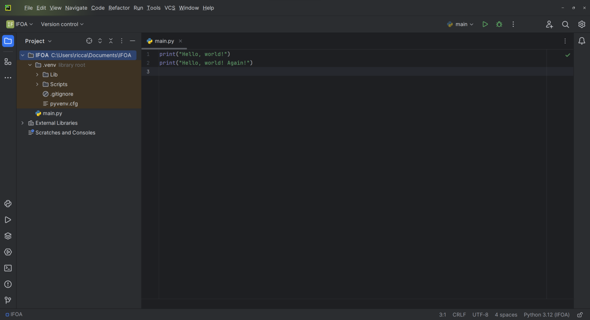

    <figcaption>
        <em>PyCharm and debugging tools.</em>
         
         
    </figcaption>

Installing a library from the graphical environment of PyCharm:
- At the top left click on File / Settings.
- Search for Project IFOA / Python Interpreter.
- A window like the one shown in the sources should appear.
- Verify that the selected interpreter refers to venv.
- Click on + to install a new library.

    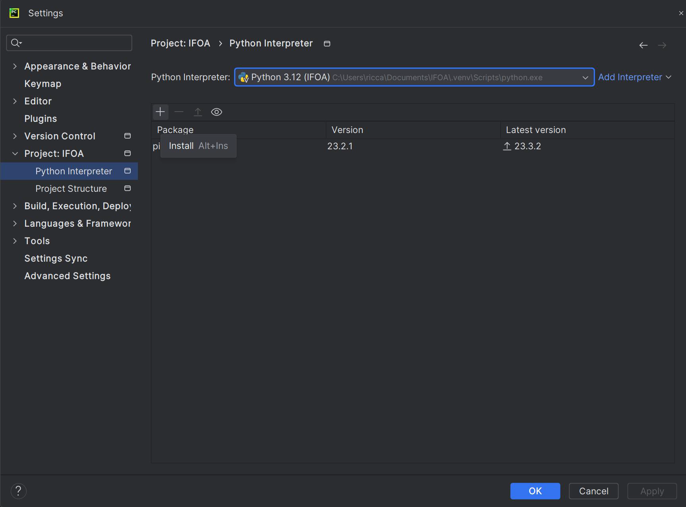

    <figcaption>
        <em>PyCharm and debugging tools.</em>
         
         
    </figcaption>

- In the search bar at the top write «matplotlib».
- Click on matplotlib.
- Click on Install Package.
- The library will now be downloaded and installed.
- Once the installation is complete, close all windows.

    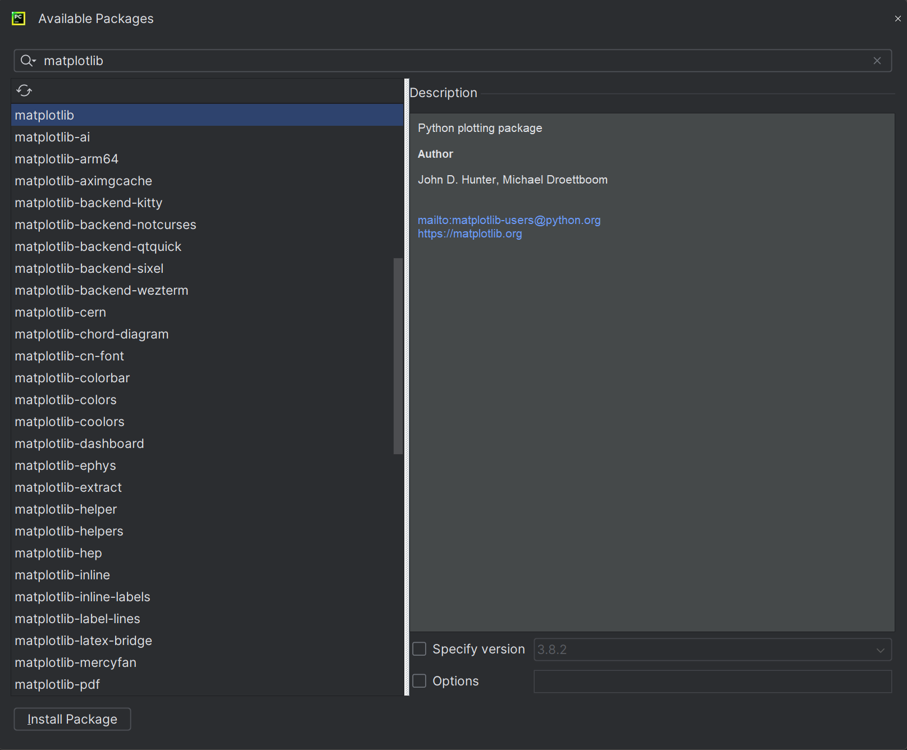

    <figcaption>
        <em>PyCharm and debugging tools.</em>
         
         
    </figcaption>

The process is not yet complete: PyCharm will scan the new libraries in the background to resolve any additional dependencies.