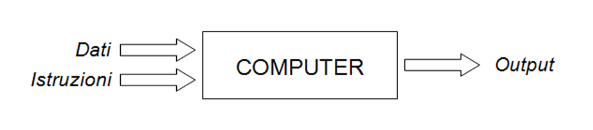
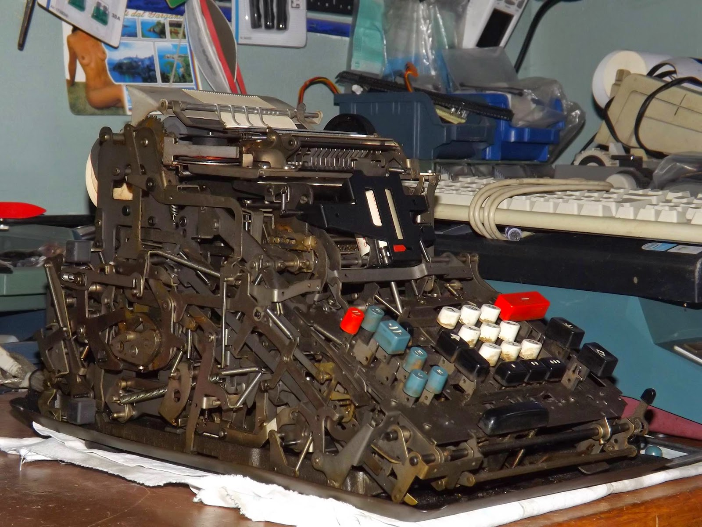
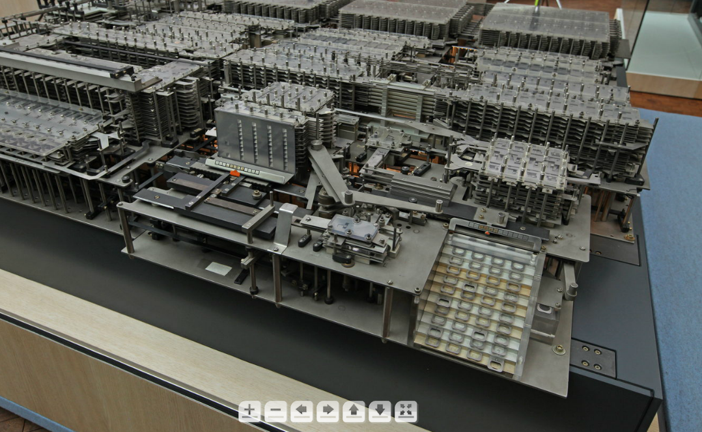
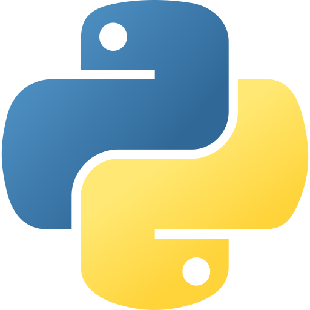

# Programming with Python

<!-- TODO: add a short intro -->

## What does it mean to "to program"?

A program is a set of instructions called a "program," executed sequentially by a machine (the computer). To properly function, it takes data to be computed by the program. Both are input elements for the computer.

    

    <figcaption>
        <em>Schema of the elements necessary for a computer to execute ... computations</em>.
         
         
    </figcaption>

The instructions contained in the program are executed sequentially, one after the other, as they were written, and have a "beginning" and an "end." 

The language in which programs are written is "encoded" (hence the use of the term code) to be understandable to humans and then easily transformed into "machine language".

There are several ways to transform "high-level" code into machine language, for example through the use of ***compilers*** or ***interpreters***.

    
    

    <figcaption>
        <em>On the left: the <a href="https://retrofficina4004.blogspot.com/2014/12/divisumma-24.html">Olivetti Divisumma 24</a>; on the right, a reproduction of the <a href="https://dcmlr.inf.fu-berlin.de/rojas/index.html%3Fp=567.html">Z1 Computer</a>, by Konrad Zuse</em>
         
         
    </figcaption>

## What are the necessary skills to program?

Some are the necessary skills to keep in mind, especially at the beginnig of the programming journey, to then become a proficient programmer. These skills are: 

- *English knowledge*:
    - English is the dominant language in the IT sector, in Italy and around the world;
    - 95% of documentation is written in English;
    - This opens the doors to the IT world to anyone who speaks this language;
    - It's good practice to program in English, as you're not programming for the computer, but for other programmers.
- *Logical Skills*;
- *Active Reading*:
    - To program, you write code and ... you read code;
    - You read documentation and read other people's code;
    - Learning to read and understand what you're reading is essential to fully understanding how a program works and modifying/adapting it to your liking.
- *Patience*:
    - Programming gives ... Programming takes away!
    - There are many moments of satisfaction in seeing a program work as expected ... and just as many moments of debugging, where you wonder what the hell is going on. :D

## Python Basic Characteristics

    

Python considered “*Easy to learn, hard to master*”. 

It is easy beacuse of its *simple syntax*, but to fully utilize its potential *requires study*. At the end of the day, it rewards in expressiveness.

Python is also very versatile. Indeed, it is used for: embedded systems, data analysis, web development, video games, machine learning, automation scripting, …

A large community exists (libraries, tutorials, troubleshooting), and advanced development tools are also available.

## Intro to Python: Let's Experiment!

### Exercise 1

Build a program that asks the user a question ("What language are we using?"). If the user answers "Python," the program displays "correct." Otherwise, the program displays "wrong!".

--

### Exercise 2

Build a calculator program. The program asks the user for a number (first operand), an operation (`+`, `-`, `*`, `/`), and a number (second operand). The program performs the operation and displays the result.

--

### Exercise 3

Build a program that calculates the result of a division and the remainder, and prints it in the form:
"`dividend / divisor = quotient + remainder`."