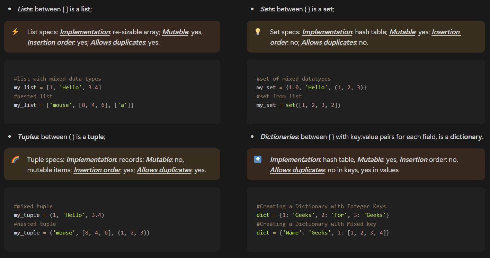
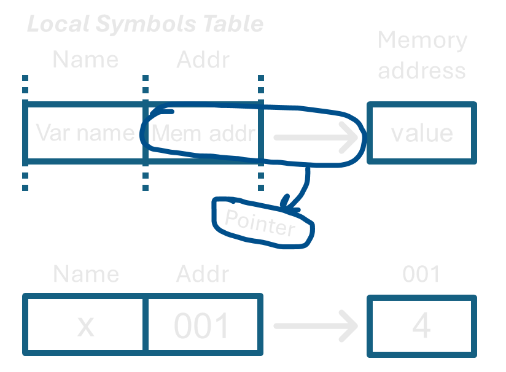
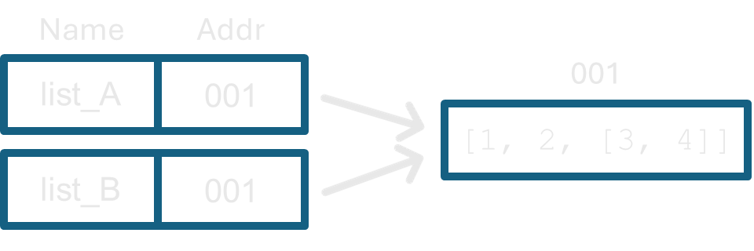
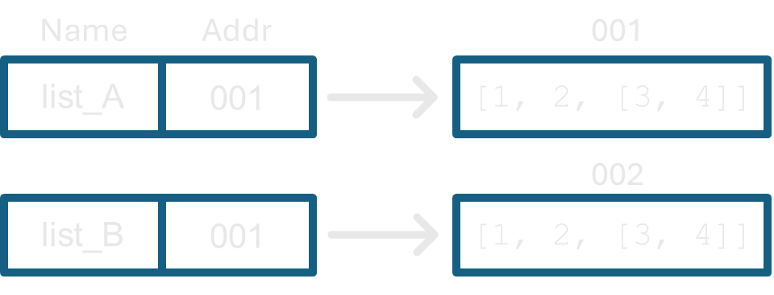

# Python Data Structures

In this section you will see: 
- Overview over main Python structured data
- Lists
- Sets
- Tuples
- Dictionaries
- Errors and Exceptions

## Overview over main Python Structured Data

Python data structures are specialized formats used to organize, store, and manage collections of data efficiently. Unlike single-value variables that hold only one piece of information at a time (like `int`, `float`, `string`, `bool`), data structures allow you to group multiple values—potentially of different types—into a single, manageable entity. This capability not only surpasses the limitations of individual variables but also provides powerful tools for data access, manipulation, and processing. 

***Built-in*** Python data structures such as *lists*, *tuples*, *dictionaries*, and *sets* each offer unique ways to store and interact with data, enabling programmers to solve complex problems more effectively.

By organizing data logically, data structures facilitate better performance, scalability, and clarity in code-key components in both simple scripting and large-scale software development.

<div align="center">
    
</div>
<div align="center">
    <figcaption>
        <em>Main Python Data Structures.</em>
        <br>
        <br>
    </figcaption>
</div>

## Python Iterables

> [!NOTE] The concept of `object`
> 
> Python is an ***Object-Oriented programming language***, which means that it implements the concept of `object`, `class`, and related details. Hereafter, is necessary to refer to some Python concepts as "*objects*", as they actually are. The only concept to remember right now, is that objects can be associated to specific functions (commands) capable to modify them. Consider them as a generic definition, until the related "***Python OOP***" section.

An ***iterable*** object is any object capable of ***returning its members one at a time***, permitting it to be iterated over in a `for` loop. 

> [!NOTE]
> 
> In simplified terms, an *iterable* is an object that can be "***iterated over***". ***Iterables*** are different from ***Iterators***.

More information in [Python Docs](https://docs.python.org/3/glossary.html#term-iterable).

Familiar examples of iterables include lists, tuples, dictionaries, sets, and strings. It is also possible to have an iterable that generates its members upon iteration without storing them in memory.

## Python Lists - The Queen of all Iterables

> [!IMPORTANT]
> 
> <ins>***Implementation***</ins>: resizable array
> <ins>***Mutable***</ins>: yes
> <ins>***Insertion Order***</ins>: yes
> <ins>***Allows Duplicates***</ins>: yes

Python Lists are an ***ordered collection of heterogeneous elements***. Lists are ordered and have a definite count. The elements in a list are indexed according to a definite sequence starting from 0. A list is created by placing all the items inside square brackets `[ ]`, separated by commas.

```python
# It defines an empty list called `my_first_list`
my_first_list = []
# It defines a second list with 3 elements called `my_second_list`
my_second_list = [1, 'two', 3]
# It defines a third list with 2 nested sub-lists, called `my_third_list`
my_third_list = ['mouse', [8, 4, 6], ['a']]
```

They are mutable and thus can be altered after creation. They can grow and shrink by adding and removing objects as needed. It’s also possible to change any object stored in any slot. 

Items can be of different types (`int`, `float`, `string` etc.). A `list` can also have another `list` as an item. 

### Python Lists: Accessing Elements

To access single elements in a Python list is possible to use Python's index operator `[ ]` (square brackets). Square brackets contain the position of the element that is necessary to retrieve starting from `0`. So, with `0` is possible to retrieve the first element, with `1` the second, and so on. Consequently, the position must always be an integer.

```python
my_list = [1, 'two', 3]
print(my_list[1])       # Returns: 'two' 
```

Negative numbers can be used as well to access elements. In this case, positions are counted from the last element of the list, starting from `-1`.

```python
my_list = [1, 'two', 3]
print(my_list[-1])       # Returns: 3 
```

Trying to access elements out of bound (i.e., in a position higher than the maximum number of elements present in the list), reaises an `IndexError`.

```python
my_list = [1, 'two', 3]
print(my_list[4])

# Returns:
# ERROR!
# Traceback (most recent call last):
#   File "<main.py>", line 2, in <module>
# IndexError: list inde
```

It is also possible to access to portion of list, or in other words, a "sub-list" of the given list, using the slicing operator `:` inside of the index operator `[ ]`. 

When using the slice operator, it is necessary to indicate before it the starting position of the slice, and after it its final position. The starting position of the slice is include, the last excluded. 

Slices are partial copies of the original list.

```python
my_list = [1, 'two', 3, 'four', 'cinque', 7, 'acht', 9, 10]
print(my_list[1:5])     # Returns: ['two', 3, 'four', 'cinque']
```

### Python Lists: Manipulation

#### Changing Elements
Having a list, it is always possible to change elements in defined positions combining the index operator `[ ]` with the assignment.

```python
my_list = [1, 'two', 3]
my_list[1] = 2

print(my_list[1])     # Returns: 2
```

Using the same process, it is also possible to add a list into an existing list.

```python
my_list = [1, 'two', 3]
my_list[1] = ['another', 'list', 'oh my god!']

print(my_list[1])     # Returns: ['another', 'list', 'oh my god!']
```

#### Adding Elements

It is possible to add elements to an existing list. 

To do it, is necessary to use `list methods`.

> [!NOTE] The concept of `method` and the Object Oriented Programming
> 
> Methods are *"actions"* given available from a given object. In Python everything is an object, and therefore also lists expose a series of methods to manipulate data present in the object. It is possible to access to an object's `method` using the `dotted notation` - for example `object.method(<eventual input data>)`.

To add an element to an existing list, it is possible to use two different methods: the first method is `.append(<element to append>)`. The method adds the passed element at the end of the list.

```python
my_list = [1, 'two', 3]
my_list.append(4)

print(my_list)     # Returns: [1, 'two', 3, 4]
```

The second method is `.insert(<position where to insert the element>, <element to insert>)`.

```python
my_list = [1, 2, 3]
my_list.insert(1, 'one')

print(my_list)     # Returns: [1, 'one', 2, 3]
```

#### Removing Elements

It is possible to remove elements to an existing list. To perform this operations, Python offers 2 different methods: `remove()`, `pop()`.

The method `.remove(<element to remove>)` removes the first occurence fo a specific element in the list.

```python
my_list = [1, 2, 3, 2]
my_list.remove(2)

print(my_list)     # Returns: [1, 3, 2]
```

The method `.pop(<position to withdraw>)`, instead, withdraws the element and returns it to the program.

```python
my_list = [1, 2, 3, 2]
x = my_list.pop(2)

print(my_list)      # Returns: [1, 2, 2]
print(x)            # Returns: 3
```

> [!NOTE]
> 
> With `.pop()` it is not possible to use the slice.

#### Sorting Elements

It is possible to sort elements in a list using the method `.sort(<reverse=False>)`.

```python
my_list = [1, 2, 4, 3]
my_list.sort()

print(my_list)      # Returns: [1, 2, 3, 4]

my_list.sort(reverse=True)
print(my_list)      # Returns: [4, 3, 2, 1]
```

> [!NOTE]
>
> The `.sort()` method works only if the elements in the list are *homogeneous*.

> [!WArnING]
>
> Keep in mind that after sorting, it is not possible to return back to the original positioning of the list's elements. To avoid it, it is possible to use the Puython built-in `sorted()`. 

#### Other Basic Operations

Python lists offer other lists methods for basic operations: 

- the method `.index(<element to search>, <start=0>, <end=-1>)` returns the first position from the left where the element is found.

    ```python
    my_list = [1, 2, 3, 2]

    i = my_list.index(2)
    print(i)        # Returns: 1
    ```
    If the element is not found, it returns a `ValueError`.
    The `start` and `end` parameters define the sublist where to perform the research.

- the method `count(<element to count>)` returns the number of times that an item appears in the list.

    ```python
    my_list = [1, 2, 3, 2]

    c = my_list.count(2)
    print(i)        # Returns: 2
    ```

- the Python built-in method `len(<sequence or collection>)` returns the number of elements contained in a list (or in any other sequence - such as `str` - or collection): 
    
    ```python
    my_list = [1, 2, 3, 2]

    print(len(my_list))     # Returns: 4
    ```

- the Python built-in method `list(<iterable>)` it is possible to convert an interable into a list.

    ```python
    my_list = ['hello!']

    print(my_list)     # Returns: ['!', 'e', 'h', 'l', 'l', 'o']
    ```

- With the `+` operator, it is possible to concatenate one list to another: 

    ```python
    my_list = [1, 'two', 3]
    my_list + my_list

    print(my_list)     # Returns: [1, 'two', 3, 1, 'two', 3]
    ```

- With the `*` operator, it is possible to repeat one list to another: 
    
    ```python
    my_list = [1, 'two', 3]
    my_list * 3

    print(my_list)     # Returns: [1, 'two', 3, 1, 'two', 3, 1, 'two', 3]
    ```

### Python Lists and Iterations

It is possible to visit all the elements of the list using the `for` loop.

```python
my_list = [1, 'two', 3]

for element in my_list: 
    print(element)

# Returns: 
# 1
# 'two'
# 3
```

At the line `for element in my_list`, the variable `element` is created inplace and stores the i-th element visited during the loop.

This way of visiting the list (applicable to any other ordered iterable) is very ***"Pythonic"***, which means is a way of managing the `for` loop typical of Python.

Therefore... In which other way is is possible to visit all the elements of a collection of orderer elements? 

#### Iterating over a list using a counter

The typical way of iterating over an ordered collection of elements, is defining a counter starting from 0, increment by 1 step, until its value equals the length of the collection.

```java
ArrayList<String> cars = new ArrayList<String>();

cars.add('Ferrari');
cars.add('Lamborghini');
cars.add('Maserati');

for(int i=0; i<cars.size(); i++){
    System.out.println(cars);
}

// Returns: 
// Ferrari
// Lamborghini
// Maserati
```

In this Java code, the variable `i` is the counter, defined at the same line of the `for` loop. Then, the variable is incremented by 1 at each step, as defined by the `i++`, and stops when `i < cars.size()`.

It is possible to imitate the logic using together the Python built-ins `range()` and `len()`.

```python
cars = []       # Alternatively, it is possible to write my_list = list()

cars.append('Ferrari')
cars.append('Lamborghini')
cars.append('Maserati')

for i in range(len(cars)): 
    print(cars[i])

# Returns: 
# Ferrari
# Lamborghini
# Maserati
```

In particular, the built-in `range(<start=0>, <range>, <step=1>)` creates and returns a sequence of numbers of type `range`.

For example: 

```python
my_range = range(6)

print(my_range)         # Returns: range(0, 6)
print(type(my_range))   # Returns: <class 'range'>
```

It is possible to visit all the elements of a range: 

```python
my_range = range(6)

for elem in my_range:
    print(elem)

# Returns: 
# 0
# 1
# 2
# 3
# 4
# 5
# 6
```

As you can guess right now, if instead of `6` is passed ***the length of the list*** we want to iterate, then we have a logic very very close to the one typically used in other programming languages, such as `Java`.

To pass the length of the list, it is possible to use the Python built-in `len()`.

#### Iterating over an innested list using the built-in `Enumerate()`

Take into consideration the following example: 

```python
my_list = [['Mela', 50, 'a'], ['Banana', 30, 'b'], ['Arancia', 20, 'c']]

for k, v, z in my_list: 
    print(k)
    print(v)
    print(z)

# Returns: 
# Mela
# 50
# a
# Banana
# 30
# b
# Arancia
# 20
# c
```

The limit of such an approach it is that you need to know in advance how many variable you need to use to visit all the elements of `my_list`.

The alternative it is to use the Python built-in `enumerate()`. The built-in `enumerate(<iterable>, <start=0>)` takes as an input an iterable, and returns an ***enumerate object***. 

```python
my_list = ['a', 'b', 'c']

print(enumerate(my_list))   # Returns: <enumerate object at 0x0123456789abcdef>

for elem in enumerate(my_list): 
    print(elem)

# Returns: 
# (0, 'a')
# (1, 'b')
# (2, 'c')
```

Iterating over the enumerate object, it returns at each iteration a tuple (see later) where the first position is the position that holds the object passed at `enumerate()`, at the second, the stored element at that associated position.

Returning at our example: 

```python
my_list = [['Mela', 50, 'a'], ['Banana', 30, 'b'], ['Arancia', 20, 'c']]

for k in enumerate(my_list): 
    print(k)

# Returns: 
# (0, ['Mela', 50, 'a'])
# (1, ['Banana', 30, 'b'])
# (2, ['Arancia', 20, 'c'])

for k, v in enumerate(my_list): 
    print(k)
    print(v)

# Returns: 
# 0
# ['Mela', 50, 'a']
# 1
# ['Banana', 30, 'b']
# 2
# ['Arancia', 20, 'c']
```

### Python Lists Comprehension

Python Comprehensions are a ***Pythonic way*** to declare Python elements in a very concise way. 

Why? ... Because developers love it!

When applied to lists, then we have **List Comprehension**.

Let's look at an example: 

```python
my_list = [1, 9, 25, 49, 81]

for elem in my_list: 
    print(elem)

# Returns: 
# 1
# 9
# 25
# 49
# 81

list_compr = [x**2 for x in range(10) if (x % 2) != 0]
print(list_compr)
# Returns: [1, 9, 25, 49, 81]
```

It is also possible to innest one list inside of another using the List Comprehension.

```python
matrix = [
    [1, 2, 3],
    [4, 5, 6] 
]

for elem in matrix:
    print(elem)

# Returns: 
# [1, 2, 3]
# [4, 5, 6] 


matrix_compr = [ [row[i] for row in matrix] for i in range(len(matrix[0]))]

for elem in matrix_compr:
    print(elem)

# Returns: 
# [1, 2, 3]
# [4, 5, 6] 
```

### Python Lists and Copy

As reported at the start of [Python - the Queen of all Iterables](#python-lists---the-queen-of-all-iterables), lists are a *mutable* data type, detail which suggests the existance of *immutable* data types.

All data types in Python belong to these two cathegories, caracterized by different behaviours: 

- **Immutable data types**: `int`, `float`, `bool`, `str`, `tuple` (see later).
    - **Details**: after creation, the value associated to the name of the variable cannot be changed.
    
    ```python
    x = 3
    print(x)     # Returns: 3

    x = 4
    print(x)     # Returns: 4
    ```
    
    > [!NOTE]
    > 
    > Being immutable does not mean that it is impossible to assign a new value to an existing variable!

    - **Re-assignment behaviour**: when to a variable is assigned another variable, in the second is copied the value of the first variable. 
    
    ```python
    x = 3
    y = x
    print(x)     # Returns: 3
    print(y)     # Returns: 3 
    
    # Keep in mind that the value in y is a copy of the value in x!
    ```
    
    - **Re-assignment *"chain of changes"***: modifying a variable does not affect the other defined through the assignment, because they are two different copies. 

    ```python
    x = 3
    y = x
    print(x)     # Returns: 3
    print(y)     # Returns: 3 
    
    x = 4

    print(x)     # Returns: 4
    print(y)     # Returns: 3
    ```

- **Mutable data types**: `list`, `dict`, `set`, and most ***user-defined objects***.
    - **Details**: after creation, the value associated to the name of the variable can be changed; since most data structures are *mutable*, it means that it is possible to add, remove, and change elements associated to its variable.
    
    ```python
    my_list = [3]
    print(my_list)     # Returns: [3]

    my_list.append(2)
    print(my_list)     # Returns: [3, 2]
    ```

    - **Re-assignment behaviour**: when to a variable is assigned another variable, in the second is copied the value of the first variable. 
    
    ```python
    my_list = [3]
    another_list = my_list
    print(x)     # Returns: [3]
    print(y)     # Returns: [3] 
    
    # Now, the two lists are "chained"!
    ```
    
    - **Re-assignment *"chain of changes"***: modifying a variable does not affect the other defined through the assignment, because they are two different copies. 

    ```python
    my_list = [3]
    another_list = my_list
    print(x)     # Returns: [3]
    print(y)     # Returns: [3]
    
    my_list.append(2)

    print(x)     # Returns: [3, 2]
    print(y)     # Returns: [3, 2]
    ```

### Note on Python, Copy and References

<div align="center" style="float:right;">
    
    <div align="center">
        <figcaption>
            <em>Python Local Symbols Table.</em>
            <br>
            <br>
        </figcaption>
    </div>
</div>

But why there is this distinction of behaviour between ***immutable*** and ***mutable*** data types? The reason lays under the hood of Python.

When a number (or a generic object) is assigned to a variable:

- the variable name and the memory address (also called a pointer) where the object is saved are stored in the Local Symbols Table;

- the object is saved to a memory location at the specified memory address.

This makes copying variables a bit complicated for mutable objects. Indeed, in Python, everything is an object:

- `int`, `float`, `string`, and `tuple` are *immutable* objects;

- `list`, `dict`, `set`, and (custom) objects are *mutable* objects.

#### Shallow Copy and Deep Copy

So, how to gain control over copying variables and objects in Python? To this end, comes in help the module `copy`.

- **Shallow copy**: The function `copy.copy(<element to copy>)` performs a ***shallow copy*** of the given element. It means that only ***first level immutable elements*** are effectively copied in the new data structure, while ***second level mutable elements*** are still referred to their original object.

    ```python
    import copy

    list_A = [1, 2, [3, 4]]
    list_B = copy.copy(list_A) 

    # Modifying a not-nested immutable element in the copy
    list_B[0] = 99
    # Modifying a nested object in the copy 
    list_B[2][0] = 100
    print(list_A)                   # Returns: [1, 2, [100, 4]] 
    print(list_B)                   # Returns: [1, 2, [100, 4]]
    print(list_A is list_B)         # Returns: False
    print(list_A[0] is list_B[0])   # Returns: True
    ```

<div align="center">
    
    <div align="center">
        <figcaption>
            <em>Behaviour of the Shallow Copy at the Python Local Symbols Table level.</em>
            <br>
            <br>
        </figcaption>
    </div>
</div>
    
- ***Deep copy***: The function `copy.deepcopy(<element to copy>)` performs a ***deep copy*** of the given element. In other words, now the two variables are treaten as two completely separate entities, such as *immutable objects*, nested mutable elements included.

    ```python
    import copy
    
    list_A = [1, 2, [3, 4]]
    list_B = copy.deepcopy(list_A) 

    # Modifying a nested object in the copy 
    list_B[2][0] = 100
    print(list_A)                   # Returns: [1, 2, [3, 4]] 
    print(list_B)                   # Returns: [1, 2, [100, 4]]
    print(list_A is list_B)         # Returns: False
    print(list_A[2] is list_B[2])   # Returns: False
    ```

<div align="center">
    
    <div align="center">
        <figcaption>
            <em>Behaviour of the Deep Copy at the Python Local Symbols Table level.</em>
            <br>
            <br>
        </figcaption>
    </div>
</div>

> [!NOTE]
> 
> More information about the operator `is` [here](https://docs.python.org/3/library/operator.html#operator.is_) and [here](https://www.geeksforgeeks.org/python/difference-between-and-is-operator-in-python/).

#### Alternative way to perform the copy of a list

Alternatively, the list class offers the method `.copy()` to perform a copy of a list assigned to a variable into another variable. Remember that `.copy()` performs a ***shallow copy***.

```python
my_list = [1, 2, 3]
second_list = my_list.copy()

second_list.append(4)
print(my_list)      # Returns: [1, 2, 3]
print(second_list)  # Returns: [1, 2, 3, 4]
```

## Python Sets - Set Operations

> [!IMPORTANT]
> 
> <ins>***Implementation***</ins>: hash table
> <ins>***Mutable***</ins>: yes
> <ins>***Insertion Order***</ins>: no
> <ins>***Allows Duplicates***</ins>: no


Python `set` represent sets of ***heterogeneous***, ***not ordered*** elements. It is a ***mutable*** data type, and stores elements without admitting duplicates (because ... sets!).

A `set` can be only created using curly brackets `{ }`, passing a collection of comma separated elements. It is also possible to convert an iterable into a `set` using the relative Python built-in function `set()`.

```python
empty_set = {}

magic = set('abracadabra')
magicness = set('alakazam')

print(magic)
print(magicness)

# Returns: {'c', 'r', 'b', 'a', 'd'}
# Returns: {'k', 'a', 'm', 'l', 'z'}
```

> [!NOTE]
> 
> Since sets are ***unordered***, repeating multiple times the code above, the returned collection has every time its elements in different orders.

#### Python Sets - Basic Operations

Since `set()` models mathematical sets, all the related operations are available.

They are: 
- union, using the operator `|`
- intersection, using the operator `&`
- Difference, using the operator `-`
- Simmetric difference, using the operator `^`

```python
magic = set('abracadabra')
magicness = set('alakazam')

print(magic | magicness)    # Returns: {'z', 'l', 'r', 'c', 'k', 'a', 'd', 'm', 'b'}
print(magic & magicness)    # Returns: {'a'}
print(magic - magicness)    # Returns: {'d', 'b', 'r', 'c'}
print(magic ^ magicness)    # Returns: {'z', 'l', 'c', 'k', 'd', 'b', 'r', 'm'}
```

#### Python Sets & Lists: a little trick

Problem: having a list potentially containing duplicates, how to efficienly remove them? 

```python
my_list = [1, 2, 3, 2]
my_set = set(my_list)
my_cleaned_list = list(my_set)

print(my_cleaned_list)

# Returns: [1, 2, 3]
```

## Python Data Structures: Let's Experiment! (1)

1. Store a series of numbers taken from the user's input. Print the series in the order in which they were entered and in reverse order.

2. Store a series of numbers taken as user input. Print the mean and standard deviation (math module) and return the square root of each number.

3. Store two sets of numbers input by the user. Print the total product.

4. Store a series of numbers taken as input from the user. Then ask the user for another number. Print if the number is present in the series.

    • Variant: Show how many times the number appears in the series.

5. Store a series of numbers taken from the user's input. Print whether the series contains duplicate numbers or not. Print which numbers are duplicated, and how many times they are repeated.

6. Store a series of numbers taken as user input and sort them in ascending order. Store an additional number taken as user input. Implement the dichotomous search algorithm to show whether the number is present or not in the series (https://it.wikipedia.org/wiki/Ricerca_dicotomica).

7. Store a series of numbers taken as user input, in disarray. Implement the Bubble Sort algorithm to sort them in ascending order (https://it.wikipedia.org/wiki/Bubble_sort).

8. Store a series of numbers with duplicates taken from user input. Display only the unique numbers in the series.

9. Store two sets of numbers (even of different lengths) taken as input from the user. Show whether the two sets have at least one element in common. 

10. Store two sets of numbers taken as user input. Build a new set with only the elements in common between the two sets.

11. Store a series of numbers taken as input from the user. Build a new series with only the odd numbers from the series.

## Python Tuples

> [!IMPORTANT]
> 
> <ins>***Implementation***</ins>: records
> <ins>***Mutable***</ins>: no
> <ins>***Insertion Order***</ins>: yes
> <ins>***Allows Duplicates***</ins>: yes

Python tuples are an ***immutable*** collection of ***ordered elements***.
Tuples are a valid subtitutions for lists when is needed to have an ordered collection of immutable elements. It is possible to assign a `tuple` to a variable using rounded brackets `( )` at the right of the assignment operator `=`.

```python
my_first_tuple = ('a', 'b', 'c')
my_second_tuple = (1, 2, 3)
my_third_tuple = ([1, 2, 3], 'b', 'c')
my_fourth_tuple = ('mouse', [8, 4, 6], (1, 2, 3))

print(my_third_tuple)
# Returns: ([1, 2, 3], 'b', 'c')
```

Creating a tuple with one element is ***a bit tricky***. Having one element within parentheses is not enough. ***A trailing comma to indicate that it is a tuple, is required***.

```python
my_tuple = ('hello')
print(type(my_tuple))       # Returns: <class, 'str'>

#Creating a tuple having one element
my_tuple = ('hello',)
print(type(my_tuple))       # Returns: <class, 'tuple'>

#Parentheses is optional
my_tuple = 'hello',
print(type(my_tuple))       # Returns: <class, 'tuple'>
```

### Python Tuples: Accessing Elements

Since a `tuple` is an ordered collection, A tuple is created by placing all the items inside round brackets `( )`, separated by commas.

```python
my_tuple = ('a', 'b', 'c')

print(my_tuple[0])
print(my_tuple[2])

# Returns: 
# 'a'
# 'c'

print(my_tuple[-1])
print(my_tuple[-2])

# Returns: 
# 'b'
# 'c'
```

As in lists, it is possible to access elements from the end of it, using negative numbers, starting from `-1`.

Moreover, as in lists, it is also possible to access to portion of the tuple, or in other words, a "sub-tuple" of the given list, using the slicing operator `:` inside of the index operator `[ ]`. As for lists, the starting position of the slice is include, the last excluded. 

```python
# It is also possible to define a tuple converting another iterable, as a str
my_tuple = tuple('source code')     

print(my_tuple[0:6])        # Returns: ('s', 'o', 'u', 'r', 'c', 'e')
print(my_tuple[-4:])        # Returns: ('c', 'o', 'd', 'e')
```

### Python Tuples: Manipulation

#### Changing Elements

Unlike lists, tuples are immutable. Elements of a tuple cannot be changed once they have been assigned. However, if the element is itself a mutable data type like list, its nested items can be changed. We can also assign a tuple to different values resulting in a reassignment (i.e., new assignment).

```python
my_tuple = (4, 2, 3, [6, 5])

my_tuple[1] = 9
# Returns: 
# TypeError: 'tuple' object does not support item assignment
# Ehi... It is IMMUTABLE

#However…
my_tuple[3][0] = 9
print(my_tuple)
# Returns: (4, 2, 3, [9, 5])

#Tuples can be re-assigned
my_tuple = tuple('new tuple')
print(my_tuple)
# Returns: ('n', 'e', 'w', ' ', 't', 'u', 'p', 'l', 'e')
```

#### Adding Elements

Adding elements to an existing tuple is impossible ... ***because immutable***. Nevertheless, it is still possible to add elements to its possible inner structures.

```python
my_tuple = (4, 2, 3, [6, 5])
my_tuple[3].append(9)

print(my_tuple)     # Returns: (4, 2, 3, [6, 5, 9])
```

#### Removing Elements

Same as in the previous sub-paragraph.

```python
my_tuple = (4, 2, 3, [6, 5, 9])
my_tuple[3].remove(9)

print(my_tuple)     # Returns: (4, 2, 3, [6, 5])
```

Removing elements in a tuple is not possible, but we can re-assing it (as seen previously), or completely ***delete*** the tuple. To perform the deletion operation, it is possible to use the `del` Python keyword. 

```python
my_tuple = (4, 2, 3, [6, 5, 9])

del my_tuple[3]
# Returns: 
# TypeError: 'tuple' object doesn't support item deletion

del my_tuple

print(my_tuple)
# Returns: 
# NameError: name 'my_tuple' is not defined
```

> [!NOTE]
> 
> The `del` Python keyword does not belong only to tuples. Indeed, it is applicable to any Pyton object.

#### Sorting Elements

Objects from class `tuple` do not expose any method to order their elements.

#### Other Basic Operations

It is possible to testo if an item exists in a tuple or not, using the keyword `in`. We can use a for loop to iterate through each item in a tuple.

```python
my_tuple = ('a', 'p', 'p', 'l', 'e',)

print('a' in my_tuple)      # Returns: True
print('b' in my_tuple)      # Returns: False
print('g' not in my_tuple)  # Returns: False
```

> [!NOTE]
> 
> The `in` Python keyword does not belong only to tuples. Indeed, it is applicable to any Pyton object.

### Python Tuples - Iterations

It is possible to iterate over the elements of a `tuple` following the same principles of lists:

```python
my_tuple = ('John', 'Kate', 'Archie')
for name in my_tuple:
    print('Hello', name)

# Returns: 
# 'John'
# 'Kate'
# 'Archie'
```

It is also possible to apply `enumerate()`, as the built-in accepts any Python iterable:

```python
my_tuple = ('John', 'Kate', 'Archie')
for k in my_tuple:
    print(k)

# Returns: 
# ( 0,'John')
# ( 1,'Kate')
# ( 2,'Archie')

for k, v in enumerate(my_tuple):
    print(k, v)

# Returns: 
# 0 John
# 1 Kate
# 2 Archie
```

## Python Dictionaries

> [!IMPORTANT]
> 
> <ins>***Implementation***</ins>: hash table
> <ins>***Mutable***</ins>: yes
> <ins>***Insertion Order***</ins>: no (It depends on the ***version*** of Python)
> <ins>***Allows Duplicates***</ins>: no in keys, yes in values

Also called `Map` in other programming languages (see `Java`), are an ***heterogeneous collection of not ordered key-value pairs***, expandable and contractable as desired.

Each element of a python `dict` is organized in `key: values` pairs, with keys that must be ***unique***. Associated elements, i.e., `values`, can be of any type. 

### Python Dictionaries: Accessing Elements

Because of its structure, it is possible to access to a `dict` `value` only trough its `key`, using the index operator `[ ]`.

```python
my_dict = {'name': 'John', 'surname': 'Doe', 'year': 1984}

print(my_dict['name'])      # Returns: 'John'
```

Alternatively, it is possible to retrieve a single `value` starting from the associated `key` and using the method `.get(<key>)`

```python
my_dict = {'name': 'John', 'surname': 'Doe', 'year': 1984}

print(my_dict.get('name'))      # Returns: 'John'
```

Nevertheless, it is possible to retrieve in advance the collection of keys and the collection of values using associated methods made available by the `dict` class. Returned types are `<class 'dict_keys'>` and `<class 'dict_values'>`.

```python
my_dict = {'name': 'John', 'surname': 'Doe', 'year': 1984}

print(my_dict.keys()) 
print(my_dict.values())
# Returns: 
# dict_keys(['name', 'surname', 'year'])
# dict_values(['John', 'Doe', 1984])

print(type(my_dict.keys()))
print(type(my_dict.values()))

# Returns: 
# <class 'dict_keys'>
# <class 'dict_values'>
```

Finally, it is also possible to retrieve all the existing `key` `values` pairs using the method `.items()`.

```python
my_dict = {'name': 'John', 'surname': 'Doe', 'year': 1984}

print(my_dict.items())          # Returns: dict_items([('name', 'John'), ('surname', 'Doe'), ('year', 1984)])
print(type(my_dict.items()))    # Returns: <class 'dict_items'>
```

### Python Dictionaries: Manipulation

#### Changing Elements

Knowing the `key` in advance, it is possible to modify its associated `value` through an ***assignment operation***: 

```python
my_dict = {'name': 'John', 'surname': 'Doe', 'year': 1984}
my_dict['name'] = 'Ferdinand'

print(my_dict)      # Returns: {'name': 'John', 'surname': 'Doe', 'year': 1984}
```

#### Adding Elements

When performing the same operation on a `key` that is not present in the `dict`, it is simply added.

```python
my_dict = {'name': 'John', 'surname': 'Doe', 'year': 1984}
my_dict['country'] = 'Kirghizistan'

print(my_dict)      # Returns: {'name': 'John', 'surname': 'Doe', 'year': 1984, 'country': 'Kirghizistan'}
```

Alternatively, it is possible to use the Python method `.update({<key>: <value>})`.

```python
my_dict = {'name': 'John', 'surname': 'Doe', 'year': 1984}
my_dict.update('country': 'Kirghizistan')

print(my_dict)      # Returns: {'name': 'John', 'surname': 'Doe', 'year': 1984, 'country': 'Kirghizistan'}
```

#### Removing Elements

It is possible to remove elements from a dict using the method `.pop(<key of the element to remove>)`. When removing the element, both the `key` and the `value` are removed.

```python
my_dict = {'name': 'John', 'surname': 'Doe', 'year': 1984}
my_dict.pop('year')

print(my_dict)      # Returns: {'name': 'John', 'surname': 'Doe'}
```

Python offers also the `.popitem()` to remove the last inserted `key` `value` pair.

```python
my_dict = {'name': 'John', 'surname': 'Doe', 'year': 1984}
my_dict['country'] = 'Kirghizistan'

print(my_dict)      # Returns: {'name': 'John', 'surname': 'Doe', 'year': 1984, 'country': 'Kirghizistan'}

my_dict.popitem()
print(my_dict)      # Returns: {'name': 'John', 'surname': 'Doe', 'year': 1984}
```

It is also possible to remove all the elements contained in a dict, leaving it empty, using the method `.clear()`.

```python
my_dict = {'name': 'John', 'surname': 'Doe', 'year': 1984}
my_dict.clear()

print(my_dict)      # Returns: {}
```

#### Sorting Elements

Before Python 3.6, dictionaris where inherently ***unordered***. Starting from Python 3.7, ***insertion order has been guaranteed***. Nevertheless, the `dict` class does not offer a sorting method.

To sort a `dict` is thus necessary using the `sorted()` Python built-in. 

The `sorted(<iterable>, <key=None>, <reverse=False>)`, takes in input an interable and returns a new `iterable` containing all elements sorted in ascending order by default.

```python
words = ['banana', 'date', 'apple', 'cherry']
ascending_words = sorted(words)
descending_words = sorted(words, reverse=True)

print(ascending_words)      # Returns: ['apple', 'banana', 'cherry', 'date']
print(descending_words)     # Returns: ['date', 'cherry', 'banana', 'apple']
```

The `sorted()` built-in function allows also the specification of different sorting rules used to perform the sorting. For example, it can be possible to sort previously defined `words` by then length. Such a definition is performed using the `key` parameter.

```python
words = ['banana', 'date', 'apple', 'cherry']
length_sorted_words = sorted(words, key=lambda item: len(item))

print(length_sorted_words)      # Returns: ['date', 'apple', 'banana', 'cherry']
```

The `key` parameter allows to customize the sorting order by specifying a function that is applied to each element before comparisons are made.

More concretely, the `key` parameter expects a callable (like a `function` or `lambda`) that takes a single element as input and returns a value (a "key") which `sorted()` uses to determine the sort order. 

Instead of sorting elements by themselves, `sorted()` sorts them based on the keys returned from this function, but the original elements are returned in sorted order.

```python
words = ['banana', 'date', 'apple', 'cherry']
length_sorted_words = sorted(words, key=lambda item: len(item))

# The key returns: 
# ['banana', 'date', 'apple', 'cherry']
#     6        4        5         6    <- These are words length extracted by the key

print(length_sorted_words)      # Returns: ['date', 'apple', 'banana', 'cherry']
```

In the example above, the lambda function extracts the lenght associated to each word, i.e., its "key", and keeps the association with its element.

Then, the key is used to perform the ordering task.

> [!NOTE]
> 
> `lambda` functions are ***anonymous functions***, i.e., functions ***without a name*** defined and used in place. More about function and lambdas later in the course.

```python 
students = [
    ('john', 'A', 15),
    ('jane', 'B', 12),
    ('dave', 'B', 10),
]

# Sort by age (third element of the tuple)
sorted_students = sorted(students, key=lambda student: student[2])
```

In the case of `dict`, it is possible to perform its ordering following the keys, or the values. 

In the case of values:
- the first passage is passing the list of all key value pairs in the form of a tuple;
- then the pairs are ordered following the second value in each tuple as a key; 
- then, ordered tuples are re-converted into a dictionary.

```python
my_dict = {'name': 'John', 'surname': 'Doe', 'year': 1984}

sorted_items = sorted(my_dict.items(), key=lambda item: str(item[1]))

# Note: 
# my_dict.items() == [('name', 'John'), ('surname', 'Doe'), ('year', '1984')]

sorted_dict = dict(sorted_items)    # Reconversion in dict

print(sorted_dict)
# Returns: 
# {'year': 1984, 'surname': 'Doe', 'name': 'John'}
```

#### Other Basic Operations

It is possible to know in advance the length of the dictionary: 

```python
my_dict = {'name': 'John', 'surname': 'Doe', 'year': 1984}

print(len(my_dict))
# Returns: 3
```

It is possible to verify if a key belongs to the dict: 

```python
my_dict = {'name': 'John', 'surname': 'Doe', 'year': 1984}

print('name' in my_dict)
# Returns: True
```

It is possible to insert dictionaries in dictionaries, lists in dictionaries or dictionaries in lists.

```python
my_dict = {'name': 'John', 'surname': 'Doe', 'year': 1984, 'school': 'high school', 'school subjects': {'math':[4, 6, 7, 6.5], 'literature': [6, 7, 6, 8.5], 'physics':[4, 4, 3, 4.5]}}

print('List of marks in physics:', my_dict['school subjects']['physics'])
```

> [!NOTE]
>
> The insertion mechanism is appliable to any kind of data structure, until any depth level.

An interesting use case 
One interesting use case involves using nested dictionaries to create yellow pages.

```python
telephonic_dict = {
    'a':{'abate': 0001, 'abbagnale': 0002}, 
    'b':{'babbani': 0003}, 
    ...
}
```

### Python Dictionaries and Iterations

Iterating over a Python dictionary is impossible, since the concept of position is not available in dictionaries. 

Alternatively, it is possible to iterate over a dictionary:
- *pair-by-pair* 
- *key-by-key* 
- *value-by-value*

```python
my_dict = {'name': 'John', 'surname': 'Doe', 'year': 1984}

for item in my_dict.items():
    print(item)
# Returns: 
# ('name', 'John')
# ('surname', 'Doe')
# ('year', 1984)

for key in my_dict.keys():
    print(key)
# Returns: 
# name
# surname
# year

for value in my_dict.values():
    print(value)
# Returns:
# John
# Doe
# 1984
```

### Python Dictionaries Comprehension

Like for lists, there is a ***Pythonic way*** to declare dictionaries in a very concise way. When applied to dictionaries, it is called **Dictionaries Comprehension**.

```python
my_dict = {1: 1, 3: 9, 5: 25, 7: 49, 9: 81}

for elem in my_dict.items(): 
    print(elem)

# Returns: 
# (1, 1)
# (3, 9)
# (5, 25)
# (7, 49)
# (9, 81)

dict_compr = {x: x**2 for x in range(10) if (x % 2) != 0}
print(dict_compr)
# Returns: {1: 1, 3: 9, 5: 25, 7: 49, 9: 81}
```

### Python Dictionaries and Copy

As reported before, when a mutable data type is re-assigned to a second variable name, changes to one of the two variables names is automatically reflected to the other.

```python
dict_1 = {'k1': 'v1'}
dict_2 = dict_1

dict_2['k2'] = 'v2'
print(dict_1)       # Returns: {'k1': 'v1', 'k2': 'v2'}
print(dict_2)       # Returns: {'k1': 'v1', 'k2': 'v2'}
```

To perform a full copy of a dictionary in another variable, it is necessary to use the `dict_1.copy()` function.

Remember that the `.copy()` method performs a ***shallow copy***.

```python
dict_1 = {'k1': 'v1'}
dict_2 = dict_1

dict_2['k2'] = 'v2'
print(dict_1)       # Returns: {'k1': 'v1', 'k2': 'v2'}
print(dict_2)       # Returns: {'k1': 'v1', 'k2': 'v2'}
```

## Python Data Structures: Let's Experiment! (2)

### Exercise 1

Write a program that, given two lists—one of keys, one of values—creates a dictionary that links the key and value in the same position.

--

### Exercise 2

Develop a program that, given two dictionaries, creates a third dictionary in which the values of the shared keys are merged into a list.

--

### Exercise 3

Develop a program that, given a list with duplicate values, creates a dictionary that associates the frequency of occurrence with each value in the list.

--

### Exercise 4

Develop a "survey" program that (i) asks for the user's user name and (ii) asks the user three questions:
- Name;
- Age;
- Height.

Consider that the user can exit the survey without answering all the questions (that is, until the answer is "quit").

Record the answers, associating them with the user (and/or vice versa), and then:
- show how many users responded;
- show the most frequent answer;
- create a dictionary that associates each answer with its percentage of frequency;
- test the program by pretending to be different users.

--

### Exercise 5

Develop an alternative version of the "gradebook" program that allows manipulation of a simple student gradebook with the following features:

- Each student is represented by a dictionary with the student's first name, last name, and list of grades (integers from 1 to 10).

- The gradebook is represented by a list of students (i.e., a list of dictionaries).

- The program displays the following menu:
    1. Insert Student
    2. Add Grade
    3. Show Data
    4. Show Student Average
    5. Exit.

- The program continues to display the menu until the user enters operation code "5".

- Operation "1" allows the user to enter the first and last name of a new student;

- Operation "2" allows the user to add a grade to the list of grades of an existing student;

- Operation "3" displays all stored data (the gradebook).

- Operation "4" displays the average grade of a student identified by name and surname.
