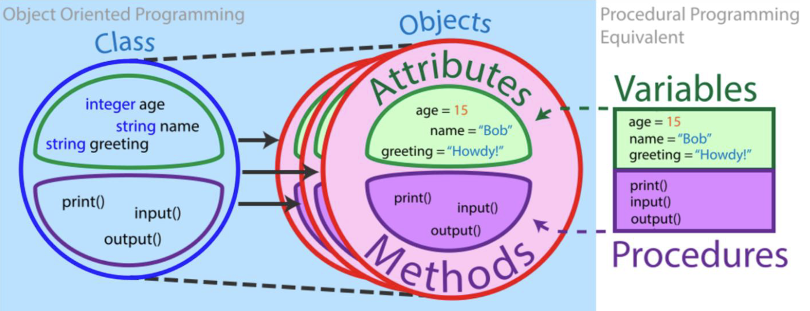

# Python Object Oriented Programming

In this section you will see: <!-- TODO: review the list -->
-  What is it, how did it originate, and other paradigms?
- Main Characteristics
- Classes, Instances, and Interfaces
- Pillars of OOP
- Classes and Instances
- `__init__()`, `__new__()`, and `__del__()`
- Dunder Methods
- Instance Attributes and Methods
- Class Attributes and Methods
- Static Methods
- Encapsulation
- Inheritance
- Polymorphism
- Abstraction

## Object Oriented Programming: What is it? 

Object-Oriented Programming (OOP) is a ***programming paradigm***. A programming paradigm is a conceptual model that defines how a programmer should structure and organize code to solve problems using a programming language. It's like a way of thinking or an approach to writing software.

A paradigm provides:
1. ***Mental structures***: Guidelines for organizing thoughts while writing code (see UML and Design Patterns).
2. ***Tools***: Language features (such as classes, functions, or logical expressions) that help implement this model.

Each object combines data (fields or attributes) and behaviors (methods) to model and interact with the system.

## OOP: How was born? 

It originated in the 1960s and 1970s with the Simula language (1967), the first to introduce the concept of objects and classes for complex
simulations.

Subsequently, the Smalltalk language (1972) refined the paradigm. Its diffusion exploded with the advent of languages ​​such as C++, Java, and, "*more recently*", Python.

The idea was to bring software closer to the way humans perceive the world: as a ***set of objects with states and behaviors***.

The answer is: yes. Because different problems require different approaches.
Each paradigm emphasizes a specific aspect of programming to achieve specific effects.
Some paradigms are:
- ***Imperative*** vs. ***Declarative Paradigm***: 
    - the imperative paradigm focuses on step-by-step control of the execution flow, ideal for sequential tasks; an example is `Python`;
    - the declarative paradigm focuses on describing the logic of computation without detailing its control flow; an example is `HTML`, or advanced tools such as `Ansible` or `Docker-Compose`.
- ***Functional Paradigm***: this paradigm is based on the evaluation of mathematics functions; it focuses on the usage of pure functions, using immutable variables and functions compositions.
- ***Object-Oriented Paradigm***: more on this later. 

## OOP: Fields or Attributes and Methods

The OOP organizes code around ***objects***, which represent real-world entities or abstract concepts. Each object combines data, i.e., ***fields*** or ***attributes***, and behaviors, that are ***methods***. 

They are useful to model the problem to solve and interact with the system. Each object combines variables that describe its state and methods that allow it to be modified.

Therefore, OOP groups properties and behaviors into individual objects.
For example, the OOP support the model of:
- a person object with:
    - ***properties*** such as name, age, and address;
    - ***behaviors*** such as walking, talking, breathing, and running.
- an email object with:
    - ***properties*** such as a recipient list, subject, and body;
    - ***behaviors*** such as adding attachments and sending.

With object-oriented programming, it is possible to model concrete, real-world things, such as cars, as well as relationships between things, such as companies and employees, students and teachers, and so on.

OOP models real-world entities as software objects with associated data that can perform specific functions.
Through OOP, it is possible to model not only physical concepts that we experience directly, but also abstract concepts, such as:
- Timers
- Communication buses
- Classes and objects that have "virtual" functions, such as creating objects following a certain behavior, adapting communication protocols, etc. - see ***Desing Patterns***.

The fundamental conclusion is that objects are at the heart of object-oriented programming. They not only represent data, as in procedural programming, but also the overall structure of the program.

## OOP Pillars

The OOP paradigm is built around 4 pillars: 
- ***Encapsulation***:
    - Encloses data and methods within an object and controls access through *visibility modifiers* (i.e., `public`, `private`, `protected`).
    - Example: A bank account balance attribute can only be modified using specific methods.
- ***Inheritance***:
    - Allows you to define new classes based on existing classes, to ***reuse*** and ***extend*** specific behaviors.
    - Example: An `ElectricCar` class can inherit from a general `Car` class.
- ***Polymorphism***:
    - Allows program components, such as objects, methods or functions, to show different behaviors depending on their use and application context
    - Example: A `.start_engine()` method may behave differently when applied on an `ICECar` with respect an `ElectricCar`.
- ***Abstraction***:
    - Allows you to define concepts, ***hiding/ignoring implementation details***.
    - In other words, it involves the process of ***identifying the essential aspects*** of a form or concept, abstracted from specific implementations.
    - Example: A `Car` object has attributes such as `brand` and `model`, but you don't care how the `engine` works internally.

Resulting programs benefit from the following features:
- ***Modularity***: Breaks the code into independent, reusable objects;
- ***Maintainability***: Encapsulating the code reduces the risk of side effects and unwanted behavior;
- ***Extensibility***: Concepts can be refined through subsequent iterations, starting from higher-level classes, or by overriding methods when appropriate.

## Classes, Instances and Interfaces

<div align="center">
    
    <div align="center">
        <figcaption>
            <em>Conceptual representation of relationship between classes and objects.</em>
            <br>
            <br>
        </figcaption>
    </div>
</div>

***Abstraction***, ***Inheritance***, ***Encapsulation***, and ***Polymorphism*** revolve around the concepts of ***Class***, ***Object***, and ***Interface***.

-*** Class***: it is a body of code that defines the ***model*** that associated object must have to belong to that class. The model is structured in terms of ***attributes*** and ***methods***.
- ***Object***: it is a particular ***instance*** of a given class. An object has assigned particular values (i.e., data) ​​for each of its attributes, which belong to it. You can have as many objects as you want for
each class.
- ***Interface***: it is a ***contract*** that defines a set of methods that a class can implement. It is similar to a class, but usually it ***it does not provide implementations*** for the methods it declares (depending on the language used).

The main relationship to focus on in the first place, is about Classes and Objects.

<div align="center">
    
    
    <div align="center">
        <figcaption>
            <em>Conceptual representation of relationship between classes and objects.</em>
            <br>
            <br>
        </figcaption>
    </div>
</div>

***Classes are models***, like projects representing how an associated object must be structured and behave when created. It is the same concept belonging to the engineering world, when a new manufact is designed, and it is represented as a `.cad` project: it is a representation of how the designed object will be and how it will behave, but the actual object it represents does not exist. 

***Objects are implementations of classes***, holding particular details as data, that the associated class does not have. As a principle, given one class it is possible to create as much associated objects as needed. Using the engineering parallel, the Object is the implemented design of the manufact of interest. It is possible to create as many replicas of this artifact as desired. Each replica can hold different details, belonging to its particular instance. 

### Classes and Objects: a Practical Example

<div align="center">
    
    <div align="center">
        <figcaption>
            <em>An example of the relationship existing between the Class and the Object concept based on cars and brands.</em>
            <br>
            <br>
        </figcaption>
    </div>
</div>

In the image above, the `Car` Class specifies that, to define a car, you must provide:
- a car manufacturer.
- a car model.

The Class, however, does not contain any manufacturer, maker, or model value for any specific car.

Then, when an object belonging to the Class `Car` is implemented (i.e., produced), then it starts holding particular details about its own instance, such as the Manufacturar and the Model name. 

## Python Class Definition

In Python, the `class` keyword, followed by the class name and a colon defines a class.

All indented code below the class definition is considered part of the class body.

The `self` keyword plays a fundamental role, as it represents the current instance of the class and is used to access the attributes and methods of that particular instance. 

In other words, `self` specifies if the associated code must be applied to the `class`, or to the associated instance (i.e., `object`) of that class.

```python
class Car:
    # Instance constructor (or initializator)
    def __init__(self, brand, model, speed=0):
        # instance attributes
        self.brand = brand
        self.model = model
        self.speed = speed
    
    # Instance methods
    def speed_up(self, step = 1):
        self.speed += step
    
    def speed_down(self, step = 1):
        self.speed -= step
```

### The Class Initializator `__init__()`

The `__init__()` method defines the fields (i.e., properties) that `Car` objects must have. Whenever a new Auto object is created, the `__init__()` method is automatically called by Python (immediately after the `__new__()` method - see below) and sets the object's initial state by assigning the values of the object's properties.

In other words, `__init__()` initializes every new instance of the class, taking the input parameters passed to the method (in the example input parameters are `brand`, `model` and `speed`), manipulating and assigning them to the assocaited object in construction. 

You can provide `__init__()` with any number of parameters,
but the first parameter will always be a variable called `self`. When a new class instance is created, the instance is automatically passed to the self parameter in `__init__()` so that new attributes can be defined on the object. You can also create classes without `__init__()`, which will behave as a  "utility-class".

```python
class Car: # or Car() or Car(object)
    # Instance constructor (or initializator)
    def __init__(self, brand, model, speed=0):
        # instance attributes
        self.brand = brand
        self.model = model
        self.speed = speed

    # Instance methods
    def speed_up(self, step = 1):
        self.speed += step
    
    def speed_down(self, step = 1):
        self.speed -= step
    

# The following line defines the program main
if __name__ == '__main__':
    m3 = Car('BMW', 'M3', 70)
    print('Brand={}, Model={}, Speed={}'.format(m3.brand, m3.model, m3.speed))
    
    punto = Car('Fiat', 'Punto')
    print('Brand={}, Model={}, Speed={}'.format(punto.brand, punto.model, punto.speed))
    
    print(id(m3), type(m3))
    print(id(punto), type(punto))
```

In the above code, the class `Car` is defined, and then, in the following program `main`, 2 objects of the class `Car` are created. Then, associated details are printed.

### The Class Destroyer `__del__()`

Being it possible in the OOP to build objects, it is also possible to destroy them. The ***destructor method*** is called during the destruction of an instance, that is, when the garbage collector deletes the instance in question.

The destruction of the object occurs when all references to its instance are removed, or when the program terminates and the object is still in memory. By manually calling the `__del__()` method, you don't actually destroy the object: you're just executing the code inside it.

In fact, the purpose of `__del__()` is to specify behaviors to be executed before the object is destroyed by the garbage collector. 

The deconstructor `__del__()` is useful in two particular use cases:
- There is a need to "clean up" resources (e.g., closing files closing network connections, freeing manually allocated resources, etc.)
- For debugging, to track when an object is destroyed.

```python
class Car: # or Car() or Car(object)
    # constructor (or initializator)
    def __init__(self, brand, model, speed=0):
        # instance attributes
        self.brand = brand
        self.model = model
        self.speed = speed
    
    # destructor
    def __del__(self):
        print(f'{self.brand} {self.model} destroyed!')
    
    # methods
    def speed_up(self, step = 1):
        self.speed += step
    
    def speed_down(self, step = 1):
        self.speed -= step


if __name__ == '__main__':
m3 = Car('BMW', 'M3', 70)
of (m3)
m3.__del__()
```

### Note: Python Dunder Methods

Methods like `.__init__()` and `__del__()` are called ***Dunder (Double Under-Score) Methods*** because they begin and end with a double underscore. There are many Dunder methods you can use to customize Python classes.

This is an advanced topic; understanding Dunder methods is an important part of mastering Python object-oriented programming and Python in general. In this course just some of these methods are presented; among them, other Dunder methods to know are `__new__()`, `__str__()` and `__repr__()`. The `__new__()` method will be presented later.

For more information: 

https://www.programmareinpython.it/video-corso-python-programmazione-a-oggetti/06-i-metodi-magici-dunder-methods/

or

https://docs.python.org/3/reference/datamodel.html#basic-customization

or (exhaustive classification)

https://www.pythonmorsels.com/every-dunder-method/

## Python Classes: Instances and Classes Attributeds and Methods

When defining a Python class, it is possible to specify attributes and methods that belong to each single instance, and act only on each of them. Moreover, also class attributes and methods exist, which have the ability to act on the class shared by all the instances, and which results can be accessed to all instances. Finally, it is also possible to define methods not belonging to classes nor instances. 

Initial details about classes attributes have been described in the paragraph about [the class initializator `__init__()`](#the-class-initializator-__init__). Now let's see more about instance methods.

### Instance Methods
After defining the `__init__()` method, it is possible to define instance methods.Instance methods are functions that have the ability ***to act on the instance*** on which they are called, changing its state or elaborating some data.

These methods are characterized by the `self` keyword, which always represents the first parameter of instance methods. Instance methods can return or not return anything, depending on the functionality implemented in them. 

Typical instance methods implemented in object-oriented languages ​​are ***getters*** and ***setters*** (we'll see them later).

```python
class Car: # or Car() or Car(object)
    # constructor (or initializator)
    def __init__(self, brand, model, speed=0):
        # instance attributes
        self.brand = brand
        self.model = model
        self.speed = speed
    
    # methods
    def speed_up(self, step = 1):
        self.speed += step
    
    def speed_down(self, step = 1):
        self.speed -= step


if __name__ == '__main__':
    m3 = Car('BMW', 'M3', 70)
    print('Brand={}, Model={}, Speed={}'.format(m3.brand, m3.model,
    m3.speed))
    
    punto = Car('Fiat', 'Punto')
    print('Brand={}, Model={}, Speed={}'.format(punto.brand, punto.model,
    punto.speed))
    
    print(id(m3), type(m3))
    print(id(punto), type(punto))
```

### Class Attributes

It is possible to define attributes that do not belong to the individual instance, but are part of the class that defines them. These attributes are called ***Class Attributes***. More generally, OOP calls them ***Static Variables***.

In Python, you can define a class attribute by declaring it outside the `__init__()` method. Class attributes are shared with all instances of that specific class.Class attributes are useful when you want to share a common state or behavior across all instances of that class:
- Shared values
- Shared counters
- Common configurations
- Global data storage
- Utilities that do not depend on individual instances

In Python, you can access class attributes using the punto notation `ClassName.attribute_name`.

```python
class Car: # or Car() or Car(object)
    # Class attributes
    wheels = 4 # Shared value
    instance_count = 0 # Shared counter
    log_level = 'INFO' # Shared configuration
    instantiated_objs = [] # Global data memorization
    kw_to_hp_conv_factor = 1.36 # Global utilities
    
    # constructor (or initializator)
    def __init__(self, brand, model, speed=0):
        # instance attributes
        self.brand = brand
        self.model = model
        self.speed = speed
        Car.instance_count += 1
        Car.instantiated_objs.append(self)
    
    # methods
        [...]


if __name__ == '__main__':
    [...]
    print(Car.wheels)       # Output: 4
```

### Class Methods

Like attributes, it is possible to implement methods that are part of a class, and not of the instances generated by it. These methods are generally used to access the state of the class (i.e., class attributes), rather than the instance.

To define a class method:
- Replace the self keyword with cls as the first parameter of the method, which refers to the class;
- Use the `@classmethod` annotation to highlight that it is a class method.

```python
class Car: # or Car() or Car(object)
    # Class attributes
    wheels = 4
    instance_count = 0 # Shared counter
    log_level = 'INFO' # Shared configuration
    instantiated_objs = [] # Global data memorization
    kw_to_hp_conv_factor = 1.36 # Global utilities
    
    # constructor (or initializator)
    def __init__(self, brand, model, speed=0):
        # instance attributes
        self.brand = brand
        self.model = model
        self.speed = speed
        Car.instance_count += 1
        Car.instantiated_objs.append(self)
    
    # methods
    @classmethod
    def less_wheels(cls):
        cls.wheels -= 1
    
    @classmethod
    def more_wheels(cls):
        cls.wheels += 1


if __name__ == '__main__':
    [...]
```

> [!NOTE] Python Decorators
> 
> Decorators are a tool that allows us to extend and modify the behavior of functions and classes without having to directly alter their source code. More information [here](https://www.geeksforgeeks.org/python/decorators-in-python/).

### Static Methods

Methods annotated with `@staticmethod` do not access or modify the state of the class, or of an instance. They are localized in a given class, although they do not interact with it or its instances, for organizational reasons.

Static notations are often used in utility classes. They are characterized by the absence of `self` or `cls` in their parameters.

```python
class Car: # or Car() or Car(object)
    # Class attributes
    wheels = 4
    instance_count = 0 # Shared counter
    log_level = 'INFO' # Shared configuration
    instantiated_objs = [] # Global data memorization
    kw_to_hp_conv_factor = 1.36 # Global utilities

    # constructor (or initializator)
    def __init__(self, brand, model, speed=0):
        # instance attributes
        self.brand = brand
        self.model = model
        self.speed = speed
        Car.instance_count += 1
        Car.instantiated_objs.append(self)
    
    # methods
    @staticmethod
    def within_limits(speed, max_speed):
        return speed < max_speed


if __name__ == '__main__':
    [...]
```

 ## Python OOP and OOP Pillars

 As said before, OOP Pillars are 4: 
 - Encapsulation
 - Inheritance
 - Polimorphism
 - Abstraction

 Next sections will dig into the meaning and these 4 pillars and their role in Python OOP. 

 ### Python and Encapsulation

Encapsulation refers to building data (i.e., attributes) and methods (i.e., functions) operating on that data into a single unit, called object, descripted in a class. Encapsulation enables a series of characteristics and details referred to objects. 

#### Access Modifiers

Since attributes and methods are built into an object, it enables the possibility of ***controlling the access*** to these attributes and methods.

Typically, 3 level of access are defined, and they are ***protected***, ***private*** and ***public***. They are called ***access modifiers***, and all of them are implemented in Python:
<!-- TODO: convert in a table --> 
- ***Private***: the variable/method is accessible only internally to the class. It is defined putting a double underscore in front of the variable when declared: `__my_private_variable = 4`;
- ***Protected***: the variable/method is accessible only internally to the class, and internally to any subclasses. It is defined putting a single underscore in front of the variable when declared: `_my_protected_variable = 4`;
- ***Public***: the variable/method is accessible both internally and externally to the class. It is defined putting no underscore in front of the variable when declared: `my_public_variable = 4`;

```python
class Car:
    # constructor (or initializator)
    def __init__(self, brand, model, speed=0):
        # instance attributes
        self.brand = brand
        self._model = model
        self.__speed = speed
    
    # methods
    [...]


if __name__ == '__main__':
    [...]
```

In Python, access modifiers are "just" notes. That is, they do not place any real limit on the access of the variable/method at compile time or runtime (for example, generating an error).

This does not happen in other languages, such as, for example, Java: if you try to access a private variable from a context outside the class in Java, the compiler will return an error. 

This is one of the reasons why Python is considered "*a great experiment in freedom*": the responsibility of respecting an access modifier or not is left to the developer.

#### Getters and Setters

Remaining within the scope of OOP, to access a limited-access variable from a context outside the class, we use so-called ***getters*** and ***setters***.

***Getters and setters are public methods that allow you to find or modify the value of a limited-access variable***.

In Python, a getter has very limited utility, while the purpose of having a setter is much deeper: in fact, one of the setter's tasks in Python is to verify whether the received value is correct with respect to the type of variable being modified.

Practical example: changing the license plate of a vehicle.

```python
class Car:
    def __init__(self, brand, model, license):
        self._brand = brand         # Protected
        self._model = model         # Protected
        self._license = license     # Protected

    # Public
    def get_brand(self):
        return self._brand
    
    # Public
    def set_brand(self, brand):
        self._brand = brand
    
    # Public
    def get_model(self):
        return self._model
    
    # Public
    def set_model(self, model):
        self._model = model
    
    # Public
    def get_license(self):
        return self._license
    
    # Public
    def set_license(self, license):
        if len(license) != 7:
            raise ValueError("license must be LLNNNLL")
        if not all(x.isalpha() for x in license[0:2]):
            raise ValueError("license must be LLNNNLL")
        if not all(x.isalpha() for x in license[-2:]):
            raise ValueError("license must be LLNNNLL")
        if not all(x.isnumeric() for x in license[2:5]):
            raise ValueError("license must be LLNNNLL")
        self._license = license
    
    # Public
    def __repr__(self):
        return (self.__dict__)


if __name__ == '__main__':
    # warning: the constructor do not apply controls!! How to prevent that?
    m3 = Car('BMW', 'M3', 'ABCDEFG') # the set_license method works fine
    
    try:
        m3.set_licence('AA123TT')
    except ValueError as e:
        ('Invalid License')
        # warning: should not be done but still working
        m3._license = 'fake!'
    
    print(m3.get_license())
```
In this example, the `_brand`, `_model`, and `_license` attributes are protected. The declared getters and setters therefore ***allow access to private attributes from outside the class***. 
 
By the way, because of the freedom offered by Python, although the setter for the `_license` attribute performs checks, the freedom that Python offers allows you to work around this obstacle and directly modify the field without going through the setter. Furthermore, in this version, `__init__()` does not perform any checks on the received values.

The use of getters and setters as shown in the previous slide is discouraged, as it modifies the interface for accessing the class's attributes (what would happen if you wanted to modify a class, moving from a Pythonic approach to a more object-oriented one?).In other words, to access the brand attribute, there should be a way where the developer is use one of the accessing styles between `m3.get_brand()` and `m3.brand`.

To overcome this drawback, Python introduces the `@property`, `@attribute_name.setter`, and `@attribute_name.deleter` annotations have been implemented. This way, when calling `m3.license`, you will not directly access the license field of the m3 instance, but will call the getter annotated with `@property` associated with the method with the same name as the field you want to access.

Similarly, when you want to modify (e.g., assign) an attribute of an instance a new value, the class will call the method annotated with `@attribute_name.setter`.


```python
class Car:
    def __init__(self, brand, model, license):
        self._brand = brand
        self._model = model
        self._license = license
    
    @property
    def license(self):
        print('property.getter')
        return self._license
    
    @license.setter
    def license(self, value):
        print('property.setter')
        if len(value) != 7:
            raise ValueError("license must be LLNNNLL")
        if not all(isinstance(x, str) for x in value[0:2]):
            raise ValueError("license must be LLNNNLL")
        if not all(isinstance(x, str) for x in value[-2:]):
            raise ValueError("license must be LLNNNLL")
        if not all(x.isnumeric() for x in value[2:5]):
            raise ValueError("license must be LLNNNLL")
        self._license = value
    
    @license.deleter
    def license(self):
        print('property.deleter')
        del self._license
    
    def __repr__(self):
        return str(self.__dict__)


if __name__ == '__main__':
    m3 = Car('BMW', 'M3', 'GY455AI')
    m3.license = 'FY335YT'
    print(m3.license)
    print(m3)
```

### Python and Inheritance

Inheritance allows us to define a class that inherits all the methods and properties from another class. The inherited class is called the ***base class***, ***parent class***, or ***super class***. The class that inherits the other class is called the ***child class*** or ***derived class***.

Derived classes inherit all the attributes and methods from a base class. They can also:
- add attributes and methods,
- redefine existing methods.

Python provides a `super()` function that allows us to access the superclass. The `super()` function is typically used in derived class constructors to initialize the inherited part of the object.

```python
# Base class
class Car:
    def __init__(self, brand, model, speed=0):
        self.brand = brand
        self.model = model
        self.speed = speed

    def speed_up(self):
        self.speed += 1

    def speed_down(self):
        self.speed -= 1

    def __repr__(self):
        return str(self.__dict__)


# Derived class
class ECar(Car):
    def __init__(self, brand, model, speed=0, battery_level=0):
    super().__init__(brand, model, speed)
        self.battery_level = battery_level

    def charge(self):
        self.battery_level += 1

    def discharge(self):
        self.battery_level -= 1


if __name__ == '__main__':
    tsla = ECar('Tesla', 'ModelX')
    tsla.speed_up()
    tsla.charge()
    print(tsla)
```

#### Multiple and Multilevel Inheritance

It's also possible to inherit a class from another class that is itself inherited. In this case, we'll talk about multilevel inheritance.

```python
class Base:
    pass

class Derived1(Base):
    pass

class Derived2(Derived1):
    pass
```

In addition to offering multilevel inheritance, Python offers the ability to inherit from multiple classes simultaneously. In multiple inheritance, all the characteristics of the parent classes are inherited in the child class. The syntax for multiple inheritance is similar to that of single inheritance.

```python
class Base1:
    pass

class Base2:
    pass

class MultiDerived(Base1, Base2):
    pass
```

#### Inheritance and Method Resolution Order

Every class in Python derives from the `object` class. It is the ***root class***, the parent of every object in Python.

All classes, both built-in and user-defined, are derived classes, and all objects are instances of the object class. In multiple inheritance, each attribute or method is searched first in the current class. If not found, the search continues in the lowest-level parent classes. The search order is ***depth-first, left-right fashion***, without searching the same class twice in a row.

```python
# issubclass compares two types
print(issubclass(float, object))    # Output: True
print(issubclass(str, object))      # Output: True

# isinstance compares an object and a type
print(isinstance(5.5, object))      # Output: True
print(isinstance("Hello", object))  # Output: True
```

In the previous example, the attribute or method search order is `[MultiDerived, Base1, Base2, object]`. This order is also called child class linearization (MultiDerived).

You can inspect a class's MRO using the `__mro__` attribute or the `.mro()` method. MRO allows you to predict the result of a method call if the parent methods have two methods with the same name.

```python
class Base1:
    def greet(self):
        return 'hi!'

class Base2:
    def greet(self):
        return 'hello!'

class MultiDerived(Base1, Base2):
    pass
        
m = MultiDerived()
print(m.greet())  # hi!

# inspecting the MRO 
MultiDerived.__mro__ 
# Output: (__main__.MultiDerived, __main__.Base1, __main__.Base2, object)

MultiDerived.mro()
# Output: [__main__.MultiDerived, __main__.Base1, __main__.Base2, object]
```

### The `__new__()` Role 

When a new object is created, there is another method that comes into play in conjunction with `__init__()`: it is `__new__()`.

The role of of `__new__()` is to: 
- Allocate memory for the new object
- Return an instance of the class.

```python
class Car:
    # creator 
    def __new__(cls, *args, **kwargs): 
        instance = super().__new__(cls)
        return instance

    # constructor (or initializator)
    def __init__(self, brand, model, speed=0): 
        # instance attributes 
        self.brand = brand 
        self.model = model 
        self.speed = speed

    # methods 
    [ ... ]


if __name__ == '__main__': 
    m3 = Car('BMW', 'M3', 70) 
    print('Brand={}, Model={}, Speed={}'.format(m3.brand, m3.model, m3.speed)) 

    punto = Car('Fiat', 'Punto') 
    print('Brand={}, Model={}, Speed={}'.format(punto.brand, punto.model, punto.speed)) 

    print(id(m3), type(m3)) 
    print(id(punto), type(punto))
```

The `__new__()` method is the first called when creating a new
object. Once the process in `__new__()` is complete, the `__init__()` method is called. When multilevel inheritance is involved, then the `__new__()` method is called several times, once for each parent.

```python
class A(object):
    def __new__(cls, *args, **kwargs):
        print("Creation of an instance of A")
        instance = super().__new__(cls)
        return instance

    def __init__(self):
        print("Initialization of A")
    
    def method(self):
        print("Method of A")


class B(A):
    def __new__(cls, *args, **kwargs):
        print("Creation of an instance of B")
        instance = super().__new__(cls)
        return instance

    def __init__(self):
        super().__init__()
        print("Initialization of B")
    
    def method(self):
        print("Method of B")
        super().method()


class C(B):
    def __new__(cls, *args, **kwargs):
        print("Creation of an instance of C")
        instance = super().__new__(cls)
        return instance

    def __init__(self):
        super().__init__()
        print("Initialization of C")

    def method(self):
        print("Method of C")
        super().method()


# Creation of an instance of the class C
obj = C()
print() # Empty line
obj.method()

# Output: 
# Creation of an instance of C
# Creation of an instance of B
# Creation of an instance of A
# Initialization of A
# Initialization of B
# Initialization of C

# Method of C
# Method of B
# Method of A
```

When an object of class C is created:
- The `__new__()` method of C is called;
- The `__new__()` method of B is called;
- The `__new__()` method of A is called;
- The `__new__()` method of object is called;
- A is initialized;
- B is initialized;
- C is initialized.

Object of type C is created:
- When the method of C is called;
- The method of B is called;
- The method of A is called.

### Python and Polmorphism

Python implements various forms of polimorphism, from ***Duck Typing*** to ***operators overloading***.

#### Python Duck Typing

Python's built-in functions feature a form of polymorphism.

```python
print(len("Hello"))     # String length
print(len([1, 2, 3]))   # List length
```

In Python, [Duck Typing](https://www.geeksforgeeks.org/python/duck-typing-in-python/) allows you to pass objects of any type to functions.

```python
print(max(1, 3, 2))         # Maximum of integers
print(max("a", "z", "m"))   # Maximum in strings
```

> [!Tip] Duck Typing
> 
> If it walks like a duck and quacks like a duck... then it's a duck!

This feature enables a form of polymorphism: indeed, the result of a function changes implicitely with respect to characteristics of the passed data.

```python
def add(a, b):
    return a + b

print(add(3, 4))                    # Integer addition
print(add("Hello, ", "World!"))     # String concatenation
print(add([1, 2], [3, 4]))          # List concatenation
```

#### Python and Operators' Polimorphism

In Python, operators like `+` exhibit polymorphic behavior. In fact, with the `+` operator, it is possible to both add and concatenate or join the data passed, depending on their types.

```python
print(5 + 10)               # Integer addition
print("Hello " + "World!")  # String concatenation
print([1, 2] + [3, 4])      # List concatenation
```

#### Python and Class's Polimorphism

In Python, different classes can implement methods with the same name and the same parameters. Depending on the class on which the method is called, the result may differ.

```python
class Car: 
    def __init__(self, brand, model): 
        self.brand = brand 
        self.model = model 
    
    def move(self): 
        print("Drive!")


class Boat: 
    def __init__(self, brand, model): 
        self.brand = brand 
        self.model = model 
    
    def move(self): 
        print("Sail!")


class Plane: 
    def __init__(self, brand, model): 
        self.brand = brand 
        self.model = model 
    
    def move(self): 
        print("Fly!")


car = Car("Ford", "Mustang")
boat = Boat("Ibiza", "Touring 20")
plane = Plane("Boeing", "747")

for x in (car, boat, plane): 
    x.move()
```

#### Python and Inheritence Polimorphism

In Python, using inheritance, the child class inherits the methods of the parent class. They are not unchangeable; in fact, ***it is possible to override their methods***.

The process of rewriting the methods of methods inherited by child classes is called ***method overriding***. Method overriding is a form of polymorphism: in fact, as in class polymorphism, in this case too, the same methods behave differently depending on the object on which they are called.

```python
class Animal:
    def talk(self):
        pass


class Dog(Animal):
    def talk(self):
        return "Woof!"


class Cat(Animal):
    def talk(self):
        return "Meow!"

dog = Dog()
cat = Cat()
print(dog.talk())   # "Woof!"
print(cat.talk())   # "Meow!"
```

#### Python Polimorphism: Overloading vs. Overriding

More generally, in OOP, there are two main ways to achieve polymorphic behavior: ***method overloading*** or ***method overriding***:
- ***Method overriding***: involves overriding a method inherited from a higher class to obtain more specific or different behavior in the current class.
- ***Method overloading***: involves creating two methods within the same class with the same name but different parameters (in number, type, or both). The compiler/interpreter will then have the task of calling the correct method based on the parameters passed.

 Method overloading is not natively supported by Python.

```python
def product(a, b):
    p = a * b
    print(p)
def product(a, b, c):
    p = a * b * c
    print(p)

product(4, 5)       # Output: Error
product(4, 5, 5)    # 100
```

To achieve overloading, you can use several strategies.
- Strategy 1: Using a control field and `*args` or `**kwargs`;
- Strategy 2: Using the `None` keyword;
- Strategy 3: Using the ***Multiple Dispatch Decorator*** (install with pip).

```python
### Using *args or **kwargs
def add(datatype, *args):
    if datatype == 'int':
        answer = 0
    if datatype == 'str':
        answer = ' '
    for x in args:
        answer = answer + x
    print(answer)

add('int', 5, 6)
add('str', 'Hello, 'World,', '!')

### Using None
def add(a=None, b=None):
    if a != None and b == None:
        print(a)
    else:
        print(a+b)

add(2, 3)
add(2)

### Using the Multiple Dispatch Operator
from multipledispatch import dispatch

@dispatch(int, int)
def product(first, second):
    result = first*second
    print(result)

@dispatch(int, int, int)
def product(first, second, third):
    result = first * second * third
    print(result)

@dispatch(float, float, float)
def product(first, second, third):
    result = first * second * third
    print(result)

product(2, 3)
product(2, 3, 2)
product(2.2, 3.4, 2.3)
```

### Python and Abstraction

Abstraction concerns the process of ***identifying the essential aspects of a form or concept***, abstracted from specific implementations. The concept of abstraction is visible both in the formal interfaces of classes and objects, and in the concept of *informal interfaces* with which Python implements the interfaces of OOP.

An informal interface is ***a class that defines methods that can be overridden*** through the concept of method overriding.

To use an informal interface, you must use a ***concrete class***, i.e., a "traditional" class.

```python
class InformalCarInterface:
    def speed_up(self):
        pass
    def speed_down(self):
        pass

### Implementing the Car from the InformalCarInterface
class Car(InformalCarInterface):
    def speed_up(self):
        pass
    def speed_down(self):
        pass

### Implementing the ECar from the InformalCarInterface
class ECar(InformalCarInterface):
    def speed_up(self):
        pass
    def speed_down(self):
        pass
```

Informal interfaces are good for small projects with few developers working on the code. In fact, they do not implement any type of run-time checking, and therefore could become cumbersome during debugging as the project grows.

Alternatively, you can use the `abc` module to create ***abstract base classes***. 

```python
from abc import ABC, abstractmethod

# Interface defintion
class InformalCarInterface(ABC):
    @abstractmethod
    def speed_up(self):
        pass

    @abstractmethod
    def speed_down(self):
        pass


class Car(InformalCarInterface):
    def speed_up(self):
        pass
    
    def speed_down(self):
        pass
```

ABC classes provide a formal structure to define interfaces by explicitly declaring abstract methods that must be implemented by subclasses. ABC classes ***catch errors at instantiation time*** if a subclass does not implement all abstract methods, preventing incomplete implementations. 

Other ABC strengths are:
- ***Explicit Contracts***: ABCs define clear contracts enforcing method implementation, leading to more robust and predictable designs.

- ***Better Tooling Support***: Many IDEs and static analyzers understand ABCs and can provide better autocompletion, type checking, and error detection.

- ***Encourages Consistency***: By forcing subclasses to implement methods, ABCs promote consistent API design across different classes.

- ***Safe Instantiation***: Attempting to instantiate a class missing required abstract methods raises immediate errors, preventing subtle bugs.

- ***Ease of Refactoring***: Changes in the interface are easier to manage as all subclasses must comply, whereas informal interfaces can be more fragile.

## Python Cheatsheet

- Source 1: https://www.pythoncheatsheet.org/
- Source 2: https://www.codecademy.com/resources/cheatsheets/all

## Python OOP: Let's Experiment!

### Exercise 1

Create a class called Point that represents a point in two-dimensional
space. The class must have the following attributes and methods:

1. Attributes: `x` and `y` (coordinates of the point);
2. Method `__init__(self, x, y)`: An initialization method that sets the coordinates of the point.
3. Method `distance(self, other_point)`: A method that calculates and returns the Euclidean distance between the current point and another point passed as an argument;
4. (Extra) Modify the program so that it can represent triangles and parallelepipeds from their points in two dimensions, collect them in a data structure, and allow the user to explore them from the prompt.

--

### Exercise 2

Create a class called Student that represents a student. The
class should have the following attributes and methods:

1. Attributes: `first name`, `last name`, `year of birth`, `student number`;
2. Method `__init__(self, first_name, last_name, birth_year, student_number)`: An initialization method that sets the student's information;
3. Method `calculate_age(self, current_year)`: A method that calculates and returns the student's age given the current year;
4. Method `print_information(self)`: A method that prints the student's information;
5. (Extra) Collect several students in a data structure and run a program that allows you to explore the student's information from a menu.

--

### Exercise 3

Create a class called `Book` that represents a book. The class should have the following attributes and methods:

- Attributes: `title`, `author`, `year of publication`, `number of pages`;
- Methods: 
    - `__init__(self, title, author, year of publication, number of pages)`  to initialize the `Book` object;

    - `info(self)` method: a method that returns a formatted string with book information; 
    
Create a second class called `Library`, which collects various books and allows you to perform a search and get the book you're looking for, or an error message if it doesn't exist;

(Extra) Modify the program so that the library can lend books to users.

--

### Exercise 4

 Create a class called `Calculator` that represents a simple calculator. The class should have the following methods: 
 - `sum(self, a, b)`: A method that returns the sum of two numbers. 
 - `subtraction(self, a, b)`: A method that returns the subtraction of two numbers. 
 - `multiplication(self, a, b)`: A method that returns the product of two numbers. 
 - `division(self, a, b)`: A method that returns the result of dividing two numbers.
