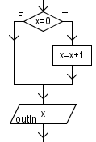
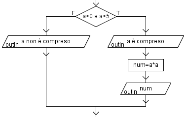

# Extra Exercises - 1

Some extra exercises to complete to reinforce basic coding skills.

---

### Exercise 01
Given two numbers, find the greater and display it.

--

### Exercise 02
Given a number, say whether it is even or odd.

--

### Exercise 03
Given two (different) numbers, write them in ascending order.

--

### Exercise 04
Given the dimensions of a quadrilateral, say whether it is a rectangle or a square.

--

### Exercise 05
Acquire a number and say whether it is inside or outside the previously acquired 
interval [A;B].

--

### Exercise 06
Acquire two numbers in any order and indicate whether one is a multiple of the 
other.

--

### Exercise 07
Swap the contents of two variables if the first is greater than the second.

--

### Exercise 08
Ask the user for a number, check whether it is even or odd, and provide an 
appropriate message. Then, check whether it is a multiple of 5, and always display an appropriate message.

--

### Exercise 09
Acquire the score achieved in a test and return the corresponding evaluation, knowing that:

| POINTS            | GRADE         |
|-------------------|---------------|
| < 30              | Insufficient  |
| Between 31 and 50 | Sufficient    |
| > 50              | Good          |

--

### Exercise 10
Display whether a natural number N is divisible by 9. If not, display the remainder of the division by 9.

--

### Exercise 11
Display whether a natural number N is divisible by another natural number X. If not, indicate how many units must be added to N to make it divisible.

--

### Exercise 12
Acquire the ages of two people and display how many years older one is than the other. 

(Note: the number of years is always a positive quantity).

--

### Exercise 13
A beverage vending machine offers the following options:

| BUTTON    | DRINK TYPE    | COST  |
|-----------|---------------|-------|
| 1         | Coffee        | €0.50 |
| 2         | Tea           | €1.00 |

Write a block diagram that displays the cost based on the user's choice.

--

### Exercise 14
A percentage discount is applied to the amount of tracksuits received from the soccer club "www" according to the following table:

| AMOUNT                        | DISCOUNT %    |
|-------------------------------|---------------|
| Up to €200                    | No discount   |
| Between €200.01 and €550.00   | 7%            |
| Over €550.00                  | 10%           |

Given the invoice amount, calculate and display the discount and the final discounted amount. The company decides to have the goods shipped by courier and must pay a fixed amount, which must be requested as input, indicating how much the company ultimately spends.

--

### Exercise 15
The cost of admission to a tourist attraction varies with age:

| AGE                   | COST  |
|-----------------------|-------|
| Up to 5 years         | €0.00 |
| From 6 to 14 years    | €5.00 |
| Over 14 years         | €8.00 |

Let the user insert the age of each person participating to the attraction, and finally print the ticket price.

--

### Exercise 16
Ask for the price of a ticket to see Reggiana Basket. Establish the price actually paid, taking into account the following: if the spectator is 18 or older: no discount; if a minor: 5% discount; over 65: 10% discount.

--

### Exercise 17
The cost of renting a minibus daily is made up of a fixed fee (Q) and a variable fee, which depends on the kilometers traveled. For distances up to 200 km, a T rate per km applies. For each km beyond 200 km, the T rate is decreased by 2%. (e.g., Km = 250 → 200 km at T rate per km and 50 km at T rate - 2% of T per km + fixed rate).

Enter the kilometers traveled, the rate per km, and the fixed rate. Calculate and display the rental cost.

--

### Exercise 18
Given input of a number: `num1`, a second number: `num2`, and an arithmetic operator: `K`, ask the user for the operator and display the result, assuming the user can choose between the following operators: `+`, `-`, `*`, `/`.

--

### Exercise 19
The cost of a phone call made from a hotel room depends on the connection time, according to the following table:

| TIME                                  | AMOUNT                                    |
|---------------------------------------|-------------------------------------------| 
| Less than 5 minutes                   | €0.30 per minute                          |
| Greater than or equal to 5 minutes    | €0.25 per minute + a fixed fee of €1.50   |

The amount thus determined must then be increased by €0.75 for room service. Acquire the connection time. Calculate and display the cost of the call.

--

### Exercise 20
The parking fee depends on the duration of the parking, according to the following table:

| TIME                      | AMOUNT    |
|---------------------------|-----------|
| Up to 2 hours             | €3.00     |
| For each subsequent hour  | €1.00     |

If the number exceeds 24, a fixed fee of €9.50 is charged in addition to the normal charge. Acquire the duration of the parking. Calculate and display the amount to be paid.

--

### Exercise 21
Acquire a range ]A,B[ and then acquire a real value X:

- If the value X is within the range, calculate and display the result of the following expression: X2 + X – 5;
- If it is before the range, calculate and display the sign (positive, negative, or zero) of the following expression: X3-X;
- If it is after the range, indicate whether X is a multiple of B or not.

--

### Exercise 22
Given two non-zero and different values ​​X and Y, proceed as follows:

- If X>0, display
- Perimeter and area of ​​the rectangle with base X and height X/3
- The value of the expression 3*X*X – 8*Y*Y – X*Y
- Otherwise, display:
- The smaller of X and Y
- The average value

--

### Exercise 23
Given an expense amount, consider the following: 

- in the first case, if the expense exceeds 100 euros, a 3% discount is applied to the total; 
- in the second case, if the expense exceeds 100 euros, a 10% discount is applied to the portion of the expense exceeding 100 euros. 

Acquire the expense S and calculate the final expense and discount in the two supermarkets, and display which supermarket is cheaper and the corresponding final expense and discount. 

NOTE: also consider the case of equality.

--

### Exercise 24
Acquire a value x between -99 and +99: 

- if the value is not within this range, display the message "operation not executable"; 
- otherwise, if x is negative, acquire a further value y, and: 
    - if x is greater than y, swap the contents and display the result; 
    - if x is null, display the message “null value”; 
    - if x is positive, calculate and then display the number A whose units digit is the tens digit of x and whose tens digit is the units digit of x, (e.g. x=23 then A=32) then check that the difference between the 2 values ​​x and A is divisible by 9.

--

### Exercise 25
A group of 4 friends wants to go on vacation. The agency offers two proposals:

- Travel by public transport using a train pass costing T euros and a bus pass costing A euros. The passes are individual.
- Rent a single car for which an initial deposit C is required and a cost of 0.8 euros for each of the first 500 km and 0.5 euros for each subsequent km.

Acquire the cost T of a train pass and the cost A of a bus pass, and calculate and display the per capita cost of the first proposal.

Acquire the value of the deposit C and the number of kilometers to be traveled, and calculate and display the per capita cost for each of the four friends in the second proposal. 

Finally, compare the two per capita costs calculated previously and indicate which of the two proposals is more convenient (the output should be a message such as 'first proposal', 'second proposal', 'same convenience').

--

### Exercise 26 
Solve the following problem using a block diagram:

A martial arts gym in Reggio Emilia offers the following membership offers:

| GENDER    | MONTHLY PRICE | TERMS                 | DISCOUNT  |
|-----------|---------------|-----------------------|-----------|
| F         | €50.00        | Age <26 or age >60    | 20%       |
| M         | €50.00        | Age >=20 and age <=65 | 10%       |

Acquire age and gender (sex = 'F', or sex = 'M') and display the price paid.

--

### Exercise 27
If the weight of a truck's load is <= 250 kg and no fine is issued; if it is between 250 and 500 kg (excluding the extremes), a fine is issued consisting of a fixed amount M and 0.5% of the amount M for each kg in excess; if the weight is greater than 500 kg, a fine is issued consisting of a fixed amount M1, and for each kg between 250 and 500, a fine of €2 is paid, while for each kg exceeding 500, a fine of 0.5% of M1 is paid. Acquire the weight P, the fixed amounts M and M1, and display the final fine value in a single output.

--

### Exercise 28 
Acquire two non-zero numbers x and y:

- If x is even, display its half;
- If x is different from y, calculate and display the difference between the largest and smallest values; otherwise, calculate and display the product of x and y.
- If x is less than y, swap x with y and display the output.

--

### Exercise 28
Use a block diagram to solve the following problem:

The parking fee depends on the duration of parking, according to the following table:

| TIME                      | AMOUNT    |
|---------------------------|-----------|
| Up to 2 hours             | €3.00     |
| For each subsequent hour  | €1.50     |

If the number of hours exceeds 24, a fixed fee of €9.50 is charged in addition to the normal fee. Acquire the duration of parking. Calculate and display the amount to be paid.

--

### Exercise 30
Code the following program sections.

    
    

